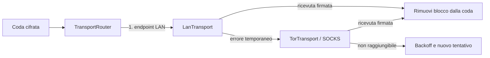

# Architettura

Brotherhood usa un singolo modulo Android, separato per responsabilità:

```text
app/
  ui/          Compose, navigazione, permessi e diagnostica
  model/       stato serializzabile, code, endpoint e trasferimenti
  crypto/      identità, inviti, envelope, frame e ricevute
  storage/     archivio cifrato, Keystore, PIN e migrazioni
  data/        repository, contatti, gruppi, deduplicazione
  transport/   interfaccia comune, LAN, Tor, router e delivery engine
  media/       immagini, registrazione e riproduzione vocale
  background/  foreground service, WorkManager e boot receiver
  core/        retry, replay, limiti, blocchi e ricostruzione
```

Il prototipo `app/brotherhood.py` non entra nell’APK.

## Identità e archivio

1. Tink genera ECIES P-256 per cifratura e ECDSA P-256 per firma.
2. ID e impronta derivano dalle chiavi pubbliche.
3. Chiavi private, onion key, contatti, messaggi e code sono serializzati nello stato.
4. Lo stato viene cifrato AES-256-GCM con chiave non esportabile Android Keystore.
5. Il PIN è PBKDF2-HMAC-SHA256 con sale casuale e protegge l’accesso alla UI.

Il PIN non deriva la chiave Keystore: non è un secondo fattore crittografico contro un
processo compromesso sul telefono sbloccato.

## Trasporti

`MessageTransport` espone tipo, stato osservabile, `start`, `stop` e `send`. LAN e Tor
ricevono la stessa `NetworkFrame` firmata e restituiscono la stessa ricevuta.



LAN ascolta su TCP 42337 e non esegue discovery pubblico: l’host arriva dall’invito
firmato. Tor avvia `libtor.so`, un SOCKS locale e un onion service v3 che inoltra la porta
remota 80 alla stessa porta applicativa locale. Il socket applicativo non viene esposto
tramite port forwarding Internet.

## Protocollo applicativo

1. Il repository persiste messaggio e elementi di coda.
2. Il payload viene cifrato ECIES per la chiave pubblica del destinatario.
3. Il `WireEnvelope` è firmato ECDSA.
4. La `NetworkFrame` versione 2 lega mittente, destinatario, nonce, timestamp ed envelope
   con una seconda firma.
5. Il server applica limite 5 MB, timeout, massimo otto connessioni, rate limit e framing
   a lunghezza.
6. Prima di decifrare accetta solo un mittente presente e non bloccato.
7. Verifica firma frame, finestra temporale, firma envelope, destinatario e limiti payload.
8. Persiste messaggio o blocco prima di creare una ricevuta firmata.
9. Il mittente elimina dalla coda soltanto l’elemento confermato.

La stessa frame viene riusata nel fallback LAN→Tor. Se la ricevuta LAN è valida, Tor non
viene chiamato. Se una ricevuta si perde, l’ID dell’elemento permette al destinatario di
restituirla senza mostrare una seconda copia.

## Endpoint Tor

Onion e revisione sono dentro la carta contatto firmata. Gli aggiornamenti con revisione
inferiore vengono rifiutati; cambiare onion alla stessa revisione viene rifiutato. La UI
può disabilitare localmente l’endpoint di un contatto. La rotazione dell’identità Tor
incrementa la revisione, crea una nuova onion key e richiede di condividere un nuovo invito.

## Vocali e ripresa

Il registratore scrive un file temporaneo privato, usa Opus/OGG su API 29+ o AAC/MP4 su
API 28, impone 60 secondi e 1,5 MB, calcola SHA-256 e cancella il file. Il repository divide
il dato in blocchi da 64 KiB; ogni destinatario di un gruppo riceve elementi di coda
separati per blocco.

Il destinatario salva i blocchi incompleti nell’archivio cifrato. Sono accettati in ordine
arbitrario, con metadati coerenti; al completamento vengono ricostruiti, verificati rispetto
a dimensione e SHA-256, trasformati in un unico messaggio e rimossi dallo stato parziale.
I trasferimenti parziali scadono dopo sette giorni.

## Background

`TransportRuntimeController` usa proprietari logici (`ui`, worker, servizio) per evitare
start/stop concorrenti. La modalità foreground mantiene un proprietario finché la notifica
è attiva; WorkManager lo acquisisce solo durante l’esecuzione; Solo quando aperta usa il
proprietario UI. Dettagli in [BACKGROUND_BEHAVIOR.md](BACKGROUND_BEHAVIOR.md).

## Gruppi

Massimo 20 identità. Ogni messaggio e blocco è cifrato separatamente per ogni membro.
Nome, membri e revisione viaggiano nel payload cifrato. Soltanto il proprietario può
aggiornare una composizione già nota; un membro rimosso non riceve le consegne successive.
Non sono implementati MLS o Sender Keys.
