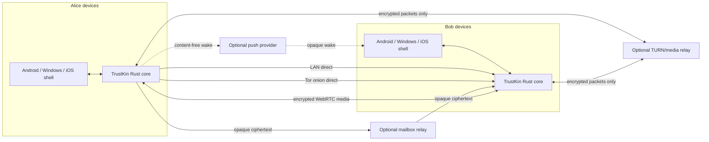
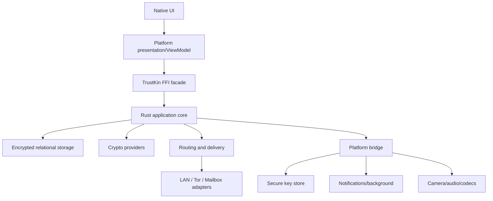
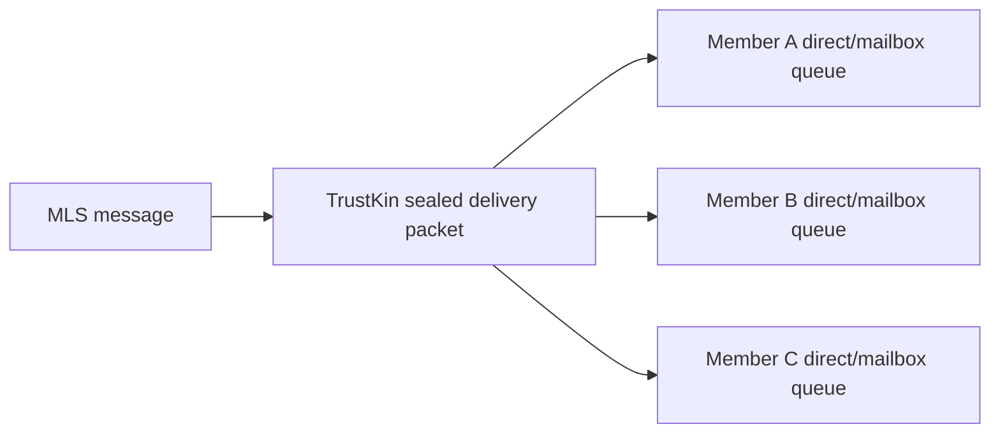
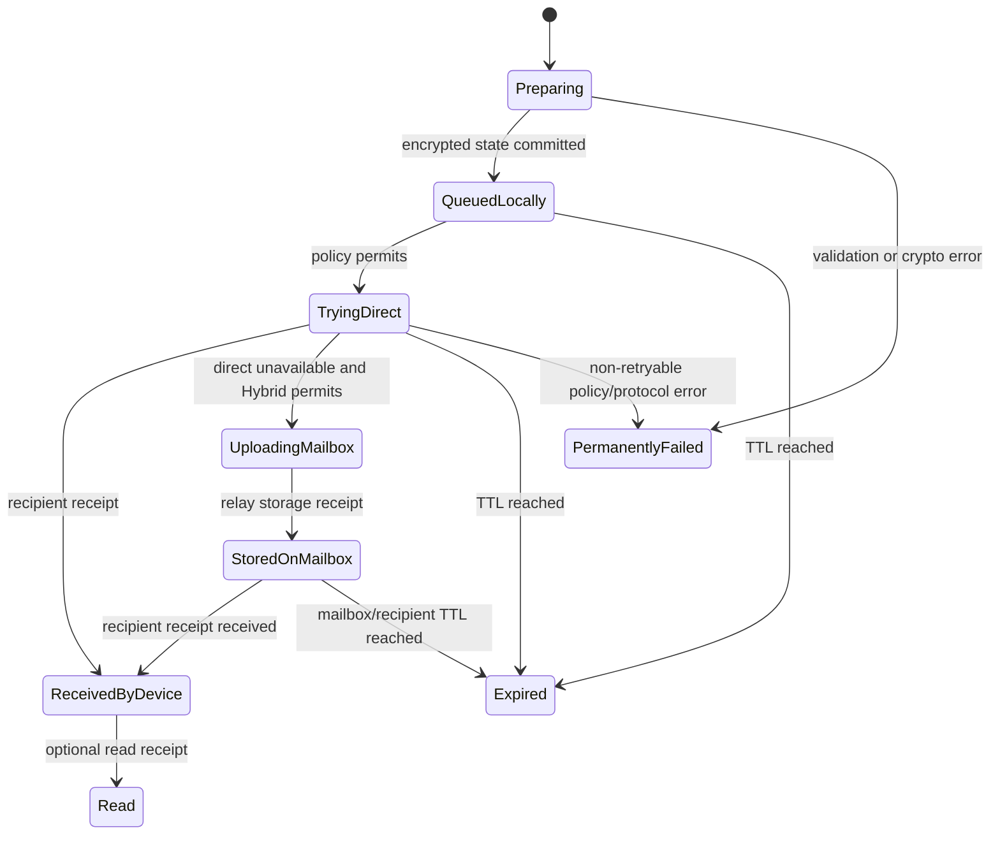
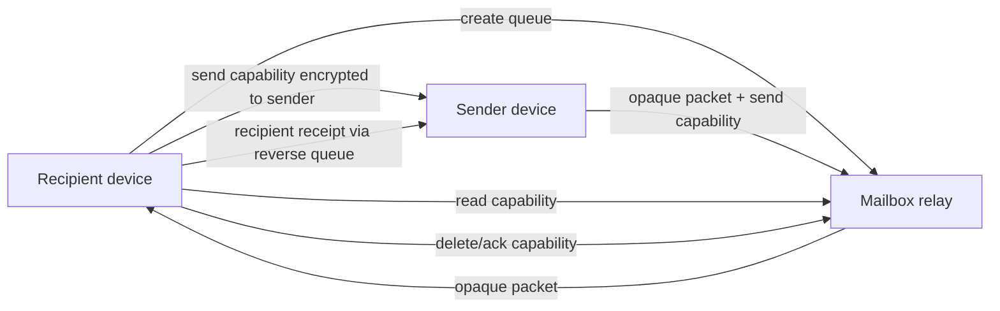

# TrustKin Technical Design Specification

**Document version:** 0.1  
**Status:** Design baseline approved for task planning  
**Date:** 2026-07-31  
**Product:** TrustKin  
**Primary platform:** Android  
**Planned platforms:** Windows, then iOS  
**Requirements input:** `requirements.md` version 0.1  
**Repository baseline inspected:** `pmchanel5/Brotherhood`, `main`, through merge commit `23de7f8f92f88d7557697239f902f26e3a3d5505`

## 1. Purpose

This document defines the target architecture for transforming the current Brotherhood Android alpha into TrustKin: a public, open-source, privacy-focused messenger with two primary operating modes:

1. **Pure P2P:** direct LAN and/or Tor delivery, with no mailbox storage.
2. **Hybrid:** direct delivery plus optional capability-based store-and-forward mailboxes.

The design covers the shared client core, cryptographic protocols, group messaging, multi-device identity, routing, the reference mailbox relay, local storage, background reliability, message requests, calls, metadata hardening, platform boundaries, security engineering, and the clean rename/rewrite from Brotherhood to TrustKin.

This is an architectural specification. Concrete work items, ownership, milestones, and timelines belong in `task.md`.

## 2. Approved design decisions

| ID | Decision |
|---|---|
| D1 | Shared Rust core with native platform shells. |
| D2 | Adopt an established Signal-style one-to-one protocol implementation; do not invent an unaudited custom messenger protocol. |
| D3 | Pairwise secure-session groups may be used only during private alpha; MLS replaces them before public beta. |
| D4 | Stable 1.0 uses hybrid post-quantum session establishment; post-quantum group security follows later unless safely available earlier. |
| D5 | Mailbox protocol uses HTTPS/HTTP/2 and SMP-inspired capabilities; a compatible custom binary transport may be added later. |
| D6 | Reference relay uses Rust, Axum, and SQLite initially. |
| D7 | Relay discovery combines bundled starter descriptors, optional signed community directories, and manual entry. |
| D8 | One mailbox queue per relationship and direction; rotating queue epochs are designed for later addition. |
| D9 | Message-link identity exposure is user-selectable: verified, temporary, and later anonymous forms. |
| D10 | One root identity authorizes independent, revocable device identities. |
| D11 | Backups offer selectable scopes. |
| D12 | Client state uses an encrypted relational database. |
| D13 | The UI provides Maximum Privacy, Balanced, and Maximum Reliability presets. |
| D14 | Calls use WebRTC-compatible media; audio is implemented before video. |
| D15 | Rewrite immediately around the final shared-core architecture. |
| D16 | Rename package/application now; current alpha data may be discarded. |

## 3. Design goals

TrustKin MUST be designed so that:

- no mandatory central TrustKin account or message database exists;
- clients remain authoritative for identities, relationships, sessions, message history, and group state;
- direct communication remains available without a mailbox operator;
- optional relays cannot decrypt message contents;
- a compromised relay does not reveal a global account database or complete social graph;
- one cryptographic and protocol implementation is reused across Android, Windows, and iOS wherever practical;
- transport, storage, cryptography, notifications, UI, and platform integrations remain replaceable behind explicit interfaces;
- protocol formats are versioned, bounded, testable, and independently implementable;
- security-sensitive behavior fails closed;
- privacy claims remain accurate and do not promise perfect anonymity or security after full endpoint compromise.

## 4. Explicit architectural non-goals

Before stable 1.0, the architecture does not need to provide:

- public channels or communities larger than 20 identities;
- searchable global usernames or a central contact directory;
- one identity hosting several isolated personas on the same device;
- project-operated public mailbox infrastructure;
- group voice/video calls;
- large social-network feeds;
- guaranteed delivery latency in Pure P2P mode;
- protection after an attacker fully controls the operating system or active application process.

## 5. Current implementation and rewrite boundary

### 5.1 Current reusable assets

The current Brotherhood repository provides useful prototypes and test knowledge:

- Kotlin and Jetpack Compose Android UI;
- local onboarding, contacts, chats, groups, settings, and diagnostics flows;
- LAN transport and framing concepts;
- Android Tor runtime integration using Briar's wrapper and Tor Android binaries;
- transport lifecycle coordination across UI, foreground service, and WorkManager;
- image normalization and metadata removal;
- voice recording, chunking, integrity checking, retry, and playback;
- queue, backoff, receipt, replay, and deduplication concepts;
- Android Keystore persistence lessons;
- regression tests for Tor/emulator transport recovery and background behavior.

These are references and migration inputs, not the target security architecture.

### 5.2 Components to replace

The following current structures MUST NOT become the production TrustKin core:

- the static ECIES-to-identity-key message protocol;
- the current ECDSA/ECIES application envelope as the final public protocol;
- pairwise static group encryption;
- the single serialized encrypted application-state file;
- Android-only domain and protocol logic;
- `org.brotherhood.app` package and Brotherhood branding;
- the existing Python/Cloudflare prototype as an active product component.

### 5.3 Rewrite strategy

TrustKin starts a new package and architecture immediately:

- new Android application ID: `org.trustkin.app`;
- new root project name: `TrustKin`;
- no production migration from the current Brotherhood alpha database;
- current alpha preserved through a Git tag/archive branch for reference;
- new active code organized around a Rust workspace and native shells;
- legacy Python/Cloudflare code removed from production build paths and archived separately.

The rewrite may reuse isolated platform code only after it is moved behind the new interfaces and reviewed against the new threat model.

## 6. System context



### 6.1 Trust boundaries

| Component | Trusted for confidentiality? | Trusted for availability? | May observe |
|---|---:|---:|---|
| Local client core | Yes, while endpoint is not compromised | Partly | Plaintext and local relationship state |
| Platform shell | Yes, within OS boundary | Partly | UI content, OS events, notifications |
| LAN transport | No | No | Local IPs, timing, sizes |
| Tor network | No single relay | No guarantee | Partial traffic metadata; correlation remains possible |
| Mailbox relay | No | Best effort | Queue activity, sizes, timing, direct IP if HTTPS is used without Tor |
| Push provider | No | Best effort | Opaque wake token and timing only |
| TURN relay | No | Best effort | Call timing, size, IP metadata; no plaintext media |
| Relay directory | No | Best effort | Relay discovery requests |

## 7. Repository and workspace layout

```text
trustkin/
  Cargo.toml                    # Rust workspace
  rust-toolchain.toml
  LICENSE
  README.md

  crates/
    trustkin-core/              # use cases, state machines, orchestration
    trustkin-model/             # domain models and IDs
    trustkin-protocol/          # canonical wire formats and versioning
    trustkin-crypto/            # provider traits and common crypto policy
    trustkin-signal-adapter/    # selected one-to-one provider adapter
    trustkin-mls/               # MLS/OpenMLS adapter
    trustkin-routing/           # policy engine and delivery state machine
    trustkin-mailbox-client/    # mailbox capability client
    trustkin-storage/           # relational repositories and migrations
    trustkin-attachments/       # encrypted chunking and manifests
    trustkin-backup/            # encrypted export/import containers
    trustkin-ffi/               # UniFFI and stable C boundary
    trustkin-testkit/           # deterministic clocks, fake transports, vectors

  apps/
    android/
      app/                      # Kotlin/Compose shell
      platform/                 # Keystore, services, notifications, Tor runtime
    windows/
      src-tauri/                # reference Windows shell
      ui/                       # desktop UI
    ios/
      TrustKin/                 # SwiftUI shell

  services/
    mailbox-relay/              # Axum relay service
    personal-mailbox/           # single-user deployment/companion mode
    relay-directory/            # signed static-directory tooling, not mandatory

  protocol/
    cddl/                       # canonical CBOR schemas
    test-vectors/
    conformance/
    versions/

  docs/
    requirements.md
    design.md
    task.md
    threat-model.md
    protocol.md
    mailbox-protocol.md
    security.md
    privacy.md
    adr/

  tools/
    release/
    sbom/
    reproducibility/
    fuzz/

  legacy/
    README.md                   # points to immutable Brotherhood archive/tag
```

The active production build MUST NOT depend on `legacy/`.

## 8. Shared Rust core and platform boundary

### 8.1 Core responsibilities

The Rust core owns:

- identity and device-certificate models;
- contact and relationship state;
- one-to-one session orchestration;
- MLS group state;
- canonical protocol serialization;
- message-request processing;
- routing-policy evaluation;
- outbound/inbound delivery state machines;
- mailbox queue and capability state;
- receipts, retries, deduplication, expiry, and replay protection;
- encrypted database schema and migrations;
- attachment encryption, chunking, integrity, and resumption;
- backup container creation and validation;
- security-policy enforcement;
- local diagnostic event generation without sensitive values.

### 8.2 Platform-shell responsibilities

Platform shells own:

- UI and accessibility;
- application lifecycle;
- biometric and system-credential prompts;
- Android Keystore, Windows DPAPI/Windows Hello, and Apple Keychain/Secure Enclave adapters;
- notification providers and tokens;
- foreground/background execution primitives;
- camera, QR scanning, microphone, speaker, and media codecs;
- network-change and battery signals;
- embedded Tor runtime lifecycle;
- OS file pickers and sharing;
- store-specific distribution behavior.

### 8.3 FFI strategy

- **Android and iOS:** UniFFI-generated Kotlin and Swift bindings.
- **Windows/Tauri:** direct Rust calls inside the Tauri command layer.
- **Alternative Windows shell:** a stable C ABI generated with `cbindgen` if WinUI or another native shell is selected later.
- FFI methods MUST be coarse-grained use cases, not chatty database primitives.
- FFI payloads MUST use typed records and byte arrays, not raw JSON strings for security-critical state.
- Exceptions/errors MUST map to stable error codes plus localized UI messages.



## 9. Protocol encoding and versioning

### 9.1 Encoding

TrustKin protocol records use **deterministic CBOR** with published CDDL schemas.

Constraints:

- no floating-point values in signed protocol records;
- duplicate map keys are rejected;
- shortest integer and length encodings are required;
- unknown critical fields cause rejection;
- unknown explicitly extensible fields are retained or ignored as specified;
- all collections, strings, and byte arrays have explicit maximum sizes;
- signatures cover the exact canonical encoded bytes, not a reserialized object graph;
- every top-level object contains a protocol version and object type.

Mailbox HTTP descriptors and human-readable error responses MAY use JSON. Mailbox message bodies remain opaque `application/octet-stream` values.

### 9.2 Version domains

Versions are separated so one component can evolve without forcing all others to change:

- `client_schema_version`
- `identity_protocol_version`
- `session_suite_id`
- `group_suite_id`
- `delivery_packet_version`
- `mailbox_api_version`
- `backup_format_version`
- `relay_descriptor_version`

Downgrades below a contact's previously accepted security level MUST be rejected unless the user explicitly performs a documented recovery/reset flow.

## 10. Identity and multi-device model

### 10.1 Root identity

Each TrustKin identity contains a long-lived root signing identity used to authorize devices and identity-level changes. It is not used directly to encrypt every message.

```text
Root Identity
  root_identity_id
  root_signing_public_key
  safety_number / fingerprint
  identity_revision
```

`root_identity_id` is derived from the root public key with domain-separated hashing.

### 10.2 Device identities

Every installation generates independent device material:

```text
Device Certificate
  root_identity_id
  device_id
  device_signing_public_key
  session/prekey public material
  capabilities
  created_at
  expires_at or rotation policy
  device_revision
  root_identity_signature
```

Properties:

- no private root or device key is shared merely to add another device;
- each device has independent sessions and mailbox queues;
- contacts trust the root identity and a signed device list;
- device revocation increments a signed device-list revision;
- messages are fanned out to every active recipient device according to policy;
- a compromised device can be revoked without replacing the root identity;
- key-change warnings distinguish root identity replacement from normal device addition.

### 10.3 Device linking

Primary flow:

1. New device creates an ephemeral linking key and displays a QR code.
2. Existing trusted device scans the QR code.
3. Both devices display a short authentication string.
4. User confirms both ends.
5. Existing device signs the new device certificate.
6. State selected by the user is transferred over an ephemeral authenticated encrypted channel.
7. The new device creates its own sessions and mailbox queues.
8. Contacts receive a signed device-list update.

Remote linking MAY use Tor or a temporary mailbox channel, but MUST preserve the same authenticated confirmation.

## 11. One-to-one cryptographic architecture

### 11.1 Required protocol family

The one-to-one provider MUST implement an established asynchronous secure-messaging construction with:

- authenticated prekey-based session setup;
- forward secrecy;
- post-compromise recovery;
- unique message keys;
- out-of-order delivery support;
- replay handling;
- session reset and key-change detection.

The target family is:

- public beta: X3DH-equivalent authenticated asynchronous setup plus Double Ratchet;
- stable 1.0: hybrid PQXDH-style setup using classical and ML-KEM secrets, followed by an audited ratchet profile;
- later: Triple Ratchet or equivalent continuous post-quantum ratcheting when mature, interoperable, and audited.

### 11.2 Crypto provider interface

```rust
trait OneToOneCryptoProvider {
    fn create_device_identity(&self) -> DeviceCryptoIdentity;
    fn create_prekey_bundle(&self, policy: PrekeyPolicy) -> PrekeyBundle;
    fn verify_prekey_bundle(&self, bundle: &[u8]) -> VerifiedPrekeyBundle;
    fn initiate_session(&self, peer: VerifiedPrekeyBundle) -> SessionInitiation;
    fn accept_session(&self, initial: &[u8]) -> AcceptedSession;
    fn encrypt(&self, session_id: SessionId, plaintext: &[u8], aad: &[u8]) -> CipherMessage;
    fn decrypt(&self, session_id: SessionId, message: &[u8], aad: &[u8]) -> PlainMessage;
    fn export_opaque_state(&self, session_id: SessionId) -> SecretStateBlob;
    fn delete_session(&self, session_id: SessionId);
}
```

The rest of TrustKin treats provider session state as opaque.

### 11.3 Provider adoption gate

The preferred candidate is the official Rust-backed Signal `libsignal`, but it MUST NOT be adopted silently. Before integration, the project MUST complete an architecture decision record covering:

- AGPLv3 implications for a GPLv3-or-later TrustKin distribution;
- whether TrustKin will move the combined client to AGPLv3-or-later or obtain another lawful arrangement;
- upstream's warning that use outside official Signal applications is unsupported;
- API stability and update burden;
- Android, Windows, and iOS packaging;
- F-Droid reproducibility;
- dependency and supply-chain review;
- external audit scope.

If that gate fails, TrustKin MUST select another maintained, independently audited implementation of the published protocol family. TrustKin MUST NOT substitute an unaudited in-house implementation merely to avoid licensing or integration work.

### 11.4 Prekey distribution

Prekeys are associated with individual devices.

- Pure P2P invitations include a bounded signed device list, signed prekey, and a small batch of one-time prekeys.
- Established Pure P2P contacts refresh prekeys during direct sessions.
- Hybrid contacts may publish capability-protected prekey bundles through their chosen mailbox relay.
- Message-me links include either embedded one-time material or a capability to retrieve a bounded signed bundle.
- Relays can observe public prekey blobs but cannot forge them because they are authenticated by the device/root identity.
- Prekey reuse, depletion, rotation, and last-resort-key use are surfaced in local diagnostics.

### 11.5 Associated data

Every encrypted application message binds at least:

- protocol and suite version;
- sender root identity and device certificate hash;
- recipient root identity and device certificate hash;
- logical conversation identifier;
- message identifier;
- content type;
- expiry/disappearing policy;
- reply/reaction relationship where applicable.

Sensitive identifiers are included inside the sealed encrypted packet whenever routing does not require them outside.

## 12. Group cryptographic architecture

### 12.1 Private-alpha transition

During private alpha only, a group message MAY be copied into independent one-to-one ratcheted sessions for each member. This temporary design MUST be clearly marked non-final and removed before public beta.

### 12.2 Public-beta MLS design

Public beta uses MLS as specified by RFC 9420 through a reviewed Rust implementation, with OpenMLS as the preferred candidate.

The TrustKin MLS adapter owns:

- group creation;
- member KeyPackages;
- Welcome messages;
- proposals and commits;
- group epochs;
- member add/remove/update;
- state persistence;
- fork/conflict handling;
- periodic self-updates for post-compromise recovery;
- application-message encryption/decryption;
- authenticated group metadata revisions.

### 12.3 Delivery-service mapping

MLS assumes an untrusted delivery service. TrustKin maps that role onto its existing transports:



The mailbox relay sees queue activity and padded ciphertext, not the MLS group ID, epoch, membership, or application content. These values remain inside the TrustKin sealed packet where feasible.

### 12.4 Group identity and authorization

- A group has a random 256-bit `group_id` visible only to members.
- The creator is the initial administrator.
- Administrative roles are represented by authenticated application policy layered on MLS.
- Membership changes require valid MLS commits and TrustKin authorization policy.
- A removed member loses access to future epochs but retains already received plaintext.
- Groups remain limited to 20 identities through stable 1.0.

### 12.5 Post-quantum group path

Post-quantum MLS ciphersuites or extensions are not required for stable 1.0 under the approved design unless a mature implementation is available. The MLS adapter MUST remain suite-agile and store the selected suite with group state so a later reinitialization can upgrade the group.

## 13. Sealed delivery packet

All transports carry the same opaque delivery abstraction.

```text
DeliveryPacket
  packet_version
  suite_id
  delivery_id                 # random and idempotent
  padded_ciphertext
  expiry_class
  optional relay receipt request
```

The encrypted inner content contains:

```text
InnerEnvelope
  sender root/device identity
  recipient root/device identity
  session or MLS payload
  logical message ID
  content manifest
  timestamps
  disappearing policy
  reply/reaction metadata
  receipt route
  protocol extensions
```

Properties:

- relay-visible headers contain no user name, contact ID, conversation ID, or group ID;
- `delivery_id` prevents duplicate display across direct and mailbox attempts;
- packet size is padded into configured buckets;
- the receiver persists authenticated state before issuing a recipient receipt;
- a valid duplicate receives another receipt without creating another visible message.

## 14. Invitations and message requests

### 14.1 Invitation types

TrustKin supports:

1. **Mutual contact invitation** — intended to establish a trusted relationship.
2. **One-time message-request link** — one successful initial request.
3. **Reusable message-me link** — multiple requests until expiry/revocation.
4. **Anonymous dropbox link** — stable 1.0 feature, isolated from normal contacts.

### 14.2 Link privacy modes

Users choose among:

- **Verified link:** temporary inbox key is signed by the stable TrustKin root identity.
- **Temporary link:** independent temporary inbox identity; stable identity is revealed only after acceptance.
- **Anonymous dropbox:** sender may use an ephemeral identity and optional temporary reply route.

One-time links default to the temporary-link mode. Reusable public links support rotation and short policy-defined epochs.

### 14.3 Message-request envelope

```text
RequestEnvelope
  request_version
  inbox_id
  request_id
  sender_card or ephemeral sender key
  encrypted request content
  optional temporary reply queue
  created_at
  expires_at
  proof-of-work/admission proof when required
  sender signature when an identity is supplied
```

Unknown requests are processed by a separate request handler, not by the trusted-contact receiver.

### 14.4 Request acceptance

Acceptance:

1. verifies sender or ephemeral material;
2. prompts for fingerprint/identity verification where appropriate;
3. creates a trusted contact;
4. creates dedicated queues in both directions;
5. establishes one-to-one sessions for active devices;
6. moves the accepted first message into the new conversation;
7. retires the temporary request route when policy requires it.

### 14.5 Unknown media

- The first request fetch contains only a small encrypted manifest.
- Media is not fetched automatically.
- The user sees type, approximate size, claimed sender, and a warning.
- Executables and active-content document types are prohibited as first-contact attachments.
- Downloaded media is parsed through constrained local decoders in a sandboxed process where the platform allows it.

## 15. Operating modes and routing policy

### 15.1 Separate concepts

TrustKin separates three settings:

1. **Operating mode:** Pure P2P or Hybrid.
2. **Routing strategy:** direct-first, mailbox-first, Tor-only, relay-only, or automatic.
3. **Privacy preset:** Maximum Privacy, Balanced, or Maximum Reliability.

This avoids treating a privacy preference as if it were the same as an infrastructure choice.

### 15.2 Presets

#### Maximum Privacy

- Pure P2P: Tor direct only, unless the user explicitly enables LAN.
- Hybrid: Tor direct, then Tor-only mailbox access.
- Proprietary push disabled by default.
- Calls use Tor-compatible relay paths or fail with a warning.

#### Balanced

- LAN when local and permitted.
- Tor direct next.
- Mailbox fallback, Tor preferred with HTTPS fallback.
- Content-free push wake may be enabled.

#### Maximum Reliability

- LAN and direct permitted routes are attempted quickly.
- HTTPS mailbox access is permitted.
- Content-free push is enabled when available.
- Calls use direct ICE and TURN fallback.

### 15.3 Policy resolution

```text
EffectivePolicy =
  recipient advertised constraints
  INTERSECT local global policy
  INTERSECT per-contact override
  INTERSECT current platform capability
```

The recipient's permitted routes are authoritative. A sender cannot force mailbox storage for a Pure P2P recipient.

### 15.4 Route engine

The route engine receives:

- effective policy;
- recipient endpoints and queue descriptors;
- transport health;
- current network and battery state;
- background-execution availability;
- message size/type/expiry;
- previous attempts and backoff;
- privacy budget.

Initial public-beta behavior is deterministic and sequential. Later performance work MAY race compatible routes using a Happy-Eyeballs-style strategy, but idempotency and recipient policy MUST remain intact.

## 16. Delivery state machine



### 16.1 Persistence rules

- Message and outbound delivery rows are committed in one transaction before the UI shows `Queued locally`.
- Attempt state is updated transactionally.
- A mailbox storage receipt changes status only to `Stored on mailbox`.
- Only a verified recipient-device receipt changes status to `Received by recipient device`.
- Expiry stops retries but retains local encrypted history.
- Manual resend creates a new delivery ID and references the expired logical message.

### 16.2 Fan-out

A logical message produces delivery items for:

- each active recipient device in a one-to-one relationship;
- each active group member/device according to MLS delivery policy;
- each attachment chunk/object required by those recipients.

Conversation UI shows a summarized status while diagnostics can show per-device state.

## 17. Transport architecture

### 17.1 Transport interface

```rust
#[async_trait]
trait MessageTransport {
    fn kind(&self) -> TransportKind;
    async fn availability(&self, endpoint: &Endpoint) -> TransportAvailability;
    async fn deliver(&self, endpoint: &Endpoint, packet: &DeliveryPacket)
        -> TransportAttemptResult;
}
```

Transport implementations cannot modify plaintext or cryptographic session state.

### 17.2 LAN transport

- Uses a length-prefixed, bounded binary stream over TCP initially.
- Advertises only reachable, policy-approved local addresses.
- No public LAN discovery in the first beta; endpoints arrive through signed relationship updates.
- Authenticated application packets remain required even on a trusted Wi-Fi network.
- Connection and frame limits protect against resource exhaustion.
- Emulator-only addresses are never advertised to other devices.

A compatible QUIC or custom binary transport MAY be added later behind the same interface.

### 17.3 Tor transport

The platform Tor runtime provides:

- local SOCKS endpoint;
- onion-service creation/restoration;
- onion private-key protection;
- bootstrap and descriptor status;
- bridge/pluggable-transport configuration;
- shutdown and rotation.

The Rust core connects to peer onion services through the local SOCKS endpoint and treats Tor as a transport, not as the message-encryption layer.

Android may initially refactor the current Tor Android/Briar-wrapper integration behind `TorRuntimeBridge`. Windows may use Arti or a managed Tor daemon after a dedicated compatibility/security spike. iOS requires a separately reviewed embedded-Tor strategy.

### 17.4 Mailbox transport

The mailbox transport uploads the unchanged `DeliveryPacket`, obtains a signed storage receipt, and later receives recipient receipts through the sender's receiving queue or a direct route.

## 18. Mailbox relay architecture

### 18.1 Relay role

The relay is an untrusted temporary blob store. It does not manage TrustKin accounts, contacts, groups, usernames, conversation history, or plaintext.



### 18.2 Queue capability model

Each queue has independent high-entropy capabilities:

```text
queue_id           256-bit random identifier
send_capability    permits bounded uploads
read_capability    permits listing/fetching
ack_capability     permits acknowledging/deleting items
admin_capability   permits queue rotation/deletion/policy changes
```

- Capabilities are never derived from identity IDs.
- The relay stores keyed hashes of capabilities, not plaintext capability values.
- Read, ack, and admin capabilities never appear in invitations sent to ordinary senders.
- A relationship normally has two queues, one per direction.
- Each recipient device MAY have its own queue or a shared identity queue with per-device encrypted fan-out; the default is per-device queues for independent revocation.

### 18.3 Relay descriptor

A signed relay descriptor contains:

```text
RelayDescriptor
  descriptor_version
  relay_id and signing key
  operator display name
  HTTPS endpoints
  onion endpoints
  jurisdiction
  retention classes
  quota classes
  supported API versions
  supported padding classes
  admission policy
  privacy-policy hash/URL
  infrastructure logging disclosure
  valid_from / expires_at
  operator signature
```

The client verifies descriptors and displays material policy changes before use.

### 18.4 HTTP API

Reference API:

```text
GET    /v1/descriptor
POST   /v1/queues
DELETE /v1/queues/{queue_id}
POST   /v1/queues/{queue_id}/items
GET    /v1/queues/{queue_id}/items?cursor=...&limit=...
POST   /v1/queues/{queue_id}/acks
GET    /v1/queues/{queue_id}/watch       # optional WebSocket/long poll

POST   /v1/objects
PUT    /v1/objects/{object_id}/chunks/{n}
GET    /v1/objects/{object_id}/chunks/{n}
DELETE /v1/objects/{object_id}
```

Rules:

- capability authorization uses an explicit TrustKin authorization scheme;
- queue/item identifiers are random and unguessable;
- requests and responses have strict size and time limits;
- upload is idempotent by `delivery_id`;
- listing uses opaque cursors;
- batch acknowledgement is crash-safe;
- relay errors reveal no existence information to unauthorized callers;
- relay operators MAY require invitation/admission tokens or proof-of-work for queue creation.

### 18.5 Storage receipts

```text
RelayStorageReceipt
  relay_id
  queue_id_hash
  delivery_id
  stored_at
  expires_at
  size_class
  relay_signature
```

The client verifies the relay signature. This receipt proves only that the selected relay accepted the blob under its policy.

### 18.6 Relay storage

Initial reference implementation:

- Rust/Axum service;
- SQLite in WAL mode;
- transactional item insertion and acknowledgement;
- periodic TTL cleanup;
- filesystem or SQLite blob storage for small packets;
- separate encrypted-object directory for attachments;
- no message decryption keys;
- no persistent source-IP logging;
- no default reverse-proxy access log;
- bounded in-memory rate-limit state plus optional privacy-preserving abuse counters.

Larger community operators MAY use PostgreSQL/object storage through the same repository interface, but the protocol does not depend on the backend.

### 18.7 Retention and quota defaults

- ordinary packets: 7 days;
- message requests: 72 hours;
- image/voice objects: 3 days;
- incomplete objects: 3 to 7 days;
- maximum 100 pending queue items;
- default queue storage approximately 10–25 MiB;
- shorter user-selected retention is permitted;
- authenticated acknowledgement triggers deletion as soon as crash-safe processing allows.

### 18.8 Attachment object store

Messages do not embed large Base64 media.

```text
EncryptedObjectManifest
  object_id
  object_key
  MIME class
  encrypted size
  plaintext size
  chunk size/count
  per-chunk hashes
  whole-object hash
  expiry
  download/delete capabilities
```

- Objects are encrypted client-side with a random per-object key.
- The manifest is included inside the end-to-end encrypted message.
- The relay sees only random object IDs, encrypted chunks, size class, and expiry.
- Chunks support resumable upload/download.
- Content-addressing uses ciphertext hashes, never plaintext hashes visible to the relay.

### 18.9 Personal mailbox mode

The same relay protocol supports:

- Docker on Linux/Windows/NAS;
- a single-user home-server profile;
- a spare Android-device companion with a visible foreground service;
- Tor-only exposure without public port forwarding.

Personal mailbox mode uses stricter defaults and may accept queues only from the owner's signed provisioning token.

### 18.10 Relay discovery

Clients support:

1. bundled non-authoritative starter descriptors;
2. multiple optional signed community directory sources;
3. QR/paste/manual relay descriptors;
4. direct custom HTTPS or onion descriptors.

A directory cannot authorize message access. It merely distributes signed relay descriptors. Users can disable all directories and use only manually supplied relays.

## 19. Metadata-hardening design

### 19.1 Public-beta protections

- one queue per relationship, direction, and normally recipient device;
- no stable user ID in relay-visible packets;
- sender identity inside sealed ciphertext;
- Tor-only relay option;
- size padding buckets for ordinary packets;
- attachments separated from normal message packets;
- randomized polling jitter;
- no persistent IP logs in reference relay software;
- short retention and immediate acknowledged deletion;
- capability rotation on block/revocation;
- per-link temporary inbox identities;
- push payloads contain only opaque wake handles.

Initial packet padding classes:

```text
1 KiB, 4 KiB, 16 KiB, 64 KiB, 256 KiB
```

Larger payloads use the encrypted object store.

### 19.2 Post-beta protections

- rotating queue epochs;
- multiple redundant relays;
- optional dummy polling or cover traffic;
- relay selection diversity;
- batch fetch/ack timing smoothing;
- more advanced padding profiles;
- private relay-directory retrieval;
- post-quantum MLS upgrades.

Cover traffic is opt-in because it consumes battery and network data and cannot guarantee protection from a global observer.

## 20. Synchronization and offline behavior

### 20.1 Device-local authority

There is no central canonical chat history. Each device has a local encrypted view derived from authenticated events it has received.

### 20.2 Event model

Conversation operations are represented as immutable logical events:

- message created;
- edit/replacement;
- reaction added/removed;
- remote-delete request;
- disappearing expiry;
- receipt;
- group membership commit;
- device-list update.

Events have stable logical IDs, author device IDs, authenticated ordering context, and conflict rules.

### 20.3 Multi-device synchronization

A user's devices synchronize by sending end-to-end encrypted device-sync events through direct or mailbox routes. There is no plaintext sync server.

- outgoing messages are copied to the user's other active devices;
- incoming messages are delivered independently to each active device;
- read state synchronizes only when enabled;
- local deletion may remain device-local;
- identity-level operations use signed monotonically increasing revisions;
- session state is never naively copied after it has advanced independently.

### 20.4 Conflict handling

- duplicate events collapse by logical ID;
- reactions form an add/remove set keyed by author and reaction ID;
- edits use an authenticated sequence per original message;
- device-list and group updates reject stale revisions/epochs;
- disappearing-message expiry uses authenticated policy plus local monotonic timers;
- severe divergence produces a visible repair/reset flow rather than silent rollback.

## 21. Local database and encrypted media

### 21.1 Database

TrustKin uses SQLCipher-compatible encrypted SQLite through the Rust storage layer.

Core tables include:

```text
identity_roots
local_devices
authorized_devices
contacts
contact_devices
safety_verifications
prekeys
one_to_one_sessions
conversations
messages
message_events
delivery_items
receipts
groups
mls_state
mailbox_relays
mailbox_queues
invitations
message_requests
attachments
attachment_chunks
reports
settings
schema_migrations
```

- Foreign keys are enabled.
- All state transitions use transactions.
- Migrations are forward-only and tested from every supported released schema.
- Database backups are disabled at the OS level unless explicitly exported through TrustKin.
- Search indexes remain inside the encrypted database.

### 21.2 Media files

Media is stored outside the database as encrypted files:

- random filename;
- random per-file data key;
- authenticated chunk encryption;
- key and manifest stored inside SQLCipher;
- no plaintext thumbnails on disk;
- temporary decode/playback files cleaned best-effort;
- cache eviction never deletes undelivered outbound material without explicit state transition.

### 21.3 Root storage key

TrustKin generates a random 256-bit Root Storage Key (RSK). The RSK protects the SQLCipher key and media-key hierarchy.

Unlock methods create independent encrypted envelopes for the RSK:

- passphrase/PIN envelope using Argon2id-derived material and platform binding;
- biometric/system-credential envelope using platform secure storage;
- backup envelope using export-passphrase material.

A PIN MUST participate in cryptographic unlocking; it is not merely a UI boolean as in the current alpha.

### 21.4 Platform key protection

- Android: Android Keystore; hardware-backed/StrongBox used when available and tested.
- Windows: DPAPI/Windows Hello-backed key protection; TPM-backed options where available.
- iOS: Keychain with access-control policies; Secure Enclave used for suitable non-exportable operations.

The core receives unwrapped key material only for the minimum active lifetime and never writes it to logs.

## 22. Duress design

### 22.1 Recognition

The unlock boundary verifies normal and duress credentials in a timing-resistant flow before opening the main database.

### 22.2 Default local silent erase

On valid duress credential:

1. delete platform key aliases and RSK unlock envelopes;
2. delete local device/session key material;
3. delete mailbox read/ack/admin capabilities;
4. delete the encrypted database and encrypted media index;
5. delete notification caches and temporary files;
6. perform best-effort filesystem cleanup;
7. avoid an explicit "duress wipe completed" message.

Physical flash erasure is not guaranteed.

### 22.3 Optional network revocation

When selected and network is available, TrustKin attempts, before final key destruction and within a strict timeout, to:

- publish a signed device-revocation statement;
- delete/rotate mailbox queues using capability credentials;
- revoke active invitation capabilities;
- notify linked devices through encrypted control messages.

If offline or unsuccessful, local erase proceeds. The UI MUST describe network revocation as best effort, not guaranteed.

### 22.4 Cover behavior

After duress processing, the app returns to a generic unavailable/fresh-state flow without identifying the entered credential as a duress PIN. TrustKin cannot guarantee concealment from an observer who knows what data was previously present.

## 23. Backup and recovery

### 23.1 Export scopes

1. **Identity recovery:** root identity, device authorization seed/recovery material, contacts, and safety state.
2. **Relationships:** identity plus groups, relay descriptors, relationship metadata, and non-live session setup data.
3. **Full local backup:** encrypted history and encrypted media in addition to the above.

### 23.2 Backup container

`trustkin-backup-v1` is a versioned authenticated container:

```text
public header
  format version
  Argon2id parameters
  random salt
  chunking parameters

encrypted manifest
  scope
  identity metadata
  schema version
  object list

encrypted chunks
  database/history/media objects

authentication footer
```

### 23.3 Anti-rollback rule

A restored backup MUST NOT silently restore an old live ratchet or MLS state over a newer state.

- Identity-only and relationship restores create a new device and re-establish sessions.
- Full-history restore imports history but still creates a new active device/session state.
- Direct device-to-device transfer may migrate live state only through a coordinated handoff that marks the source state transferred or rotates sessions afterward.

## 24. Notifications and background reliability

### 24.1 Android build variants

- `play`: optional FCM wake adapter.
- `foss`: UnifiedPush, foreground service, WorkManager, polling, manual refresh; no proprietary Google dependency.
- `direct`: configurable mix for GitHub/site APK distribution.

The protocol core is identical across variants.

### 24.2 Wake payload

A push provider receives only:

```text
wake_channel_id
random event nonce
coarse urgency class
```

It receives no sender, recipient, conversation, message type, content, relay queue ID, or onion address.

### 24.3 Availability modes

- **Always available:** visible foreground service; active direct transports and mailbox watch/poll.
- **Balanced:** content-free wakes plus bounded periodic work.
- **Only while open:** no persistent background network ownership.
- **Strict P2P:** no proprietary push; foreground/manual behavior only.

### 24.4 Android minimum

Public beta targets **Android 10 / API 29 or later**. The previous Android 9 alpha remains archived. API 29 removes the legacy voice-codec branch, reduces the device matrix, and provides a cleaner baseline for the rewritten security architecture. The target SDK is kept at the current store-required level at each release.

### 24.5 Reliability rules

- A wake is only a hint; clients always reconcile queues on launch/resume/network change.
- Background work is idempotent.
- Force Stop and manufacturer restrictions are disclosed.
- Hybrid mode remains usable even when wakes are delayed because ciphertext waits at the mailbox.
- Pure P2P delivery may require overlapping availability.

## 25. Calls

### 25.1 Scope

Stable 1.0 supports one-to-one voice and video calls. Group calls are post-1.0.

### 25.2 Signaling

- Call offers, answers, ICE candidates, capability negotiation, and hang-up events travel inside the existing end-to-end encrypted one-to-one session.
- No plaintext signaling service is required.
- Replay and stale-call protections bind signaling to a random call ID and expiration window.

### 25.3 Media

- WebRTC-compatible DTLS-SRTP media stack.
- Direct ICE path attempted first when policy permits.
- Hybrid mode may use community/self-hosted TURN.
- TURN forwards encrypted media packets and stores no media.
- Tor-routed calls use a reviewed TCP/TURN-over-Tor path and display latency/reliability warnings; they may fail when acceptable performance is unavailable.
- Voice calling is implemented and validated before video.

### 25.4 IP disclosure

Before a direct call, the UI states that the peer may learn the user's network address. Maximum Privacy prevents direct candidates unless the user explicitly overrides the policy.

## 26. UI and navigation architecture

### 26.1 Primary navigation

```text
Chats
Requests
Contacts
Groups
Settings
```

Calls are entered from trusted one-to-one conversations.

### 26.2 Onboarding

1. 18+ notice and product limitations.
2. Create identity and secure unlock method.
3. Choose availability mode.
4. Choose Pure P2P or Hybrid.
5. Select privacy preset.
6. If Hybrid, select or add a relay and review its descriptor.
7. Optional recovery export reminder.
8. Display safety number and create first invitation.

### 26.3 Security state visibility

Every conversation can display:

- verified/unverified identity state;
- contact key-change warning;
- active recipient devices;
- effective routing mode;
- last delivery path, without exposing sensitive diagnostic details;
- disappearing policy;
- read-receipt state.

### 26.4 Requests inbox

Requests remain isolated from trusted chats. Each request provides:

- claimed identity or anonymous/temporary status;
- fingerprint where applicable;
- text preview;
- media manifest warning;
- Accept, limited Reply, Delete, Block, and Report actions.

### 26.5 Relay settings

Users can inspect:

- operator;
- jurisdiction;
- retention/quota;
- Tor support;
- infrastructure logging disclosure;
- descriptor signature/fingerprint;
- current health;
- queues using that relay;
- export/replace/rotate controls.

## 27. Reporting and safety design

### 27.1 Local-first behavior

Reporting always blocks the selected identity locally. No conversation is uploaded automatically.

### 27.2 Evidence bundle

The user explicitly selects evidence. The app builds a signed `TrustKinEvidenceBundle` containing only selected material:

- selected decrypted message text or attachment copy;
- sender root/device certificate and safety identifier;
- selected timestamps;
- relay receipt/queue capability fingerprint where relevant;
- minimal diagnostic events;
- user's statement.

The app presents a final review before sending.

### 27.3 Destinations

A report can be sent only to:

- the operator of the currently involved relay, when applicable; and
- the TrustKin project safety contact.

The project safety contact may contact an external authority after review under published policy and applicable law. Ordinary private conversations are never silently reported.

### 27.4 Relay response

A relay operator can:

- revoke a reported public-request capability;
- deny a queue/capability fingerprint;
- apply rate limits;
- preserve only the evidence voluntarily included by the reporter according to published policy.

There is no global TrustKin account ban.

## 28. Security engineering

### 28.1 Secure-development baseline

- threat model maintained beside code;
- architecture decision records for cryptographic and privacy-sensitive choices;
- no unsafe Rust in TrustKin code without a reviewed exception;
- dependency pinning and lock files;
- `cargo deny`, `cargo audit`, OSV scanning, and Gradle dependency verification;
- secret scanning;
- fuzzing for every network/parser boundary;
- property-based tests for state machines;
- constant-time primitives from reviewed libraries;
- no home-grown cryptographic primitives;
- build hardening and release symbol separation;
- code review required for crypto, storage, routing, and FFI changes.

### 28.2 Protocol test vectors

Public vectors cover:

- identity and device certificates;
- invitations and link parsing;
- one-to-one setup and ratchet transitions;
- skipped/out-of-order messages;
- MLS group creation and membership changes;
- delivery packets and padding;
- mailbox capability authorization;
- receipts;
- backup containers;
- device linking and revocation.

### 28.3 Fuzz targets

- deterministic CBOR decoder;
- invitation parser;
- request-envelope parser;
- delivery packet parser;
- relay HTTP request bodies;
- attachment manifests;
- MLS message wrapper;
- backup importer;
- database migration inputs;
- FFI boundary records.

### 28.4 External review gates

- focused review of one-to-one provider adoption;
- OpenMLS integration review before public beta;
- mailbox protocol and reference relay penetration test;
- full independent cryptographic and implementation audit before stable 1.0;
- remediation of all critical/high findings before 1.0.

## 29. Diagnostics and logging

### 29.1 Structured local events

Diagnostics use a bounded structured event model:

```text
DiagnosticEvent
  event_code
  coarse timestamp
  component
  severity
  non-sensitive numeric/status fields
```

No event contains:

- plaintext;
- private keys;
- PIN/passphrase material;
- full onion addresses;
- mailbox capabilities;
- full contact/device identifiers;
- attachment contents.

### 29.2 Relay logging

- application access logs disabled by default;
- source IP never written by reference application code;
- reverse-proxy deployment guide disables access logging;
- operators must disclose unavoidable provider/network logs;
- metrics use aggregate queue/item counts and latency histograms without stable identifiers;
- Tor-only mode is recommended when upstream IP observation is unacceptable.

## 30. Build, distribution, and updates

### 30.1 Build matrix

- Android Play, F-Droid, and direct variants;
- Windows signed installer and portable verification package;
- iOS App Store/TestFlight package later;
- relay Linux static/container images and Windows binary;
- personal-mailbox container and companion build.

### 30.2 Supply-chain artifacts

Each release produces:

- signed source tag;
- checksums;
- CycloneDX or SPDX SBOM;
- dependency/license report;
- provenance attestation;
- protocol compatibility declaration;
- migration notes;
- known-security-limitations document.

### 30.3 Reproducibility

- pinned Rust toolchain;
- Gradle dependency verification;
- locked Cargo dependencies;
- deterministic generated bindings;
- documented containerized build environment;
- F-Droid-compatible source build;
- independent rebuild instructions;
- reproducibility differences treated as release blockers for stable 1.0 unless documented and independently verified.

### 30.4 Updates

- Store builds use their store update channels.
- Direct APK and Windows builds verify a signed update manifest.
- Update metadata contains no user identifier.
- Clients refuse known critically vulnerable protocol versions.
- Protocol refusal policy is signed and bundled with releases; optional network retrieval is not required for Pure P2P operation.

## 31. Migration from Brotherhood to TrustKin

### 31.1 Repository transition

1. Tag current state as the final Brotherhood experimental alpha.
2. Rename repository/project documentation to TrustKin.
3. Move or remove legacy Python/Cloudflare production paths.
4. Create Rust workspace and new `apps/android` module.
5. Set application ID to `org.trustkin.app`.
6. Create new signing/debug identities; do not reuse an accidental development identity as the public release identity.
7. Rebuild UI flows against the TrustKin FFI facade.
8. Port reviewed Android Tor/media/background adapters behind platform interfaces.
9. Delete superseded static crypto and serialized-state code from the active application.
10. Publish a fresh TrustKin private-alpha APK.

### 31.2 Data migration

No automatic migration from Brotherhood alpha data is required. The old and new package IDs coexist, allowing testers to retain the old alpha temporarily while validating TrustKin. TrustKin onboarding clearly creates a new identity.

### 31.3 Reusable code policy

Code is copied only when:

- its behavior is covered by tests;
- it fits the new interface boundary;
- licensing is known;
- it does not preserve the old protocol or state assumptions;
- security-sensitive code receives explicit review.

## 32. Test architecture

### 32.1 Test layers

1. Rust unit tests.
2. Property-based state-machine tests.
3. Protocol vector tests.
4. FFI contract tests.
5. Relay conformance tests.
6. Network simulation tests.
7. Android instrumentation tests.
8. Two-device physical tests.
9. Cross-platform interoperability tests.
10. Penetration, fuzz, and external audit tests.

### 32.2 Network simulation

The integration harness injects:

- packet loss;
- duplicate packets;
- reordering;
- long delay;
- offline intervals;
- clock skew;
- network switching;
- relay crash/restart;
- partial attachment upload;
- lost relay receipt;
- lost recipient receipt;
- simultaneous direct and mailbox delivery;
- stale device/group revisions.

### 32.3 Physical device matrix

Public beta includes at least:

- two Android devices on one Wi-Fi network;
- two Android devices on separate networks through Tor;
- Wi-Fi/mobile transitions;
- locked-screen delivery;
- Doze and battery saver;
- reboot and process termination;
- FCM and F-Droid-compatible notification paths;
- common manufacturer restrictions;
- real voice/media transfers;
- mailbox and personal-mailbox deployments.

### 32.4 Conformance suite

Third-party clients and relays can run a public conformance suite that checks:

- strict parsing and size limits;
- queue capability separation;
- idempotency;
- receipts;
- TTL cleanup;
- metadata leakage at API level;
- protocol-version negotiation;
- test-vector compatibility.

## 33. Performance and capacity budgets

These are initial engineering budgets, not user-visible guarantees:

- queueing a text message locally: target under 150 ms on supported mid-range Android hardware;
- UI interactions remain responsive while Tor starts;
- ordinary packet parsing has bounded memory proportional to configured maximum size;
- groups: maximum 20 identities;
- relay default: 100 items and 10–25 MiB per queue;
- normal packet maximum before object-store use: 256 KiB padded class;
- attachment transfers are chunked and streaming;
- database operations avoid loading full history into memory;
- crypto and database work runs off UI threads;
- Tor bootstrap and mailbox delivery are cancellable and expose progress.

## 34. Failure and recovery behavior

| Failure | Required behavior |
|---|---|
| Tor unavailable | Preserve queue; try permitted alternative; show non-sensitive status. |
| Mailbox unavailable | Preserve local queue; retry with backoff or permitted direct route. |
| Relay accepts but later loses item | Sender remains at Stored-on-mailbox until expiry/receipt; manual resend available. |
| Recipient receipt lost | Duplicate delivery is deduplicated and generates a replacement receipt. |
| Database transaction interrupted | Roll back or recover through SQLite journaling; never show uncommitted state as queued. |
| Device key changes unexpectedly | Pause sensitive delivery and require user verification. |
| Group state forks | Enter repair flow; do not silently choose an unauthenticated branch. |
| Attachment incomplete | Retain authenticated chunks until expiry and request missing chunks. |
| Push wake lost | Reconcile on launch/resume/poll. |
| Duress network revocation fails | Complete local erase and record no explicit local success banner. |
| Unsupported protocol | Reject with actionable upgrade status, without insecure downgrade. |

## 35. Mandatory design validation gates

These gates become early tasks in `task.md`; they do not reopen the approved product requirements.

### G1 — One-to-one provider and license

Confirm implementation, audit history, API stability, supported platforms, GPL/AGPL consequences, F-Droid buildability, and upgrade strategy.

### G2 — OpenMLS mobile viability

Build and test selected OpenMLS version on Android ARM64/x86_64, Windows, and iOS targets; validate storage provider, suite, and FFI behavior.

### G3 — SQLCipher cross-platform build

Verify community-edition packaging, licensing, deterministic builds, migrations, and acceptable performance across all planned platforms.

### G4 — Tor runtime strategy

Validate Android refactor, select Windows implementation, define iOS approach, and document pluggable-transport support.

### G5 — Windows shell

Validate Tauri 2 security posture, WebView hardening, accessibility, native notifications, code signing, and direct Rust-core integration. Switch to WinUI/native shell if the spike fails.

### G6 — Personal mailbox

Demonstrate Docker/self-hosted deployment and a viable spare-device background model before claiming personal-mailbox support.

### G7 — Store/legal compliance

Complete required Google Play, F-Droid, 18+, UGC/reporting, child-safety, encryption/export, and relay-operator review before public beta.

## 36. Requirements traceability summary

| Requirements area | Primary design sections |
|---|---|
| Identity and contacts | 10, 11, 14 |
| Forward secrecy and PCS | 11 |
| Post-quantum protection | 11.1, 12.5 |
| Modern group security | 12 |
| Pure P2P and Hybrid | 15–17 |
| Optional mailbox | 18–19 |
| Message requests | 14 |
| Multi-device | 10, 20 |
| Reliability and receipts | 16, 20, 34 |
| Local data protection | 21–23 |
| Duress PIN | 22 |
| Notifications/background | 24 |
| Voice/video calls | 25 |
| Reporting and blocking | 27 |
| Metadata hardening | 19, 29 |
| Cross-platform architecture | 7–8, 24–25 |
| Security engineering | 28, 32, 35 |
| Distribution/reproducibility | 30 |
| Brotherhood-to-TrustKin rewrite | 5, 31 |

## 37. Reference standards and implementation candidates

These references inform the design but do not replace TrustKin's own protocol specification and audit:

- Signal Double Ratchet specification: <https://signal.org/docs/specifications/doubleratchet/>
- Signal X3DH specification: <https://signal.org/docs/specifications/x3dh/>
- Signal PQXDH specification: <https://signal.org/docs/specifications/pqxdh/>
- Signal libsignal repository and licensing: <https://github.com/signalapp/libsignal>
- MLS protocol, RFC 9420: <https://www.rfc-editor.org/rfc/rfc9420>
- MLS architecture, RFC 9750: <https://www.rfc-editor.org/rfc/rfc9750>
- OpenMLS: <https://github.com/openmls/openmls>
- NIST ML-KEM, FIPS 203: <https://csrc.nist.gov/pubs/fips/203/final>
- UniFFI: <https://mozilla.github.io/uniffi-rs/latest/>
- SQLCipher: <https://www.zetetic.net/sqlcipher/>

## 38. Design change control

A design change that weakens a mandatory security, privacy, decentralization, or release-gate requirement requires:

1. a written architecture decision record;
2. threat-model analysis;
3. migration and interoperability impact;
4. explicit approval;
5. updated requirements/design/task documentation;
6. public disclosure before release when it changes user-visible security guarantees.

Schedule pressure alone is not sufficient justification for weakening a security property.
