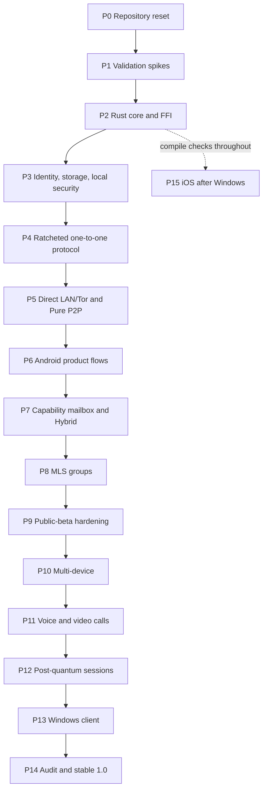

# TrustKin Development Task Plan

**Document version:** 0.1  
**Status:** Initial implementation baseline for review  
**Product:** TrustKin  
**Repository transition:** Rename the existing `pmchanel5/Brotherhood` repository and rewrite `main` after tagging the final Brotherhood alpha  
**Requirements input:** `requirements.md` version 0.1  
**Design input:** `design.md` version 0.1  
**Repository baseline inspected:** `pmchanel5/Brotherhood`, `main`, through merge commit `23de7f8f92f88d7557697239f902f26e3a3d5505`  
**Planning model:** Security-gated, milestone-based, without fixed calendar dates

## 1. Purpose

This document converts the approved TrustKin requirements and technical design into an ordered implementation plan. It guides the project from the current Brotherhood Android alpha to:

1. a new TrustKin private alpha;
2. a verified Pure P2P Android alpha;
3. a verified Hybrid/mailbox Android alpha;
4. a security-gated public Android beta;
5. multi-device, calls, post-quantum session establishment, and Windows support; and
6. an independently audited stable 1.0.

The plan deliberately does **not** assign release dates. A milestone is complete only when its acceptance criteria and security gates are satisfied.

## 2. Planning decisions and interpretations

### 2.1 Development and testing roles

| Role ID | Role | Primary responsibilities |
|---|---|---|
| `DEV-A` | Agent development team: Codex and approved agent models | Architecture, implementation, refactoring, automated tests, documentation, CI, release tooling, issue preparation, code review assistance |
| `HUM-P` | Human product and test owners: the user and partner | Real-device testing, UI bug discovery, usability evaluation, workflow validation, privacy-copy review, product decisions, acceptance sign-off |
| `EXT-S` | External security and legal specialists | Cryptographic audit, penetration test, legal/store review, accessibility review; donation-dependent |
| `COMM-R` | Community/self-host relay testers | Relay deployment, operator documentation, privacy configuration, interoperability and abuse-control testing |

`DEV-A` may implement and propose changes, but human product and release decisions remain with `HUM-P`. Security-sensitive releases require the independent gates defined below even when automated implementation is complete.

### 2.2 No fixed timeline

- The plan uses **dependencies, release gates, and effort ranges**, not dates.
- Phase effort is expressed as optimistic / expected / conservative developer-equivalent person-weeks.
- Individual task effort is expressed as focused developer-equivalent person-days.
- These estimates are sizing aids, not calendar promises. Agent-assisted work may shorten implementation, but testing, review, hardware behavior, legal review, and external audits cannot be assumed to compress proportionally.

### 2.3 Funding

- External reviews and paid services are donation-dependent.
- Lack of funding does not block implementation or private testing.
- Funding does not waive mandatory release gates. In particular, stable 1.0 remains blocked until the required independent audit and remediation are complete.

### 2.4 Android minimum-version resolution

The task plan resolves the mixed Android 9/10 preference as follows:

- **Mandatory production baseline:** Android 10 / API 29 for public beta and stable 1.0.
- **Conditional compatibility target:** Android 9 / API 28 may remain supported only if an early compatibility spike proves that the same cryptographic, storage, Tor, media, background, and update guarantees can be maintained without a separate weakened security profile.
- API 28 support is not allowed to delay or weaken the API 29 security baseline.
- If API 28 validation fails, TrustKin ships with `minSdk 29`; the final Brotherhood Android 9 alpha remains archived for reference only.

### 2.5 Repository transition

The existing repository will be renamed and rewritten directly on `main` after the final Brotherhood alpha is tagged. The TrustKin package starts fresh as `org.trustkin.app`; no automatic migration from Brotherhood alpha data is required.

### 2.6 Reuse policy

The project will:

- port reviewed Tor and media lessons/components first;
- rewrite protocol, storage, background orchestration, domain model, and UI architecture around the shared Rust core;
- never preserve the old static ECIES protocol or serialized state file as production architecture;
- keep legacy source only in the immutable tag/archive, not in active production build paths.

## 3. Release gates

### 3.1 Gate definitions

| Gate | Meaning | Minimum outcome |
|---|---|---|
| `G-RESET` | TrustKin reset complete | Brotherhood archived; renamed repository; new package/workspace builds |
| `G-CORE` | Shared core viable | Rust core, FFI, encrypted database, platform adapters and CI compile |
| `G-CRYPTO` | One-to-one protocol viable | Established ratcheting protocol passes vectors, persistence, replay and interoperability tests |
| `G-P2P` | Pure P2P alpha | Two Android devices exchange text/media by LAN and Tor with reliable queues and receipts |
| `G-HYBRID` | Hybrid alpha | Community/self-host/personal mailbox flow stores only opaque ciphertext and supports offline media |
| `G-GROUPS` | Modern group security | MLS replaces temporary pairwise group mode before public beta |
| `G-BETA` | Public Android beta | All requirements in the public-beta gate pass; no known unmitigated critical vulnerability |
| `G-MULTI` | Multi-device | Independent device keys, fan-out, sync, and revocation work across Android/Windows |
| `G-CALLS` | Calls | E2EE audio and video, direct/TURN/Tor policies, and IP-disclosure UX pass |
| `G-PQ` | Stable post-quantum session protection | Hybrid PQ session establishment is production-integrated and reviewed |
| `G-WINDOWS` | Windows client | Security and messaging parity with Android for supported features |
| `G-1.0` | Stable 1.0 | All twelve features, audit, remediation, penetration test, reproducible release and policy gates pass |
| `G-IOS` | iOS client | Native iOS shell, secure storage, background delivery and protocol parity pass |

### 3.2 Critical path



Some workstreams overlap, but a later gate cannot be declared complete while a required predecessor remains unresolved.

## 4. Continuous workstreams

The following are not deferred to a final security phase. Every feature phase must include them.

### 4.1 Security engineering

- Threat-model update for every new trust boundary.
- Dependency pinning and license verification.
- Memory and size bounds for all untrusted inputs.
- Negative tests, fuzz targets, replay tests, and malformed-input tests.
- No security claim without an executable test, inspection record, or explicit residual-risk statement.

### 4.2 Privacy review

- Document observable metadata for each transport and provider.
- Verify no plaintext or identity is sent through push providers.
- Verify logs exclude content, keys, onion addresses, capabilities, stable identifiers, and source IPs where prohibited.
- Review defaults against Maximum Privacy, Balanced, and Maximum Reliability presets.

### 4.3 Human workflow testing

`HUM-P` tests each milestone through real user journeys rather than isolated screens. Every release candidate must include:

- first-launch comprehension;
- identity creation and recovery warnings;
- adding and verifying contacts;
- sending while recipient is online and offline;
- understandable delivery states;
- battery/background behavior;
- blocked and unknown-sender flows;
- recovery from network and process failures;
- readability, accessibility, and error-message quality.

### 4.4 Documentation and traceability

- Every security-sensitive task references requirement IDs and design sections.
- Architecture decision records are created for irreversible choices.
- `requirements.md`, `design.md`, `task.md`, protocol specs, threat model, and test vectors are versioned together.

## 5. Task card conventions

Every task includes:

- **Objective and rationale**
- **Owner / required expertise**
- **Dependencies**
- **Files/components affected**
- **Implementation details**
- **Security considerations**
- **Acceptance criteria**
- **Required tests**
- **Deliverables**
- **Expected effort**
- **Blocking status**
- **Requirements/design references**

Blocking classifications:

- **Gate blocker:** required for the named release gate.
- **Phase blocker:** required before dependent tasks begin.
- **Non-blocking:** useful work that may proceed independently.
- **Conditional:** implemented only if its feasibility gate passes.

# Phase P0 — Archive Brotherhood and establish TrustKin

**Goal:** preserve the current Android alpha, rename the project, remove ambiguity between legacy and production code, and establish controlled project governance.

**Effort range:** 1 / 2 / 4 developer-equivalent person-weeks.  
**Entry:** Current Brotherhood `main` remains buildable.  
**Exit gate:** `G-RESET`.

### TK-P0-01 — Tag the final Brotherhood experimental alpha

- **Objective and rationale:** Preserve the current application and its working knowledge before replacing `main`.
- **Owner / expertise:** `DEV-A`; Git and Android release knowledge. `HUM-P` validates the archived APK.
- **Dependencies:** None.
- **Components:** Git tags, release notes, APK/checksum archive, current README.
- **Implementation:** Run current verification; create an immutable final Brotherhood tag; attach source and debug-test APK/checksum; mark it experimental and unsupported for high-risk use.
- **Security:** Do not describe unverified Tor/device behavior as production-ready. Preserve dependency and checksum records.
- **Acceptance:** Tag resolves to the reviewed commit; source builds; archived APK launches; documentation identifies limitations.
- **Tests:** Existing unit/lint/build checks; one human install and launch.
- **Deliverables:** Final Brotherhood tag, release note, checksum, archive reference.
- **Effort:** 1–2 person-days.
- **Blocking:** Gate blocker for `G-RESET`.
- **References:** Design §§5, 31; requirements §§20, 24.

### TK-P0-02 — Rename repository and project identity to TrustKin

- **Objective and rationale:** Establish the final public product identity before the rewrite grows.
- **Owner / expertise:** `DEV-A`; repository administration and Android build configuration.
- **Dependencies:** TK-P0-01.
- **Components:** Repository name, `settings.gradle.kts`, README, namespaces, documentation links, issue templates.
- **Implementation:** Rename repository to TrustKin; set root project name to `TrustKin`; replace active branding; reserve `org.trustkin.app`; update links and badges.
- **Security:** Do not reuse accidental debug signing identities as public release identities. Do not break access to the archived tag.
- **Acceptance:** Default repository and documentation display TrustKin; no active build artifact uses Brotherhood branding.
- **Tests:** Link check; Gradle configuration test; package-name grep.
- **Deliverables:** Renamed repository and branding commit.
- **Effort:** 1–3 person-days.
- **Blocking:** Gate blocker.
- **References:** Design D16, §§5.3, 31.1.

### TK-P0-03 — Remove legacy production paths from `main`

- **Objective and rationale:** Prevent the Python/Cloudflare prototype and obsolete Android protocol from being mistaken for production architecture.
- **Owner / expertise:** `DEV-A`; repository cleanup.
- **Dependencies:** TK-P0-02.
- **Components:** Legacy Python app, old APK release folder, static ECIES code, serialized-state code.
- **Implementation:** Remove or archive legacy code outside active build paths; retain historical access through the final tag; add a concise migration note rather than carrying two products in `main`.
- **Security:** Verify no old protocol or Cloudflare endpoint remains reachable from active builds.
- **Acceptance:** Active build graph contains only TrustKin components; legacy source is available through history/tag.
- **Tests:** Build graph inspection; repository search for active `brotherhood.py`, Cloudflare tunnel, and old namespace references.
- **Deliverables:** Cleanup commit and archive note.
- **Effort:** 1–2 person-days.
- **Blocking:** Phase blocker.
- **References:** Design §§5.2–5.3, 31.

### TK-P0-04 — Establish repository governance and security policy

- **Objective and rationale:** Protect the official project while preserving GPL rights and a controlled maintainer model.
- **Owner / expertise:** `DEV-A` drafts; `HUM-P` approves.
- **Dependencies:** TK-P0-02.
- **Components:** `CODEOWNERS`, contribution policy, `SECURITY.md`, branch rules, license/trademark notes.
- **Implementation:** Restrict merges to approved maintainers; require review for security-sensitive paths; document invitation-based contributions; document GPL fork rights; create responsible disclosure channel.
- **Security:** Security reports must have a private intake path. Public issue templates must warn against posting keys, onion addresses, capabilities, or private evidence.
- **Acceptance:** Governance documents are public; branch protection is enabled; security-sensitive directories have required reviewers.
- **Tests:** Repository permission check and dry-run issue/report workflow.
- **Deliverables:** Governance policy set.
- **Effort:** 2–4 person-days.
- **Blocking:** Gate blocker.
- **References:** Requirements GOV-001–GOV-009, §20.3.

### TK-P0-05 — Create planning traceability and issue taxonomy

- **Objective and rationale:** Make agent-driven implementation auditable and prevent requirements from being lost.
- **Owner / expertise:** `DEV-A`; project planning.
- **Dependencies:** TK-P0-02.
- **Components:** Issue templates, labels, milestone structure, traceability script/table.
- **Implementation:** Define task IDs, area labels, security labels, release-gate labels, and requirement/design reference fields. Add a script or CI check that detects missing references for gate-blocking issues.
- **Security:** Mark protocol, crypto, key storage, parser, relay, and update tasks as security-sensitive.
- **Acceptance:** New task issues can be generated consistently; gate queries show all unresolved blockers.
- **Tests:** Create sample issue from each template; run traceability checker.
- **Deliverables:** Label schema, templates, traceability tooling.
- **Effort:** 2–4 person-days.
- **Blocking:** Phase blocker.
- **References:** Requirements §24; design §§36, 38.

### TK-P0-06 — Establish initial CI and protected baseline

- **Objective and rationale:** Ensure every rewrite commit remains buildable and reviewable.
- **Owner / expertise:** `DEV-A`; GitHub Actions, Rust, Android.
- **Dependencies:** TK-P0-02.
- **Components:** CI workflows, formatting, linting, dependency lock checks, secret scanning.
- **Implementation:** Add minimal Rust/Android build workflows, formatting, lint, unit-test placeholders, dependency-lock verification, forbidden-secret patterns, and artifact retention.
- **Security:** Pin third-party actions by commit where practical; use least-privilege workflow permissions; never upload release keys.
- **Acceptance:** Protected `main` requires passing CI; artifacts are clearly marked test-only.
- **Tests:** Intentionally break formatting, tests, lockfiles, and secret patterns to verify failure.
- **Deliverables:** Baseline CI workflows.
- **Effort:** 2–5 person-days.
- **Blocking:** Gate blocker.
- **References:** Requirements §20; design §§28, 30, 32.

# Phase P1 — Mandatory architecture and dependency validation

**Goal:** resolve high-risk technology, licensing, mobile, and store assumptions before implementation depends on them.

**Effort range:** 3 / 6 / 12 developer-equivalent person-weeks.  
**Entry:** `G-RESET`.  
**Exit:** Signed ADRs for design validation gates G1–G7 and Android-version decision.

### TK-P1-01 — Select and approve the one-to-one protocol provider

- **Objective and rationale:** Use an established Signal-style implementation without accepting unknown licensing or API risk.
- **Owner / expertise:** `DEV-A`; applied cryptography and Rust/FFI. `EXT-S` review when available.
- **Dependencies:** P0.
- **Components:** `trustkin-crypto`, provider spike, licensing ADR.
- **Implementation:** Evaluate maintained implementations for X3DH/PQXDH/Double Ratchet properties, Rust/Android/Windows/iOS viability, GPL/AGPL compatibility, F-Droid buildability, API stability, test vectors, and migration path. Treat `libsignal` as a candidate, not an automatic dependency.
- **Security:** No custom unaudited ratchet design. Record unsupported-use and update risks. Fail the gate if key security properties cannot be independently tested.
- **Acceptance:** One provider is approved with a documented integration/upgrade strategy, or a clearly documented alternative plan is selected.
- **Tests:** Cross-platform proof-of-concept: create session, out-of-order messages, skipped keys, serialization, restore, tamper rejection.
- **Deliverables:** ADR-G1, prototype adapter, license matrix.
- **Effort:** 5–12 person-days.
- **Blocking:** Phase and `G-CRYPTO` blocker.
- **References:** SEC-CRY-001–009; design §§11, 35 G1.

### TK-P1-02 — Validate OpenMLS on all planned targets

- **Objective and rationale:** Confirm that MLS can replace private-alpha pairwise groups before public beta.
- **Owner / expertise:** `DEV-A`; Rust, MLS, mobile cross-compilation.
- **Dependencies:** P0.
- **Components:** OpenMLS spike, storage provider, FFI boundary.
- **Implementation:** Compile and execute create/join/update/remove/commit flows on Android ARM64/x86_64, Windows, and iOS compile targets; test persisted state and FFI records.
- **Security:** Validate ciphersuite policy, credential binding, epoch rollback handling, welcome-message limits, and state serialization.
- **Acceptance:** Mobile/desktop viability demonstrated with no unresolved blocker to public-beta MLS.
- **Tests:** Multi-member vectors, removal, stale epoch, replay, corrupted state, FFI round trip.
- **Deliverables:** ADR-G2 and prototype crate.
- **Effort:** 5–10 person-days.
- **Blocking:** `G-GROUPS` blocker.
- **References:** FR-GRP-001–005, SEC-CRY-006; design §§12, 35 G2.

### TK-P1-03 — Validate SQLCipher and encrypted relational storage

- **Objective and rationale:** Replace the single encrypted JSON state with a scalable cross-platform database.
- **Owner / expertise:** `DEV-A`; Rust database and platform packaging.
- **Dependencies:** P0.
- **Components:** `trustkin-storage`, SQLCipher packaging, migration test harness.
- **Implementation:** Verify licensing, deterministic builds, Android ABI packaging, Windows linking, iOS compile, WAL/journaling behavior, key injection, crash recovery, and acceptable performance.
- **Security:** Database key must come from platform-protected root material; plaintext temp databases and diagnostic dumps are prohibited.
- **Acceptance:** Create/open/migrate/corrupt/recover tests pass on supported targets.
- **Tests:** Crash injection, wrong-key rejection, rollback, concurrent reads, large history, backup/restore prototype.
- **Deliverables:** ADR-G3 and storage benchmark.
- **Effort:** 5–10 person-days.
- **Blocking:** `G-CORE` blocker.
- **References:** SEC-LOC-001–004; design §§21, 35 G3.

### TK-P1-04 — Define the cross-platform Tor runtime strategy

- **Objective and rationale:** Preserve direct Tor delivery without coupling the shared core to one Android wrapper.
- **Owner / expertise:** `DEV-A`; Tor, Android native packaging, Windows networking, iOS constraints.
- **Dependencies:** P0.
- **Components:** Tor platform adapters and runtime lifecycle ADR.
- **Implementation:** Validate the current Android Briar wrapper lessons, Lyrebird packaging, onion publication, SOCKS access, and emulator filtering; select Windows Tor packaging; define a feasible iOS approach and pluggable-transport policy.
- **Security:** Pin and verify native binaries; avoid leaking onion private keys; document traffic-correlation limits and runtime logs.
- **Acceptance:** Android strategy has a runnable spike; Windows strategy compiles; iOS strategy is technically documented with unresolved constraints identified.
- **Tests:** Bootstrap, onion publication, shutdown/restart, clock skew, offline recovery, binary-integrity check.
- **Deliverables:** ADR-G4 and adapter interface.
- **Effort:** 6–14 person-days.
- **Blocking:** `G-P2P` blocker.
- **References:** FR-NET-001–010; design §§17.3, 24, 35 G4.

### TK-P1-05 — Validate the Windows shell choice

- **Objective and rationale:** Catch shared-core and desktop integration constraints early without starting full Windows product work.
- **Owner / expertise:** `DEV-A`; Rust/Tauri, Windows security and accessibility.
- **Dependencies:** Preliminary P2 workspace may be mocked.
- **Components:** Tauri 2 spike or alternative WinUI decision.
- **Implementation:** Build a minimal Windows shell that calls Rust directly, uses hardened WebView settings, opens encrypted storage, displays a test conversation, and receives a local notification.
- **Security:** Disable remote content, unsafe navigation, broad filesystem access, and unnecessary command exposure. Evaluate code-signing and update implications.
- **Acceptance:** Tauri is approved or rejected through ADR; a fallback shell is named if rejected.
- **Tests:** Command allowlist, CSP, navigation blocking, accessibility smoke test, packaged build.
- **Deliverables:** ADR-G5 and proof-of-concept app.
- **Effort:** 4–8 person-days.
- **Blocking:** Phase blocker for Windows planning, not Android alpha.
- **References:** PLAT-001–003; design §§8, 25, 35 G5.

### TK-P1-06 — Validate self-hosted and personal-mailbox deployment

- **Objective and rationale:** Ensure the initial product can support community, custom, Docker, VPS, and spare-device mailboxes without a TrustKin-operated relay.
- **Owner / expertise:** `DEV-A` plus `COMM-R`; Rust service and deployment.
- **Dependencies:** Mailbox API can be skeletal.
- **Components:** Docker prototype, VPS deployment, spare-device feasibility notes.
- **Implementation:** Deploy an opaque queue prototype locally and on the available VPS; test a user-controlled personal-mailbox host; identify Android spare-device background constraints.
- **Security:** No plaintext, no account database, no persistent source-IP application logs, capability separation, bounded storage.
- **Acceptance:** Docker/VPS path is viable; personal-mailbox claims are scoped to demonstrated behavior.
- **Tests:** Restart, disk-full, expiry, capability misuse, Tor access, log inspection.
- **Deliverables:** ADR-G6 and deployment spike report.
- **Effort:** 4–10 person-days.
- **Blocking:** `G-HYBRID` blocker.
- **References:** FR-MBX-001–024; design §§18.9, 35 G6.

### TK-P1-07 — Complete the pre-beta legal and store compliance plan

- **Objective and rationale:** Prevent late rejection by Google Play/F-Droid and align reporting, 18+, encryption, and relay operation with public distribution.
- **Owner / expertise:** `DEV-A` prepares; `HUM-P` approves; `EXT-S` review donation-dependent but mandatory before beta.
- **Dependencies:** Requirements baseline.
- **Components:** Compliance checklist, privacy disclosures, reporting flow, content rating, export/encryption notes.
- **Implementation:** Map Google Play, F-Droid, 18+, UGC/reporting, child-safety, privacy, GPL, relay-operator, sanctions/export, and communications-service questions to required artifacts and UI behavior.
- **Security:** Review must not introduce backdoors, plaintext access, mandatory scanning, or covert moderation access.
- **Acceptance:** Every store/legal requirement has an owner, evidence item, and gate status; external focused review occurs before public beta.
- **Tests:** Policy-to-product walkthrough and store-form dry run.
- **Deliverables:** ADR-G7/compliance matrix.
- **Effort:** 3–7 person-days plus external review.
- **Blocking:** `G-BETA` blocker.
- **References:** Requirements §§16–20; design §§27, 30, 35 G7.

### TK-P1-08 — Decide Android 9 conditional compatibility

- **Objective and rationale:** Resolve whether one TrustKin build can safely support API 28 without weakening API 29 behavior.
- **Owner / expertise:** `DEV-A`; Android platform/security. `HUM-P` tests available hardware/emulators.
- **Dependencies:** P1-01, P1-03, P1-04 sufficiently advanced.
- **Components:** Android build configuration, codecs, SQLCipher, Tor binaries, notifications/background.
- **Implementation:** Build a minSdk 28 proof of concept and test cryptographic provider, database, Tor/Lyrebird, voice codec fallback, secure key storage, background modes, and update path. Compare against API 29 baseline.
- **Security:** API 28 must not receive weaker crypto, weaker key storage, unsafe TLS, or untested fallback behavior. Separate compatibility builds must not create protocol divergence.
- **Acceptance:** Either (a) API 28 is approved as a supported minimum with the same security contract, or (b) minSdk 29 is confirmed and documented.
- **Tests:** API 28 emulator/device matrix plus all security-critical smoke tests.
- **Deliverables:** Android minimum-version ADR.
- **Effort:** 4–8 person-days.
- **Blocking:** Gate blocker for final Android minSdk decision; not allowed to block API 29 implementation indefinitely.
- **References:** PLAT-003; design §24.4.

# Phase P2 — Shared Rust core, protocol foundation, and native shells

**Goal:** Create the final repository/workspace structure and prove that Android, Windows, and iOS can consume one security-critical core.

**Effort range:** 4 / 8 / 14 developer-equivalent person-weeks.  
**Entry:** Critical P1 technology choices are approved.  
**Exit gate:** `G-CORE`.

### TK-P2-01 — Create and pin the Rust workspace

- **Objective and rationale:** Establish the modular shared core defined by `design.md`.
- **Owner / expertise:** `DEV-A`; Rust workspace design.
- **Dependencies:** P0, relevant P1 decisions.
- **Components:** Root `Cargo.toml`, toolchain, crates, apps, services, protocol and tools directories.
- **Implementation:** Create the approved workspace layout; pin Rust toolchain and dependency versions; deny accidental dependency cycles; document crate ownership.
- **Security:** Enable unsafe-code policy, dependency advisories, license checks, and minimal feature sets.
- **Acceptance:** Workspace compiles with placeholder crates on Linux/CI, Android targets, Windows, and iOS compile target.
- **Tests:** `cargo check/test/clippy/fmt`; dependency and license audit.
- **Deliverables:** Workspace skeleton.
- **Effort:** 2–4 person-days.
- **Blocking:** Phase blocker.
- **References:** Design §7.

### TK-P2-02 — Define domain IDs, clocks, errors, and bounded types

- **Objective and rationale:** Prevent unbounded strings/bytes and platform-specific model drift.
- **Owner / expertise:** `DEV-A`; Rust domain modeling.
- **Dependencies:** TK-P2-01.
- **Components:** `trustkin-model`, common error taxonomy.
- **Implementation:** Introduce typed IDs, timestamps, revisions, sizes, expiry values, delivery states, route policies, and stable error codes.
- **Security:** Constructors enforce limits; secret-bearing types redact debug output and avoid serialization where prohibited.
- **Acceptance:** Invalid domain values cannot be created through public APIs without explicit validation errors.
- **Tests:** Property tests for limits, redaction, serialization exclusions, and error stability.
- **Deliverables:** Domain model crate.
- **Effort:** 3–6 person-days.
- **Blocking:** Phase blocker.
- **References:** Requirements §§5–9; design §§9, 13, 16.

### TK-P2-03 — Specify deterministic CBOR and CDDL schemas

- **Objective and rationale:** Make protocol bytes canonical, independently implementable, and safe to sign.
- **Owner / expertise:** `DEV-A`; protocol serialization.
- **Dependencies:** TK-P2-02.
- **Components:** `trustkin-protocol`, `protocol/cddl`, vectors.
- **Implementation:** Define top-level version/type framing, deterministic CBOR rules, bounded fields, extension policy, canonical signing bytes, and parser error behavior.
- **Security:** Reject duplicate keys, non-canonical values, unknown critical fields, oversized collections, and downgrade attempts.
- **Acceptance:** Encoders are deterministic across runs/platforms; independent decoder fixture accepts valid and rejects invalid corpus.
- **Tests:** Golden vectors, property tests, mutation corpus, canonicalization tests.
- **Deliverables:** Initial protocol spec and CDDL.
- **Effort:** 5–10 person-days.
- **Blocking:** `G-CRYPTO`, `G-P2P`, and relay blocker.
- **References:** SEC-CRY-007–008; design §9.

### TK-P2-04 — Implement the coarse-grained FFI facade

- **Objective and rationale:** Expose stable use cases to Kotlin and Swift without leaking internal database or cryptographic details.
- **Owner / expertise:** `DEV-A`; UniFFI and API design.
- **Dependencies:** TK-P2-01–03.
- **Components:** `trustkin-ffi`, generated Kotlin/Swift bindings.
- **Implementation:** Define typed commands/events for initialization, identity, contacts, conversations, queue state, settings, diagnostics, and lifecycle. Keep secrets opaque.
- **Security:** No raw private-key export over FFI; stable error codes; cancellation and timeout behavior; byte arrays zeroized where practical.
- **Acceptance:** Android and Swift test harnesses invoke the same Rust core and receive typed records.
- **Tests:** FFI contract tests, concurrency, cancellation, malformed input, version mismatch.
- **Deliverables:** Generated bindings and API reference.
- **Effort:** 5–10 person-days.
- **Blocking:** `G-CORE` blocker.
- **References:** Design §8.3.

### TK-P2-05 — Create platform-service interfaces

- **Objective and rationale:** Keep OS-specific key stores, Tor, notifications, media, files, and lifecycle outside the portable core.
- **Owner / expertise:** `DEV-A`; Rust traits and platform integration.
- **Dependencies:** TK-P2-04.
- **Components:** Platform bridge interfaces and fake implementations.
- **Implementation:** Define interfaces for secure key wrapping, clocks/randomness, connectivity, Tor lifecycle, notifications, background wake, media encode/decode, file operations, and biometric prompts.
- **Security:** Explicitly classify trusted/untrusted outputs; never allow platform logs to receive secret-bearing records.
- **Acceptance:** Core tests run entirely against deterministic fakes; platform shells can register adapters.
- **Tests:** Fault injection for every interface and lifecycle race tests.
- **Deliverables:** Platform bridge crate/contracts.
- **Effort:** 4–8 person-days.
- **Blocking:** Phase blocker.
- **References:** Design §§8.2, 24.

### TK-P2-06 — Bootstrap the new Android shell

- **Objective and rationale:** Replace the old package and UI architecture immediately, as approved by D15/D16.
- **Owner / expertise:** `DEV-A`; Kotlin/Compose and FFI.
- **Dependencies:** TK-P2-04–05.
- **Components:** `apps/android`, `org.trustkin.app`, Compose theme/navigation, presentation layer.
- **Implementation:** Create a minimal TrustKin app that initializes Rust core, renders loading/onboarding/locked/main states, and displays local diagnostics from typed events.
- **Security:** No old static crypto or serialized state references; no secrets in Compose state restoration or logs.
- **Acceptance:** Fresh APK installs beside archived Brotherhood app; process restart restores only new TrustKin state.
- **Tests:** Instrumented startup, process recreation, FFI error handling, package isolation.
- **Deliverables:** First TrustKin skeleton APK.
- **Effort:** 5–10 person-days.
- **Blocking:** `G-CORE` blocker.
- **References:** Design §§5.3, 26, 31.

### TK-P2-07 — Add early Windows and iOS compile checks

- **Objective and rationale:** Detect cross-platform core mistakes before Android implementation becomes entrenched.
- **Owner / expertise:** `DEV-A`; cross-compilation and CI.
- **Dependencies:** TK-P2-01–05.
- **Components:** Windows test host, Swift binding compile fixture, CI matrix.
- **Implementation:** Build core and FFI for Windows; compile generated Swift bindings and a minimal iOS host where toolchain access permits; run shared vectors on Windows.
- **Security:** Platform-specific code paths must not silently disable validations.
- **Acceptance:** Every merge runs Windows core tests and iOS binding compile checks or reports a clearly approved infrastructure exception.
- **Tests:** Cross-platform vectors and FFI smoke tests.
- **Deliverables:** CI matrix and minimal hosts.
- **Effort:** 3–6 person-days.
- **Blocking:** `G-CORE` blocker.
- **References:** PLAT-001–003; design §§8, 30.

### TK-P2-08 — Establish the shared testkit and fault-injection harness

- **Objective and rationale:** Make reliability and security behavior testable without physical networks for every change.
- **Owner / expertise:** `DEV-A`; deterministic testing and simulation.
- **Dependencies:** TK-P2-02–05.
- **Components:** `trustkin-testkit`, fake transports, fake clock, deterministic RNG fixtures.
- **Implementation:** Provide simulated packet loss, duplication, reordering, clock skew, offline intervals, relay crash, receipt loss, stale revisions, and partial attachments.
- **Security:** Deterministic RNG is test-only and impossible to enable in production builds.
- **Acceptance:** Core state machines can be exercised under all design §32.2 fault classes.
- **Tests:** Meta-tests verify each fault actually occurs and production feature flags exclude deterministic secrets.
- **Deliverables:** Reusable testkit.
- **Effort:** 4–8 person-days.
- **Blocking:** Phase blocker for later reliability tasks.
- **References:** NFR-REL-001–008; design §32.

# Phase P3 — Identity, encrypted storage, local security, and recovery

**Goal:** Implement the durable local security foundation before production messaging depends on it.

**Effort range:** 5 / 10 / 18 developer-equivalent person-weeks.  
**Entry:** `G-CORE`.  
**Exit:** Secure identity/storage private-alpha gate.

### TK-P3-01 — Implement the encrypted relational schema and migrations

- **Objective and rationale:** Store identities, devices, sessions, contacts, conversations, messages, queues, groups, capabilities, receipts, and transfers transactionally.
- **Owner / expertise:** `DEV-A`; Rust/SQLCipher.
- **Dependencies:** TK-P1-03, P2.
- **Components:** `trustkin-storage`, schema migrations, repository interfaces.
- **Implementation:** Create normalized tables, indexes, foreign-key rules, bounded retention, migration journal, schema checksum, and transactional repository APIs.
- **Security:** Never load full histories unnecessarily; prohibit plaintext fallback; use crash-safe transactions; protect rollback-sensitive session state.
- **Acceptance:** Fresh creation, every migration, interrupted migration, wrong-key, corruption, and large-history scenarios produce documented outcomes.
- **Tests:** Migration matrix, crash injection, property tests, performance budget tests.
- **Deliverables:** Versioned schema and migration guide.
- **Effort:** 8–15 person-days.
- **Blocking:** Phase blocker.
- **References:** SEC-LOC-001–004; design §21.1.

### TK-P3-02 — Implement encrypted media and attachment storage

- **Objective and rationale:** Keep large files out of the database while preserving confidentiality, integrity, resumability, and deletion semantics.
- **Owner / expertise:** `DEV-A`; streaming crypto and filesystem safety.
- **Dependencies:** TK-P3-01.
- **Components:** `trustkin-attachments`, media directory, manifest tables.
- **Implementation:** Encrypt files in chunks with per-object keys, authenticated manifests, content length/hash, resumable state, quarantine state, and atomic finalization.
- **Security:** Random file names; no EXIF/plaintext temp files after processing; path traversal impossible; deletion is logical/cryptographic, not claimed physical erasure.
- **Acceptance:** Interrupted writes resume or cleanly roll back; modified chunks fail authentication; database and filesystem remain consistent.
- **Tests:** Corrupt chunk, missing chunk, crash, disk full, duplicate object, delete while in use.
- **Deliverables:** Encrypted object store.
- **Effort:** 6–12 person-days.
- **Blocking:** Image/voice/file blocker.
- **References:** FR-MSG-003–004; design §§18.8, 21.2.

### TK-P3-03 — Implement root identity and device authorization models

- **Objective and rationale:** Separate long-lived identity authority from independently revocable device credentials.
- **Owner / expertise:** `DEV-A`; identity protocols and key lifecycle.
- **Dependencies:** TK-P2-02–03, P1-01.
- **Components:** `trustkin-model`, `trustkin-crypto`, identity/device tables.
- **Implementation:** Generate root identity signing material, device signing/authentication keys, device certificates, revisions, expiry, safety identifier, and revocation records.
- **Security:** Root identity is not used as a static message-encryption key; certificate verification is domain-separated and downgrade-resistant.
- **Acceptance:** A root identity can authorize, list, revoke, and reject forged/stale device certificates.
- **Tests:** Tamper, rollback, duplicate device ID, expiry, revoked-device operations.
- **Deliverables:** Identity/device protocol records and APIs.
- **Effort:** 6–12 person-days.
- **Blocking:** `G-CRYPTO` and `G-MULTI` blocker.
- **References:** FR-ID-001–007; design §10.

### TK-P3-04 — Implement platform-protected root storage keys

- **Objective and rationale:** Bind database/media decryption to secure platform facilities without making the PIN the sole encryption key.
- **Owner / expertise:** `DEV-A`; Android Keystore, Windows DPAPI/Hello, Apple Keychain/Secure Enclave.
- **Dependencies:** TK-P2-05, P3-01.
- **Components:** Platform key adapters, key-wrapping format.
- **Implementation:** Android adapter first; Windows and iOS compile adapters; versioned wrapping metadata; key rotation and invalidation handling.
- **Security:** Non-exportable keys where supported; authenticated wrapping; no key bytes in logs, backups, or crash reports; clear recovery behavior when keystore is invalidated.
- **Acceptance:** Database opens only through approved platform key path; wrong or revoked key fails closed.
- **Tests:** Process restart, app update, wrong alias, key deletion, simulated invalidation, device credential changes.
- **Deliverables:** Secure key adapters and key lifecycle ADR.
- **Effort:** 6–14 person-days.
- **Blocking:** Phase blocker.
- **References:** SEC-LOC-001–004; design §§21.3–21.4.

### TK-P3-05 — Implement onboarding, unlock, biometrics, and automatic lock

- **Objective and rationale:** Give users understandable control over local access without confusing UI lock with network encryption.
- **Owner / expertise:** `DEV-A`; Kotlin/Compose and local authentication. `HUM-P` owns usability acceptance.
- **Dependencies:** TK-P3-03–04.
- **Components:** Android onboarding, authentication state machine, settings.
- **Implementation:** Create identity; strong PIN/passphrase; optional biometrics/system credential; configurable lock timer; manual lock; failed-attempt throttling; clear recovery warning.
- **Security:** PIN verifier is slow and salted; no persistent plaintext PIN; biometric fallback policy is explicit; screen state does not leak sensitive previews.
- **Acceptance:** All configured unlock methods work; lock activates after timeout/background policy; failed attempts are throttled.
- **Tests:** Correct/wrong PIN, biometric cancellation, process death, rotation, background/foreground, accessibility.
- **Deliverables:** Secure onboarding and lock flow.
- **Effort:** 5–10 person-days.
- **Blocking:** Private-alpha blocker.
- **References:** SEC-LOC-001–004; requirements §11; design §§24, 26.

### TK-P3-06 — Implement duress PIN with default silent local erase

- **Objective and rationale:** Support GrapheneOS-inspired application-level cryptographic erasure under coercion.
- **Owner / expertise:** `DEV-A`; secure deletion/state-machine UX. `HUM-P` validates cover behavior.
- **Dependencies:** TK-P3-01–05.
- **Components:** Duress configuration, key deletion, local data lifecycle, optional revocation queue.
- **Implementation:** Opt-in distinct duress PIN; default mode deletes root storage key, database, downloaded media, mailbox read/delete capabilities, linked-device credentials, cached notifications, and local Tor identity; optional mode also queues network revocations if possible.
- **Security:** No confirmation prompt; no visible “duress succeeded” signal; local erase completes without network; physical flash erasure is not claimed; avoid timing differences where practical.
- **Acceptance:** Duress PIN renders prior local encrypted state inaccessible and leaves no ordinary UI indication that distinguishes it from a fresh/reset state.
- **Tests:** Offline duress, interrupted erase, optional revocation failure, normal PIN unaffected, forensic file/path inspection within app sandbox limits.
- **Deliverables:** Duress implementation and irreversible-loss documentation.
- **Effort:** 6–12 person-days.
- **Blocking:** Stable 1.0 blocker; may follow first private alpha if clearly disabled.
- **References:** SEC-DUR-001–007; design §22.

### TK-P3-07 — Implement selectable encrypted backups and device-to-device transfer

- **Objective and rationale:** Recover identity without a central account while controlling how much sensitive state leaves the device.
- **Owner / expertise:** `DEV-A`; backup cryptography and transfer protocols.
- **Dependencies:** TK-P3-01–04.
- **Components:** `trustkin-backup`, export/import UI, QR/direct transfer.
- **Implementation:** Support identity-only, identity+relationships/sessions, and full local backup scopes; strong passphrase KDF; versioned authenticated container; anti-rollback checks; direct authenticated device transfer.
- **Security:** Warn that session restore can be dangerous if rolled back; never export platform wrapping keys; verify complete integrity before import commit.
- **Acceptance:** Each scope round-trips; incorrect passphrase/tamper fails; import is atomic; old unsafe session backup cannot silently overwrite newer state.
- **Tests:** Tamper, truncation, wrong version, interrupted import, duplicate device, stale session, large media.
- **Deliverables:** Backup format specification and UI.
- **Effort:** 8–16 person-days.
- **Blocking:** Stable 1.0 and multi-device blocker; identity-only export should exist before broad beta testing.
- **References:** FR-ID-006–007; design §23.

### TK-P3-08 — Implement deletion, retention, and local data lifecycle APIs

- **Objective and rationale:** Distinguish local deletion, unsent cancellation, remote requests, disappearing messages, identity erasure, device revocation, invite revocation, and queue revocation.
- **Owner / expertise:** `DEV-A`; data lifecycle and product UX.
- **Dependencies:** TK-P3-01–02.
- **Components:** Core use cases, database, media store, UI contracts.
- **Implementation:** Define each deletion command and state transition; retain audit-free local tombstones only where needed for replay or revocation; expose honest remote-deletion semantics.
- **Security:** Never claim deletion from a recipient device can be guaranteed; revoke keys/capabilities where meaningful.
- **Acceptance:** Every deletion type has deterministic behavior and user-facing explanation.
- **Tests:** Delete during send/download, expired message, revoked queue, linked-device propagation, crash recovery.
- **Deliverables:** Lifecycle API and deletion matrix.
- **Effort:** 4–8 person-days.
- **Blocking:** Messaging feature blocker.
- **References:** FR-DEL-001–002; requirements §11.2.

# Phase P4 — Forward-secret one-to-one messaging protocol

**Goal:** Replace static identity encryption with an established asynchronous ratcheting protocol before any public beta.

**Effort range:** 8 / 16 / 28 developer-equivalent person-weeks.  
**Entry:** Identity/storage foundation and provider ADR.  
**Exit gate:** `G-CRYPTO`.

### TK-P4-01 — Implement the approved crypto-provider adapter

- **Objective and rationale:** Encapsulate the selected established protocol behind TrustKin-owned interfaces.
- **Owner / expertise:** `DEV-A`; applied cryptography and Rust FFI.
- **Dependencies:** TK-P1-01, P2, P3-03.
- **Components:** `trustkin-signal-adapter` or approved equivalent, `trustkin-crypto` traits.
- **Implementation:** Map identity/device credentials, session creation, encryption/decryption, skipped-key handling, session serialization, and provider errors into stable TrustKin types.
- **Security:** Provider internals are not reimplemented casually; version and migration policy is explicit; sensitive debug output disabled.
- **Acceptance:** Adapter passes provider vectors and TrustKin cross-platform round trips.
- **Tests:** Provider vectors, known-answer tests, tamper, serialization/restore, platform interop.
- **Deliverables:** Production provider adapter.
- **Effort:** 10–20 person-days.
- **Blocking:** `G-CRYPTO` blocker.
- **References:** SEC-CRY-001–003; design §11.

### TK-P4-02 — Implement prekey/key-package generation and publication records

- **Objective and rationale:** Allow asynchronous first contact while recipients are offline.
- **Owner / expertise:** `DEV-A`; session establishment.
- **Dependencies:** TK-P4-01, P3-03.
- **Components:** Prekey storage, signed bundles, rotation scheduler, protocol records.
- **Implementation:** Generate signed prekeys and bounded one-time material per device; define direct-invite and mailbox publication containers; track consumption and replenishment.
- **Security:** Authenticate bundles to device certificates; prevent reuse beyond provider rules; reject stale/revoked device material.
- **Acceptance:** A sender can establish a session using a valid offline bundle; used/stale/forged bundles are rejected.
- **Tests:** Concurrent consumption, missing one-time key, stale bundle, revoked device, replay.
- **Deliverables:** Prekey subsystem and spec.
- **Effort:** 6–12 person-days.
- **Blocking:** Phase blocker.
- **References:** SEC-CRY-002; design §11.4.

### TK-P4-03 — Implement one-to-one session lifecycle

- **Objective and rationale:** Provide authenticated session establishment, ratcheted message keys, out-of-order handling, and post-compromise recovery.
- **Owner / expertise:** `DEV-A`; protocol state machines.
- **Dependencies:** TK-P4-01–02.
- **Components:** Session service, conversation state, delivery packet integration.
- **Implementation:** Create/accept session, encrypt/decrypt application payloads, manage skipped keys, handle simultaneous initiation, reset/re-establish, and expose safety state.
- **Security:** Fail closed on identity mismatch, downgrade, counter rollback, invalid associated data, or excessive skipped-key windows.
- **Acceptance:** Two fresh devices establish and continue a session through message loss, reordering, offline intervals, and process restarts.
- **Tests:** Bidirectional ratchet, simultaneous initiation, out-of-order, loss, replay, state restore, compromise-recovery simulation.
- **Deliverables:** One-to-one session engine.
- **Effort:** 10–20 person-days.
- **Blocking:** `G-CRYPTO` blocker.
- **References:** SEC-CRY-001–003, 007–008; design §§11, 13.

### TK-P4-04 — Persist ratchet state safely and prevent rollback

- **Objective and rationale:** Ensure database crashes or stale backups cannot cause unsafe key reuse.
- **Owner / expertise:** `DEV-A`; transactional crypto state.
- **Dependencies:** TK-P3-01, P4-03.
- **Components:** Session tables, transactional send/receive APIs, anti-rollback metadata.
- **Implementation:** Atomically persist message, queue item, and updated send state; atomically persist received message and updated receive state before acknowledgement; bind revisions to database state.
- **Security:** Never emit ciphertext if new ratchet state was not durably committed; never acknowledge plaintext before receive state and replay ID are committed.
- **Acceptance:** Crash at every transaction boundary does not duplicate message keys or accept replay.
- **Tests:** Systematic crash injection around encrypt/send/decrypt/receipt paths.
- **Deliverables:** Transactional session persistence.
- **Effort:** 8–15 person-days.
- **Blocking:** `G-CRYPTO` blocker.
- **References:** NFR-REL-001–008; design §§16.1, 21, 34.

### TK-P4-05 — Implement safety identifiers and key-change handling

- **Objective and rationale:** Make identity changes visible and prevent silent impersonation.
- **Owner / expertise:** `DEV-A`; identity UX and protocol validation. `HUM-P` tests comprehension.
- **Dependencies:** P3-03, P4-03.
- **Components:** Fingerprint/safety number, QR verification, contact security state.
- **Implementation:** Compute safety identifier from root/device identity context; scan/compare QR; record verification; pause sensitive send on unexpected root key change; display history.
- **Security:** Device additions signed by the same root should not look like root identity replacement; genuine root replacement requires explicit acceptance.
- **Acceptance:** Forged or unexpected key changes block sending; user can verify and resume through a clear flow.
- **Tests:** New device, root replacement, stale card, QR mismatch, accessibility/readability.
- **Deliverables:** Verification and key-change UI/API.
- **Effort:** 5–10 person-days.
- **Blocking:** Public-beta blocker.
- **References:** FR-ID-004–005; design §§10, 11.

### TK-P4-06 — Publish protocol vectors and fuzz the session boundary

- **Objective and rationale:** Make the implementation independently testable and resilient to malformed records.
- **Owner / expertise:** `DEV-A`; fuzzing and protocol testing.
- **Dependencies:** P4-01–05.
- **Components:** `protocol/test-vectors`, fuzz targets, conformance fixtures.
- **Implementation:** Publish deterministic vectors for identity/device records, prekeys, session setup, encrypted packets, receipts, key changes, and errors.
- **Security:** Include negative vectors and downgrade/tamper cases; fuzz all parser and provider-adapter boundaries.
- **Acceptance:** Vectors run on Rust, Android, and Windows harnesses; fuzz campaigns meet defined execution budget without crash or unbounded allocation.
- **Tests:** Vector runner, libFuzzer/AFL-style corpora, memory-bound assertions.
- **Deliverables:** Public vector suite and fuzz corpus.
- **Effort:** 6–12 person-days.
- **Blocking:** `G-BETA` blocker.
- **References:** Requirements §20.1; design §§28.2–28.3, 32.4.

### TK-P4-07 — Remove obsolete static cryptography from active code

- **Objective and rationale:** Prevent accidental fallback to the Brotherhood ECIES/ECDSA envelope.
- **Owner / expertise:** `DEV-A`; codebase cleanup.
- **Dependencies:** P4-03–04.
- **Components:** Old `CryptoEngine`, models, tests, dependencies.
- **Implementation:** Delete active static message-encryption paths, replace call sites, and add CI forbidden-symbol checks for obsolete protocol types.
- **Security:** No compatibility mode may silently emit old packets.
- **Acceptance:** Active code cannot build or negotiate the old protocol; archived tag remains accessible.
- **Tests:** Repository grep, protocol negotiation negative test, dependency audit.
- **Deliverables:** Cleanup commit and migration ADR.
- **Effort:** 2–4 person-days.
- **Blocking:** `G-CRYPTO` gate blocker.
- **References:** SEC-CRY-003; design §5.2.

### TK-P4-08 — Conduct the one-to-one private-alpha security gate

- **Objective and rationale:** Prevent transport/UI work from masking unresolved core cryptographic failures.
- **Owner / expertise:** `DEV-A` prepares evidence; `HUM-P` validates workflows; `EXT-S` optional early review.
- **Dependencies:** P4-01–07.
- **Components:** Gate report and test artifacts.
- **Implementation:** Run vectors, fuzz corpus, crash tests, identity-change tests, backup rollback tests, and two local process interoperability tests.
- **Security:** Document every residual risk and provider assumption.
- **Acceptance:** No unresolved critical/high internal finding; `G-CRYPTO` signed off by maintainers.
- **Tests:** Full P4 suite.
- **Deliverables:** `G-CRYPTO` evidence report.
- **Effort:** 3–6 person-days.
- **Blocking:** Gate blocker.
- **References:** Requirements §§12, 20; design §35 G1.

# Phase P5 — Direct transports, routing, receipts, and Pure P2P alpha

**Goal:** Deliver ratcheted messages directly over LAN and Tor with durable queueing, clear statuses, and no mailbox dependency.

**Effort range:** 6 / 12 / 22 developer-equivalent person-weeks.  
**Entry:** `G-CRYPTO`.  
**Exit gate:** `G-P2P`.

### TK-P5-01 — Implement the sealed delivery packet and recipient receipt

- **Objective and rationale:** Carry session/group ciphertext through transports without exposing message semantics.
- **Owner / expertise:** `DEV-A`; protocol design.
- **Dependencies:** P2-03, P4.
- **Components:** `trustkin-protocol`, delivery records, receipt verification.
- **Implementation:** Define bounded packet ID, destination routing hint, encrypted inner envelope, expiry, padding class, sender-concealment fields, and signed/authenticated recipient receipt.
- **Security:** Transport cannot read plaintext; relay storage acknowledgement is distinct from recipient receipt; packet replay and expiry enforced.
- **Acceptance:** Same packet can traverse LAN, Tor, or mailbox without re-encrypting application plaintext.
- **Tests:** Tamper, wrong destination, replay, expiry, receipt forgery, duplicate receipt.
- **Deliverables:** Delivery-packet protocol and vectors.
- **Effort:** 5–10 person-days.
- **Blocking:** Phase blocker.
- **References:** FR-MSG-005–010; design §§13, 16.

### TK-P5-02 — Implement routing policies and privacy presets

- **Objective and rationale:** Make Pure P2P/Hybrid choices explicit, enforce recipient capabilities, and keep advanced routing understandable.
- **Owner / expertise:** `DEV-A`; policy engine. `HUM-P` tests UX terms.
- **Dependencies:** P2-02, P5-01.
- **Components:** `trustkin-routing`, settings, per-contact overrides.
- **Implementation:** Model Pure P2P, Strict P2P, direct-first, mailbox-first, Tor-only, relay-only, and automatic policies; implement Maximum Privacy, Balanced, and Maximum Reliability presets.
- **Security:** Recipient-advertised routes and sender privacy policy are both constraints; no silent downgrade to HTTPS/push/relay.
- **Acceptance:** Deterministic route plan is produced for every policy/capability/network combination.
- **Tests:** Policy truth table, downgrade attempts, recipient P2P-only, no-route cases.
- **Deliverables:** Routing policy engine and UX copy.
- **Effort:** 5–9 person-days.
- **Blocking:** Phase blocker.
- **References:** FR-NET-001–010; design §15.

### TK-P5-03 — Implement the durable outbound delivery state machine

- **Objective and rationale:** Guarantee correct queue, retry, expiry, deduplication, and status behavior across process/network failures.
- **Owner / expertise:** `DEV-A`; async state machines and database transactions.
- **Dependencies:** P3-01, P4-04, P5-01–02.
- **Components:** Delivery engine, queue tables, retry policy, events.
- **Implementation:** Implement Preparing, Queued, Trying Direct, Stored on Mailbox, Received, Read, Expired, and Permanent Failure transitions; exponential/jittered backoff; manual resend; idempotent receipts.
- **Security:** Retry limits and expiry are bounded; status never overstates delivery; duplicate packets do not duplicate plaintext.
- **Acceptance:** All transitions survive restart and simulated failures; only recipient receipt marks Received.
- **Tests:** State-machine property tests and design §32.2 network simulation.
- **Deliverables:** Delivery engine and status API.
- **Effort:** 8–15 person-days.
- **Blocking:** `G-P2P` and `G-HYBRID` blocker.
- **References:** FR-MSG-005–010, NFR-REL-001–008; design §§16, 20, 34.

### TK-P5-04 — Implement the LAN transport adapter

- **Objective and rationale:** Provide fast direct delivery on suitable local networks without public discovery.
- **Owner / expertise:** `DEV-A`; networking and Android lifecycle.
- **Dependencies:** P5-01–03, P2-05.
- **Components:** `LanTransport`, framed sockets, endpoint advertisement.
- **Implementation:** Port reviewed framing/limits concepts; advertise only reachable addresses; exclude emulator-isolated and unsafe addresses; authenticate packet before expensive processing.
- **Security:** Connection/time/body limits, rate limiting, no public unauthenticated discovery, known-contact/request channel separation.
- **Acceptance:** Two emulators and two devices exchange packets on supported LAN; isolated emulator address is never advertised as reachable.
- **Tests:** Malformed length, slow client, connection flood, stale endpoint, Wi-Fi isolation, duplicate packet.
- **Deliverables:** LAN adapter and diagnostics.
- **Effort:** 6–12 person-days.
- **Blocking:** `G-P2P` blocker.
- **References:** FR-NET-001–003; design §17.2.

### TK-P5-05 — Port and harden the Android Tor adapter

- **Objective and rationale:** Reuse current Tor/Lyrebird lessons behind the new platform interface while removing old domain coupling.
- **Owner / expertise:** `DEV-A`; Android native/Tor integration.
- **Dependencies:** TK-P1-04, P2-05, P5-01–03.
- **Components:** Android Tor runtime, onion service, SOCKS client, secure onion-key storage.
- **Implementation:** Port lifecycle logic, Lyrebird packaging, bootstrap progress, descriptor readiness, error preservation, restart recovery, onion rotation, and signed endpoint updates.
- **Security:** Verify binary hashes/licenses; onion private key stays encrypted; logs redact onion/capabilities; no direct socket exposure to the internet.
- **Acceptance:** Two Android installations on separate networks exchange ratcheted messages through onion services and recover after restart/network change.
- **Tests:** Bootstrap, descriptor upload, clock skew, process kill, rotation, unavailable Tor, network switch, malformed packet.
- **Deliverables:** Android Tor adapter and operator-free direct path.
- **Effort:** 8–18 person-days.
- **Blocking:** `G-P2P` blocker.
- **References:** FR-NET-001–010; design §§17.3, 24.

### TK-P5-06 — Rewrite Android runtime and background ownership

- **Objective and rationale:** Replace legacy orchestration while preserving lessons about UI/worker/service races.
- **Owner / expertise:** `DEV-A`; Android services, WorkManager, coroutines.
- **Dependencies:** P2-05–06, P5-03–05.
- **Components:** Foreground service, WorkManager, lifecycle controller, network callbacks.
- **Implementation:** Implement logical runtime owners, idempotent start/stop, cancellation, Doze-aware scheduling, boot restore, and route-specific wake behavior.
- **Security:** Foreground service is visible and non-exported; no secret notification text; Force Stop limitations documented.
- **Acceptance:** UI, worker, and service cannot stop each other incorrectly; queues resume after normal reboot and network restoration.
- **Tests:** Lifecycle race, repeated acquire/release, boot, Doze, battery saver, Force Stop explanation, notification permission denial.
- **Deliverables:** New background runtime controller.
- **Effort:** 6–12 person-days.
- **Blocking:** `G-P2P` blocker.
- **References:** FR-NOT-001–007, NFR-REL; design §24.

### TK-P5-07 — Add transport diagnostics and delivery-speed instrumentation

- **Objective and rationale:** Improve delivery speed later using evidence without collecting centralized telemetry.
- **Owner / expertise:** `DEV-A`; local observability.
- **Dependencies:** P5-02–06.
- **Components:** Local diagnostic events, benchmark harness.
- **Implementation:** Record local-only timings for route selection, LAN connect, Tor bootstrap, queue dwell, retries, and receipt latency using redacted identifiers and bounded history.
- **Security:** No content, keys, onion addresses, capabilities, contacts, or persistent source IPs. Export only by explicit user action.
- **Acceptance:** Humans can diagnose slow delivery locally; diagnostics pass redaction tests.
- **Tests:** Snapshot/redaction tests, bounded retention, export review.
- **Deliverables:** Local diagnostics and performance baseline.
- **Effort:** 3–6 person-days.
- **Blocking:** Non-blocking for first message; beta blocker for supportability.
- **References:** NFR-DIA-001–004; design §29.

### TK-P5-08 — Complete the two-device Pure P2P acceptance matrix

- **Objective and rationale:** Prove the core product works beyond compilation and emulation.
- **Owner / expertise:** `DEV-A` prepares builds/logs; `HUM-P` executes real workflows.
- **Dependencies:** P5-01–07.
- **Components:** Test plan and physical devices/emulators.
- **Implementation:** Test same Wi-Fi, separate networks through Tor, sender/recipient offline, process death, reboot, Wi-Fi/mobile changes, duplicate receipt, text/image/voice placeholders, and Strict P2P.
- **Security:** Verify no mailbox traffic in Pure P2P and no proprietary push in Strict P2P.
- **Acceptance:** Every mandatory matrix row passes or has a documented blocker; no known critical transport flaw.
- **Tests:** Physical and simulated matrix.
- **Deliverables:** `G-P2P` evidence report and Pure P2P alpha APK.
- **Effort:** 5–10 person-days plus human test cycles.
- **Blocking:** Gate blocker.
- **References:** Requirements §§7, 9–10, 20.1; design §§32–35.

# Phase P6 — Android messaging product flows and private alpha

**Goal:** Build the user-facing Android messenger on top of the new core, including all public-beta messaging flows except final MLS replacement and Hybrid mailbox delivery.

**Effort range:** 10 / 20 / 36 developer-equivalent person-weeks.  
**Entry:** `G-P2P`.  
**Exit:** Feature-complete Android private alpha ready for Hybrid and MLS integration.

### TK-P6-01 — Build the TrustKin navigation and presentation architecture

- **Objective and rationale:** Replace the monolithic prototype UI with testable screens and state holders driven by FFI events.
- **Owner / expertise:** `DEV-A`; Compose architecture. `HUM-P` directs UX.
- **Dependencies:** P2-06, P3, P5.
- **Components:** Onboarding, Chats, Requests, Contacts, Groups, Settings, diagnostics.
- **Implementation:** Create typed presentation models, navigation, loading/error/recovery states, responsive layout, privacy-sensitive state restoration, and design system.
- **Security:** Sensitive screens use configurable screenshot policy; navigation arguments contain IDs, not secrets; previews are redacted.
- **Acceptance:** All primary screens navigate without stale state or crashes; process recreation is safe.
- **Tests:** Compose UI tests, state restoration, screen-reader labels, large text.
- **Deliverables:** Android UI foundation.
- **Effort:** 8–15 person-days.
- **Blocking:** Phase blocker.
- **References:** PLAT-004–007; design §26.

### TK-P6-02 — Implement trusted invitations, QR, contacts, and verification

- **Objective and rationale:** Create authenticated relationships without phone numbers or a global directory.
- **Owner / expertise:** `DEV-A`; protocol/UI/QR.
- **Dependencies:** P3-03, P4-05, P5 routes.
- **Components:** Invitation records, deep links, QR scanner/generator, contact details.
- **Implementation:** Signed/versioned/expiring invitations, endpoint and prekey bundle references, import validation, local alias, block/remove/revoke, safety verification.
- **Security:** Strict URI/parser limits; no automatic trust on scan; deep links do not execute side effects before user confirmation.
- **Acceptance:** Two devices add, verify, block, remove, rotate invite, and handle key change correctly.
- **Tests:** Expired/forged/oversized/deep-link attacks, camera denial, duplicate contact.
- **Deliverables:** Contact onboarding flow.
- **Effort:** 6–12 person-days.
- **Blocking:** Private-alpha blocker.
- **References:** FR-ID-003–005, FR-CON-001–004; design §14.

### TK-P6-03 — Implement text, replies, reactions, and disappearing messages

- **Objective and rationale:** Deliver the core conversation experience required for public beta.
- **Owner / expertise:** `DEV-A`; messaging state/UI.
- **Dependencies:** P4, P5, P6-01–02.
- **Components:** Conversation use cases, composer, message list, expiry scheduler.
- **Implementation:** Send/receive text, quote/reply references, reaction events, local ordering, disappearing timers, status rendering, manual resend, local delete.
- **Security:** Reply/reaction references are authenticated; timers do not imply remote physical deletion; notification previews respect policy.
- **Acceptance:** Flows work online/offline and after restart; expiry behavior is accurately explained.
- **Tests:** Reordering, duplicate reaction, missing parent, timer across reboot, clock change, accessibility.
- **Deliverables:** Core text conversation.
- **Effort:** 8–15 person-days.
- **Blocking:** Public-beta blocker.
- **References:** FR-MSG-001–010.

### TK-P6-04 — Port and harden the image pipeline

- **Objective and rationale:** Support safe image messaging without EXIF leakage or unsafe data-URL behavior.
- **Owner / expertise:** `DEV-A`; Android image codecs and secure file handling.
- **Dependencies:** P3-02, P6-03.
- **Components:** Image picker, decoder, re-encoder, thumbnailer, attachment manifests.
- **Implementation:** Decode supported formats, correct orientation, resize, strip metadata, re-encode to approved formats, generate encrypted thumbnail, stream chunks.
- **Security:** Reject SVG/executable/polyglot/oversized/decompression-bomb inputs; sandbox decoding; no raw path leakage.
- **Acceptance:** Supported images retain acceptable quality with metadata removed; malicious corpus is rejected safely.
- **Tests:** EXIF, malformed files, huge dimensions, wrong MIME, crash during encode, media cleanup.
- **Deliverables:** Image message pipeline.
- **Effort:** 5–10 person-days.
- **Blocking:** Public-beta blocker.
- **References:** FR-MSG-003–004, FR-REQ-008–011.

### TK-P6-05 — Port and harden voice-message recording and playback

- **Objective and rationale:** Preserve useful prototype behavior behind the new encrypted object store and delivery engine.
- **Owner / expertise:** `DEV-A`; Android audio/media.
- **Dependencies:** P3-02, P5, P6-03.
- **Components:** Recorder, codec adapter, waveform/progress, encrypted chunks.
- **Implementation:** Press/hold/cancel flow, duration/size limits, Opus/OGG on supported baseline, conditional API 28 fallback only if approved, streaming encryption, resumption, single playback controller.
- **Security:** Microphone only after explicit action/permission; no background recording; temp files cleaned; content hash authenticated.
- **Acceptance:** Real voice messages survive interrupted transfer/restart and play once fully authenticated.
- **Tests:** Permission denial, cancel, max duration, partial transfer, corrupted chunk, simultaneous playback, headset/route changes.
- **Deliverables:** Voice-message feature.
- **Effort:** 7–14 person-days.
- **Blocking:** Public-beta blocker.
- **References:** FR-MSG-001, 004; design §§18.8, 21.2.

### TK-P6-06 — Implement limited file attachments

- **Objective and rationale:** Meet public-beta limited-file scope without turning messages into unbounded storage.
- **Owner / expertise:** `DEV-A`; file handling and MIME policy.
- **Dependencies:** P3-02, P5, P6-03.
- **Components:** File picker, manifests, chunk transfer, quarantine.
- **Implementation:** Approved file types/size caps, encrypted chunking, download consent, integrity verification, local open/share through OS intents.
- **Security:** No executable first-contact files; MIME sniffing and declared type must be checked; never auto-open; filename sanitized.
- **Acceptance:** Supported files transfer/resume; unsafe types are blocked with clear explanation.
- **Tests:** Oversize, wrong MIME, path traversal names, partial transfer, disk full, open-app absence.
- **Deliverables:** Limited attachment feature and policy.
- **Effort:** 6–12 person-days.
- **Blocking:** Public-beta blocker.
- **References:** FR-MSG-001–004, FR-REQ-010.

### TK-P6-07 — Implement one-time and reusable message-request links

- **Objective and rationale:** Allow first contact without mutual contact addition while preserving trusted-contact isolation.
- **Owner / expertise:** `DEV-A`; invitation protocol and abuse controls.
- **Dependencies:** P4, P5, P6-01.
- **Components:** Temporary/verified inbox keys, request envelopes, link rotation, Requests inbox.
- **Implementation:** One-time and reusable links; verified and temporary privacy modes; sender card/ephemeral identity; temporary reply queue; accept/delete/block/report; conversion to dedicated contact/session.
- **Security:** Normal trusted receiver still rejects unknown senders; request channel has strict independent limits; links are high entropy, expiring, revocable, and rotatable.
- **Acceptance:** Unknown user can send one request without prior mutual add; recipient can reply temporarily or accept into a trusted conversation.
- **Tests:** Reuse one-time link, forged sender card, flood limits, expired/revoked link, acceptance race, block.
- **Deliverables:** Message-request feature.
- **Effort:** 8–16 person-days.
- **Blocking:** Public-beta blocker.
- **References:** FR-REQ-001–010; design §14.

### TK-P6-08 — Implement unknown-media manifest and quarantine UX

- **Objective and rationale:** Let users choose non-text request media without automatic unsafe download.
- **Owner / expertise:** `DEV-A`; secure UX and attachment policy. `HUM-P` validates warning clarity.
- **Dependencies:** P6-04–07.
- **Components:** Request manifest, quarantine storage, download action.
- **Implementation:** Receive only bounded encrypted metadata first; display claimed sender/type/size/warning; require Download/Delete/Block/Report; apply user policy.
- **Security:** No auto-download, preview, parser execution, or notification thumbnail before explicit consent.
- **Acceptance:** Unknown image/voice/file remains unavailable until consent and cannot bypass policy through MIME tricks.
- **Tests:** Manifest tamper, MIME mismatch, cancel, offline download, repeated prompt, accessibility.
- **Deliverables:** Quarantine and consent flow.
- **Effort:** 4–8 person-days.
- **Blocking:** Public-beta blocker.
- **References:** FR-REQ-008–011; design §14.5.

### TK-P6-09 — Implement Android notifications and availability-mode UX

- **Objective and rationale:** Make privacy/reliability tradeoffs understandable and changeable after onboarding.
- **Owner / expertise:** `DEV-A`; Android notifications/background. `HUM-P` tests comprehension.
- **Dependencies:** P5-06, P6-01.
- **Components:** Notification channels, confidential previews, availability wizard/settings.
- **Implementation:** Ask user to choose Always/Balanced/When Open; explain battery and delivery; support sender/message preview policies; manual refresh; content-free wake integration hooks.
- **Security:** Default notification shows only generic text; no secrets in intents; Strict P2P can disable proprietary push.
- **Acceptance:** Settings accurately alter runtime behavior and preview content; denial paths remain usable.
- **Tests:** Android 10+, notification permission variants, lock-screen privacy, reboot, channel migration.
- **Deliverables:** Notification and availability controls.
- **Effort:** 5–10 person-days.
- **Blocking:** Public-beta blocker.
- **References:** FR-NOT-001–007; design §24.

### TK-P6-10 — Implement local blocking and voluntary reporting

- **Objective and rationale:** Meet privacy and store requirements without central conversation access.
- **Owner / expertise:** `DEV-A`; safety UX and encrypted evidence export. `HUM-P` reviews consent language.
- **Dependencies:** P6-02, P6-07.
- **Components:** Block list, report composer, evidence bundle.
- **Implementation:** Local block immediately; user selects specific message/contact evidence; explicit preview/consent; destinations limited to current relay operator and TrustKin safety contact; safety contact may escalate after review under policy.
- **Security:** No automatic report, scanning, or background upload; redact unrelated conversation data; reports are separately encrypted/authenticated where destination supports it.
- **Acceptance:** Blocked identity cannot deliver through trusted or request routes; report includes only user-selected evidence.
- **Tests:** Cancel report, offline report, no relay configured, evidence redaction, blocked retry.
- **Deliverables:** Blocking/reporting feature and safety policy hooks.
- **Effort:** 5–10 person-days.
- **Blocking:** `G-BETA` blocker.
- **References:** Requirements §16; design §27.

### TK-P6-11 — Establish localization, RTL, and accessibility foundations

- **Objective and rationale:** Avoid rebuilding the UI late for stable 1.0 requirements.
- **Owner / expertise:** `DEV-A`; Android accessibility/i18n. `HUM-P` tests real workflows.
- **Dependencies:** P6-01.
- **Components:** String resources, semantic labels, focus order, scalable layout.
- **Implementation:** English baseline; externalize all strings; plural/date formatting; RTL-safe layout; screen-reader semantics; switch/keyboard navigation; non-color status cues.
- **Security:** Accessibility descriptions must not reveal hidden sensitive content on lock screen or request quarantine.
- **Acceptance:** Pseudolocalization and forced RTL complete without broken navigation; core flows usable with TalkBack and large text.
- **Tests:** Accessibility scanner, TalkBack scripts, 200% font, RTL, contrast.
- **Deliverables:** Accessibility/i18n baseline and checklist.
- **Effort:** 5–10 person-days.
- **Blocking:** Foundation now; full stable 1.0 gate later.
- **References:** PLAT-004–007.

### TK-P6-12 — Optional private-alpha pairwise group bridge

- **Objective and rationale:** Permit early human testing of group UX before MLS is complete without confusing it with production group security.
- **Owner / expertise:** `DEV-A`; group fan-out.
- **Dependencies:** P4, P6-01–06.
- **Components:** Temporary group model and explicit experimental flag.
- **Implementation:** Encrypt separately through existing secure one-to-one sessions; restrict to private test builds; prominently label temporary group architecture.
- **Security:** Must never be enabled in public beta/release variants; removed when P8 completes.
- **Acceptance:** Internal group UX can be tested; CI proves public variants exclude temporary mode.
- **Tests:** Fan-out, removal stops future sends, build-variant exclusion.
- **Deliverables:** Optional private-alpha group bridge.
- **Effort:** 4–8 person-days.
- **Blocking:** Non-blocking; conditional.
- **References:** D3; FR-GRP-001.

### TK-P6-13 — Run the Android private-alpha human acceptance cycle

- **Objective and rationale:** Validate actual workflows before adding mailbox and MLS complexity.
- **Owner / expertise:** `HUM-P` leads; `DEV-A` fixes and instruments.
- **Dependencies:** P6-01–11 and `G-P2P`.
- **Components:** Private-alpha APK, test charters, bug backlog.
- **Implementation:** Execute onboarding, contact, verification, text/image/voice/file, request, block/report, background, expiry, backup, and duress workflows.
- **Security:** Testers use non-sensitive test data; debug builds clearly identified; collect logs only by explicit export.
- **Acceptance:** No blocker in primary user journeys; all critical/high bugs resolved or documented as gate blockers.
- **Tests:** Human workflow matrix and regression suite.
- **Deliverables:** Private-alpha report and prioritized issue set.
- **Effort:** Multiple 1–3 day cycles; no fixed count.
- **Blocking:** Phase exit blocker.
- **References:** Public-beta feature subset; design §32.3.

# Phase P7 — Capability mailbox relay and Hybrid mode

**Goal:** Add optional asynchronous delivery without introducing accounts, plaintext access, or a mandatory TrustKin-operated service.

**Effort range:** 10 / 20 / 36 developer-equivalent person-weeks.  
**Entry:** Android private alpha and stable delivery packet.  
**Exit gate:** `G-HYBRID`.

### TK-P7-01 — Publish the mailbox protocol specification

- **Objective and rationale:** Define a small, independently implementable, SMP-inspired capability relay before client/server code diverges.
- **Owner / expertise:** `DEV-A`; protocol/API design.
- **Dependencies:** P2-03, P5-01.
- **Components:** `docs/mailbox-protocol.md`, CDDL/HTTP schemas, conformance fixtures.
- **Implementation:** Specify relay descriptors, queue creation, send/read/delete capabilities, item IDs, opaque packet body, TTL, quota errors, pagination/cursors, storage receipts, deletion, idempotency, and versioning.
- **Security:** Queue/capabilities are random and non-identifying; read and delete capability never appears in sender descriptor; errors do not reveal queue existence unnecessarily.
- **Acceptance:** A third party can implement a compatible relay from the public spec and vectors.
- **Tests:** Protocol review checklist, valid/invalid examples, capability-separation vectors.
- **Deliverables:** Mailbox v1 specification.
- **Effort:** 6–12 person-days.
- **Blocking:** Phase blocker.
- **References:** FR-MBX-001–011; design §§18.1–18.5.

### TK-P7-02 — Implement queue capability and lifecycle logic

- **Objective and rationale:** Enforce separate sender, reader, and deleter authority without accounts.
- **Owner / expertise:** `DEV-A`; capability security.
- **Dependencies:** TK-P7-01.
- **Components:** `trustkin-mailbox-client`, relay capability module.
- **Implementation:** Generate high-entropy queue IDs and capability tokens; store only verifier hashes server-side; rotate/revoke queues; enforce one queue per relationship/direction; support one-time request queues.
- **Security:** Constant-time verifier comparison; bounded token attempts; no capability in logs/URLs; capability compromise has queue-scoped impact.
- **Acceptance:** Write capability cannot read/delete; read capability cannot write/administer; revoked/rotated capability fails.
- **Tests:** Capability matrix, brute-force throttling, replay, rotation, concurrent use.
- **Deliverables:** Capability library and vectors.
- **Effort:** 5–10 person-days.
- **Blocking:** Phase blocker.
- **References:** FR-MBX-005–007; design §18.2.

### TK-P7-03 — Implement the Rust/Axum reference relay

- **Objective and rationale:** Provide a small community/self-hostable implementation without user accounts.
- **Owner / expertise:** `DEV-A`; Rust/Axum service development.
- **Dependencies:** P1-06, P7-01–02.
- **Components:** `services/mailbox-relay`, HTTP/2 API, health endpoints.
- **Implementation:** Queue create, item deposit, item listing/fetch, acknowledgement/delete, bounded request bodies, graceful shutdown, health/readiness, configuration file, and capability authentication.
- **Security:** No plaintext interpretation; strict body/time/connection limits; safe error handling; least-privilege process; no admin API exposed publicly by default.
- **Acceptance:** Client conformance suite passes locally and through TLS/Tor.
- **Tests:** API integration, malformed requests, slowloris, connection flood, unauthorized operations, restart.
- **Deliverables:** Reference relay binary and source.
- **Effort:** 8–16 person-days.
- **Blocking:** `G-HYBRID` blocker.
- **References:** FR-MBX-001–024; design §§18.3–18.6.

### TK-P7-04 — Implement relay SQLite storage, retention, and quotas

- **Objective and rationale:** Store opaque ciphertext crash-safely with predictable deletion and abuse bounds.
- **Owner / expertise:** `DEV-A`; SQLite and service reliability.
- **Dependencies:** TK-P7-03.
- **Components:** Relay database, cleanup worker, quota accounting.
- **Implementation:** Queue/item tables, transactional deposit/delete, per-queue item and byte limits, ordinary/request/media TTL defaults, shorter recipient-selected TTL, cleanup after expiry/acknowledgement.
- **Security:** Database contains no user profile; encrypted packet remains opaque; quota checks happen before large allocation; secure operational permissions.
- **Acceptance:** Crash/restart preserves accepted items; expired/acknowledged items are removed according to documented behavior.
- **Tests:** Disk full, crash during deposit/delete, quota race, TTL clock skew, database corruption response.
- **Deliverables:** Relay storage engine and retention documentation.
- **Effort:** 6–12 person-days.
- **Blocking:** `G-HYBRID` blocker.
- **References:** FR-MBX-012–017; design §§18.6–18.7.

### TK-P7-05 — Enforce zero persistent source-IP application logging

- **Objective and rationale:** Meet the hard relay privacy requirement while accurately documenting infrastructure limits.
- **Owner / expertise:** `DEV-A`; service logging/privacy. `COMM-R` validates deployment.
- **Dependencies:** TK-P7-03.
- **Components:** Tracing/log configuration, reverse-proxy templates, metrics.
- **Implementation:** Disable access logs by default; structured operational events omit IP, queue IDs, capabilities, content, and stable user identifiers; provide privacy-safe counters; document VPS/upstream observability.
- **Security:** Tests fail if known sensitive fields appear; Maximum Privacy uses Tor-only access.
- **Acceptance:** Default relay logs contain no source IP or queue/capability values during conformance traffic.
- **Tests:** Automated log-snapshot/redaction test; reverse-proxy configuration audit.
- **Deliverables:** Privacy-safe logging profile and operator disclosure template.
- **Effort:** 3–6 person-days.
- **Blocking:** `G-HYBRID` and `G-BETA` blocker.
- **References:** FR-MBX-018–024; design §§19, 29.2.

### TK-P7-06 — Implement mailbox transport in the shared core

- **Objective and rationale:** Treat mailbox as a replaceable transport for the same sealed delivery packet.
- **Owner / expertise:** `DEV-A`; Rust async HTTP and routing.
- **Dependencies:** P5-01–03, P7-01–04.
- **Components:** `trustkin-mailbox-client`, routing adapter, queue state.
- **Implementation:** Create/refresh queues, deposit packet, verify relay storage receipt, poll/fetch items, verify/decrypt locally, return recipient receipt through reverse queue, delete acknowledged items.
- **Security:** TLS validation mandatory outside Tor; capabilities never in query strings/logs; relay receipt cannot mark final delivery.
- **Acceptance:** Offline recipient later retrieves text packet; sender transitions Stored → Received only after recipient receipt.
- **Tests:** Relay loss after receipt, lost recipient receipt, duplicate fetch, stale cursor, revoked queue, TLS failure.
- **Deliverables:** Mailbox transport adapter.
- **Effort:** 8–16 person-days.
- **Blocking:** `G-HYBRID` blocker.
- **References:** FR-MSG-005–009, FR-MBX; design §§16, 17.4, 18.

### TK-P7-07 — Integrate all Hybrid routing modes

- **Objective and rationale:** Support direct-first default plus mailbox-first, Tor-only, relay-only, and automatic policy.
- **Owner / expertise:** `DEV-A`; routing/state machine.
- **Dependencies:** P5-02–03, P7-06.
- **Components:** Routing engine, settings, per-contact capability records.
- **Implementation:** Add mailbox route candidates, parallel/serial probing rules, battery/network signals, recipient route constraints, cancellation after valid receipt, and route-change events.
- **Security:** Automatic policy operates only within user-authorized privacy envelope; no hidden HTTPS fallback in Tor-only/Maximum Privacy.
- **Acceptance:** Policy matrix matches requirements and UI labels; P2P-only recipient never receives mailbox deposit.
- **Tests:** Full routing truth table, battery/network changes, simultaneous direct/mailbox success, downgrade attempts.
- **Deliverables:** Hybrid route engine.
- **Effort:** 5–10 person-days.
- **Blocking:** `G-HYBRID` blocker.
- **References:** FR-NET-006–010; design §15.

### TK-P7-08 — Implement encrypted offline image and voice object delivery

- **Objective and rationale:** Meet the first-Hybrid-release requirement for offline media without overloading message queues.
- **Owner / expertise:** `DEV-A`; encrypted object storage and resumable transfer.
- **Dependencies:** P3-02, P6-04–06, P7-03–07.
- **Components:** Relay attachment object store, manifests, chunk upload/fetch.
- **Implementation:** Separate capability-scoped encrypted object upload; chunk/resume; TTL/size quotas; object reference inside sealed packet; delete after authenticated completion/expiry.
- **Security:** Relay never sees plaintext or MIME beyond padded class if avoidable; capabilities scoped per object; authenticated chunk ordering and total hash.
- **Acceptance:** Offline images and voice transfer through relay, resume after interruption, and delete after recipient acknowledgement.
- **Tests:** Partial upload/download, corrupt/reordered chunk, object capability leak, expired object, disk full.
- **Deliverables:** Hybrid attachment service/client.
- **Effort:** 10–20 person-days.
- **Blocking:** `G-HYBRID` blocker.
- **References:** FR-MBX-016–017; design §18.8.

### TK-P7-09 — Implement relay descriptors and decentralized discovery

- **Objective and rationale:** Let users find relays without a mandatory central TrustKin directory.
- **Owner / expertise:** `DEV-A`; signed metadata and UX.
- **Dependencies:** P7-01–05.
- **Components:** Relay descriptor, bundled starter file, signed directory format, manual entry.
- **Implementation:** Descriptor includes endpoint/onion, operator name, jurisdiction, Tor support, quotas, retention, policy URLs, key fingerprint, and signature; support bundled non-authoritative list and user-selected signed directories.
- **Security:** Directory cannot silently replace a previously trusted relay key; manual verification available; no relay recommendation implies audit/endorsement.
- **Acceptance:** Users can add manually, import a signed list, inspect policy, detect key change, and remove a directory.
- **Tests:** Forged/stale descriptor, rollback, unavailable directory, key rotation, offline starter list.
- **Deliverables:** Relay discovery system and operator metadata schema.
- **Effort:** 6–12 person-days.
- **Blocking:** Public-beta usability blocker; basic custom relay can precede it.
- **References:** FR-MBX-008–011, 024; design §§18.3, 18.10.

### TK-P7-10 — Package Docker and VPS self-hosting

- **Objective and rationale:** Make community and personal infrastructure practical without TrustKin operating a public relay.
- **Owner / expertise:** `DEV-A` plus `COMM-R`; Docker/Linux operations.
- **Dependencies:** P7-03–05.
- **Components:** Container image, Compose file, systemd option, TLS/Tor examples, backup/upgrade docs.
- **Implementation:** Minimal non-root image, read-only filesystem where practical, persistent data volume, health checks, resource limits, configuration validation, signed release artifacts.
- **Security:** No default admin password; secrets via files/environment with warnings; firewall and reverse-proxy hardening; upgrade/rollback safety.
- **Acceptance:** Fresh VPS and existing personal Docker host deploy from documentation and pass conformance tests.
- **Tests:** Clean install, upgrade, backup/restore, wrong permissions, Tor-only deployment.
- **Deliverables:** Deployment packages and operator guide.
- **Effort:** 5–10 person-days.
- **Blocking:** `G-HYBRID` blocker.
- **References:** FR-MBX-008–011; design §18.

### TK-P7-11 — Implement personal-mailbox spare-device mode

- **Objective and rationale:** Support a user-controlled mailbox on an existing spare device/home environment.
- **Owner / expertise:** `DEV-A`; Android service/deployment. `HUM-P` tests spare phone.
- **Dependencies:** P1-06, P7-03–10.
- **Components:** Personal mailbox companion mode, pairing QR, foreground service.
- **Implementation:** Single-owner deployment profile; pair main device; advertise onion/HTTPS descriptor; bounded queues for owner contacts; persistent visible service; battery/network guidance.
- **Security:** Personal mailbox cannot decrypt messages; pairing capabilities displayed once; no hidden background behavior; Force Stop limitations explicit.
- **Acceptance:** Spare device stores and forwards opaque packets while primary phone is offline; restart and network recovery documented.
- **Tests:** Reboot, battery saver, process kill, storage full, pairing reset, Tor loss.
- **Deliverables:** Personal-mailbox alpha and setup guide.
- **Effort:** 8–16 person-days.
- **Blocking:** Initial mailbox-scope gate blocker before claiming personal mode; not required for basic community relay path.
- **References:** FR-MBX-008; design §18.9.

### TK-P7-12 — Implement Hybrid wake and polling adapters

- **Objective and rationale:** Improve mobile delivery without placing message content or contact identity in push systems.
- **Owner / expertise:** `DEV-A`; Android push/UnifiedPush/background.
- **Dependencies:** P6-09, P7-06–07.
- **Components:** FCM adapter for Play build, UnifiedPush adapter for F-Droid, polling/manual refresh.
- **Implementation:** Opaque wake token only; reconcile mailbox on wake, launch, resume, network restore, and scheduled work; user-selectable provider/disable state.
- **Security:** Wake payload contains no sender, recipient, message, queue, onion, or capability; provider token separated from identity records.
- **Acceptance:** Lost push does not lose messages; Strict P2P has no proprietary push path; F-Droid build contains no FCM dependency.
- **Tests:** Missing/duplicate/delayed wake, token rotation, disabled provider, build dependency inspection.
- **Deliverables:** Notification adapter set.
- **Effort:** 6–12 person-days.
- **Blocking:** `G-BETA` blocker; Hybrid can function by polling first.
- **References:** FR-NOT-001–007; design §24.

### TK-P7-13 — Implement relay-scoped reporting and capability bans

- **Objective and rationale:** Allow recipients to report abuse to the current relay operator without creating a central account-ban system.
- **Owner / expertise:** `DEV-A`; relay abuse controls and privacy.
- **Dependencies:** P6-10, P7-03–05.
- **Components:** Report intake endpoint, capability/queue ban records, operator tooling.
- **Implementation:** Accept user-selected evidence bundle or abuse metadata; permit queue/capability revocation and rate restrictions; separately support project safety-contact destination.
- **Security:** Operator cannot inspect unreported messages; report endpoint rate-limited; unrelated capabilities not exposed; no global identity ban claim.
- **Acceptance:** Reported capability can be blocked on that relay; reported user remains locally blocked; ordinary queue contents remain opaque.
- **Tests:** Forged report, oversized evidence, report spam, wrong relay, revocation scope.
- **Deliverables:** Relay report protocol and operator guide.
- **Effort:** 5–10 person-days.
- **Blocking:** `G-BETA` store/compliance blocker.
- **References:** Requirements §16; design §27.

### TK-P7-14 — Run the Hybrid alpha acceptance gate

- **Objective and rationale:** Verify community, custom, Docker/VPS, and personal-mailbox paths before public exposure.
- **Owner / expertise:** `DEV-A`, `HUM-P`, and `COMM-R`.
- **Dependencies:** P7-01–13.
- **Components:** Android Hybrid build, VPS/Docker/spare-device deployments.
- **Implementation:** Test sender and receiver offline intervals, direct-first fallback, mailbox-first, relay-only, Tor-only, media, expiry, receipt loss, relay restart, and operator privacy.
- **Security:** Inspect relay database/logs and push payloads; confirm no plaintext and no persistent source-IP app logs.
- **Acceptance:** Mandatory Hybrid matrix passes; all critical/high defects resolved; `G-HYBRID` evidence approved.
- **Tests:** Physical, simulated, and deployment matrix.
- **Deliverables:** Hybrid alpha APK, relay release, `G-HYBRID` report.
- **Effort:** 6–12 person-days plus human/operator cycles.
- **Blocking:** Gate blocker.
- **References:** Requirements §§8–10, 20.1; design §§18–19, 32.

# Phase P8 — MLS group security before public beta

**Goal:** Replace any temporary pairwise group mode with an authenticated modern group protocol.

**Effort range:** 8 / 16 / 28 developer-equivalent person-weeks.  
**Entry:** P1 OpenMLS gate, stable core/storage/delivery.  
**Exit gate:** `G-GROUPS`.

### TK-P8-01 — Implement the OpenMLS provider adapter

- **Objective and rationale:** Isolate MLS implementation details behind TrustKin group interfaces.
- **Owner / expertise:** `DEV-A`; Rust/OpenMLS and group cryptography.
- **Dependencies:** TK-P1-02, P3-01, P2-03.
- **Components:** `trustkin-mls`, credentials/storage adapters.
- **Implementation:** Configure approved ciphersuite, credential binding to root/device identities, key packages, group state serialization, and errors.
- **Security:** No custom MLS primitive changes; validate upstream version/patch policy; secrets excluded from logs/FFI.
- **Acceptance:** Adapter passes OpenMLS vectors and mobile/Windows round trips.
- **Tests:** Create/join/encrypt/decrypt/export/restore/tamper.
- **Deliverables:** MLS adapter.
- **Effort:** 8–16 person-days.
- **Blocking:** `G-GROUPS` blocker.
- **References:** FR-GRP-001–005; design §12.

### TK-P8-02 — Implement group creation, Welcome, and member authentication

- **Objective and rationale:** Establish groups of up to 20 authenticated identities/devices.
- **Owner / expertise:** `DEV-A`; MLS state and identity binding.
- **Dependencies:** P8-01, P3-03, P4 prekeys/packages.
- **Components:** Group service, Welcome delivery, group UI contracts.
- **Implementation:** Create group, select members, generate/deliver Welcome, validate root/device credentials, persist membership and epoch.
- **Security:** Reject unknown/revoked devices, stale key packages, oversized member lists, and forged group metadata.
- **Acceptance:** All invited members independently reach the same authenticated group state.
- **Tests:** Duplicate invite, missing member, forged credential, stale package, interrupted Welcome.
- **Deliverables:** Group establishment flow.
- **Effort:** 6–12 person-days.
- **Blocking:** Phase blocker.
- **References:** FR-GRP-001–002, 005.

### TK-P8-03 — Implement group messages and delivery mapping

- **Objective and rationale:** Carry MLS application messages through direct and mailbox routes without exposing group identity to relays.
- **Owner / expertise:** `DEV-A`; MLS and routing.
- **Dependencies:** P8-02, P5/P7 delivery.
- **Components:** Group message pipeline, packet fan-out/delivery service mapping.
- **Implementation:** Encrypt once at MLS layer as appropriate; map ciphertext delivery to members/devices; handle offline and duplicate transport; attach group metadata only inside encrypted context.
- **Security:** Relay routing hints must not unnecessarily reveal group membership; delivery acknowledgement semantics are clear per device/member.
- **Acceptance:** 20-member simulated group handles mixed P2P/Hybrid routes and offline members.
- **Tests:** Loss/reorder/duplicate, mixed routes, multiple devices, delayed member.
- **Deliverables:** MLS group message flow.
- **Effort:** 8–16 person-days.
- **Blocking:** `G-GROUPS` blocker.
- **References:** FR-GRP; design §§12.3, 16.2.

### TK-P8-04 — Implement membership changes, epoch updates, and removal

- **Objective and rationale:** Ensure removed members cannot receive future messages and stale group state is rejected.
- **Owner / expertise:** `DEV-A`; MLS commits and policy.
- **Dependencies:** P8-02–03.
- **Components:** Add/remove/update use cases, owner/admin policy, UI.
- **Implementation:** Authenticated commits, revision/epoch display, member removal, device revocation propagation, conflict/repair flow.
- **Security:** Never silently select an unauthenticated fork; removal does not claim deletion of prior plaintext.
- **Acceptance:** Removed member fails to decrypt all later epochs; stale/rollback commits are rejected.
- **Tests:** Concurrent commits, offline member, removed device, fork, rollback, lost commit.
- **Deliverables:** Membership lifecycle.
- **Effort:** 7–14 person-days.
- **Blocking:** `G-GROUPS` blocker.
- **References:** FR-GRP-003–005; design §§12.4, 20.4, 34.

### TK-P8-05 — Persist and repair MLS state safely

- **Objective and rationale:** Prevent group key/state loss or unsafe rollback after crashes and multi-device changes.
- **Owner / expertise:** `DEV-A`; transactional group state.
- **Dependencies:** P3-01, P8-01–04.
- **Components:** MLS storage provider, repair events, backup exclusion/inclusion rules.
- **Implementation:** Atomic epoch transitions, pending commit handling, authenticated snapshots, recovery flow, backup anti-rollback constraints.
- **Security:** Never reuse old epoch secrets; corrupted state fails closed and enters explicit repair.
- **Acceptance:** Crash at every commit/message boundary preserves or safely repairs state.
- **Tests:** Crash injection, corrupted snapshot, stale backup, simultaneous update, database rollback.
- **Deliverables:** Durable MLS state layer.
- **Effort:** 6–12 person-days.
- **Blocking:** `G-GROUPS` blocker.
- **References:** NFR-REL; design §§12, 21, 34.

### TK-P8-06 — Remove temporary group bridge from public variants

- **Objective and rationale:** Guarantee public beta never falls back to temporary pairwise group security.
- **Owner / expertise:** `DEV-A`; release configuration.
- **Dependencies:** P8-01–05.
- **Components:** Build flags, old group code, CI checks.
- **Implementation:** Migrate private-alpha test groups only if safe/necessary; otherwise reset test state; remove bridge from active production code and forbid build symbol.
- **Security:** No silent group protocol downgrade.
- **Acceptance:** Public build contains only approved MLS group path.
- **Tests:** Build inspection, negotiation negative tests, repository grep.
- **Deliverables:** Group-protocol cleanup.
- **Effort:** 2–4 person-days.
- **Blocking:** `G-GROUPS` gate blocker.
- **References:** FR-GRP-001, SEC-CRY-006.

### TK-P8-07 — Publish MLS group vectors and fuzz group inputs

- **Objective and rationale:** Make group behavior independently verifiable and robust to hostile group messages.
- **Owner / expertise:** `DEV-A`; MLS testing/fuzzing.
- **Dependencies:** P8-01–05.
- **Components:** Group vectors, conformance tests, fuzz targets.
- **Implementation:** Vectors for create/join/message/add/remove/update/fork/repair; fuzz Welcome, Commit, application message, and persisted state parsers.
- **Security:** Include resource-exhaustion limits and malicious-member cases.
- **Acceptance:** Vectors run on Android/Windows harnesses; fuzz corpus produces no crash/unbounded allocation.
- **Tests:** Vector runner, fuzz campaigns, 20-member stress.
- **Deliverables:** Public group conformance suite.
- **Effort:** 5–10 person-days.
- **Blocking:** `G-BETA` blocker.
- **References:** Requirements §20.1; design §§28, 32.

### TK-P8-08 — Complete modern group security gate

- **Objective and rationale:** Formally demonstrate public-beta group readiness.
- **Owner / expertise:** `DEV-A`; `HUM-P` workflow testing; optional `EXT-S` review.
- **Dependencies:** P8-01–07.
- **Components:** Gate evidence and group UX.
- **Implementation:** Run cryptographic, persistence, routing, membership, and human workflow matrix.
- **Security:** Review malicious member, compromised relay, stale device, and removed-member scenarios.
- **Acceptance:** No unresolved critical/high group finding; `G-GROUPS` approved.
- **Tests:** Full P8 suite and physical multi-user simulation.
- **Deliverables:** `G-GROUPS` report.
- **Effort:** 4–8 person-days.
- **Blocking:** Gate blocker.
- **References:** FR-GRP-001–005; design §35 G2.

# Phase P9 — Mobile reliability, metadata hardening, compliance, and public beta

**Goal:** Convert the working feature alpha into a responsibly distributable Android public beta.

**Effort range:** 10 / 22 / 40 developer-equivalent person-weeks.  
**Entry:** `G-P2P`, `G-HYBRID`, and `G-GROUPS`.  
**Exit gate:** `G-BETA`.

### TK-P9-01 — Apply public-beta metadata hardening

- **Objective and rationale:** Reduce linkability and traffic information exposed to relays and network observers.
- **Owner / expertise:** `DEV-A`; privacy protocol engineering.
- **Dependencies:** P5/P7/P8.
- **Components:** Delivery packet padding, queue topology, timestamps, diagnostics.
- **Implementation:** Enforce per-relationship/direction queues; size buckets; coarse/hidden timestamps where protocol permits; sender identity inside encrypted envelope; periodic capability rotation hooks; minimize stable routing identifiers.
- **Security:** Do not claim resistance to a global correlation adversary; measure bandwidth/battery cost of padding.
- **Acceptance:** Metadata review shows no avoidable sender/contact/group identity in relay API; documented residual metadata is accurate.
- **Tests:** Packet/relay trace inspection, correlation regression fixtures, padding bounds.
- **Deliverables:** Public-beta metadata profile and privacy table.
- **Effort:** 6–12 person-days.
- **Blocking:** `G-BETA` blocker.
- **References:** Requirements §13–14; design §19.1.

### TK-P9-02 — Harden notification builds and dependency separation

- **Objective and rationale:** Support Google Play and F-Droid without leaking content or bundling proprietary push where prohibited.
- **Owner / expertise:** `DEV-A`; Android Gradle variants and notifications.
- **Dependencies:** P7-12.
- **Components:** Play/F-Droid/direct APK flavors, FCM, UnifiedPush, polling.
- **Implementation:** Separate dependency graphs and manifests; content-free wake; provider selection; manual refresh; privacy settings and diagnostics.
- **Security:** F-Droid/direct privacy build has no FCM binary/dependency; push token cannot map to public identity in relay records.
- **Acceptance:** All build variants install and deliver through permitted path; dependency scans match policy.
- **Tests:** APK dependency inspection, wake payload capture, disabled-provider behavior.
- **Deliverables:** Distribution build variants.
- **Effort:** 5–10 person-days.
- **Blocking:** `G-BETA` blocker.
- **References:** FR-NOT-001–007, requirements §18.3.

### TK-P9-03 — Execute the Android physical-device reliability matrix

- **Objective and rationale:** Verify behavior under real manufacturer restrictions rather than emulation only.
- **Owner / expertise:** `HUM-P` leads; `DEV-A` prepares and fixes. Additional device volunteers welcome.
- **Dependencies:** P6–P8.
- **Components:** Android devices/emulators, VPS/Docker/spare mailbox.
- **Implementation:** Same Wi-Fi, separate networks, Tor, mailbox, locked screen, Doze, battery saver, reboot, process kill, Wi-Fi/mobile transitions, notification variants, voice/media, personal mailbox.
- **Security:** Use test identities; inspect logs/push/relay database; verify privacy preset enforcement.
- **Acceptance:** Mandatory matrix passes on available devices; manufacturer-specific limitations documented; unresolved severe reliability issue blocks beta.
- **Tests:** Physical checklist and repeatable scripts.
- **Deliverables:** Device matrix report.
- **Effort:** Repeated human cycles; developer fix effort 8–20 person-days.
- **Blocking:** `G-BETA` blocker.
- **References:** Requirements §20.1; design §32.3.

### TK-P9-04 — Complete parser fuzzing, property tests, and denial-of-service limits

- **Objective and rationale:** Harden every externally reachable parser before public exposure.
- **Owner / expertise:** `DEV-A`; fuzzing, resource limits.
- **Dependencies:** Protocol/relay/group/attachment features complete.
- **Components:** Fuzz targets, corpora, CI scheduled jobs.
- **Implementation:** Fuzz CBOR records, invitation links, request manifests, relay HTTP inputs, MLS inputs, attachment manifests, database import, backup import, and FFI inputs; assert CPU/memory bounds.
- **Security:** Crashes, panics across FFI, unbounded allocations, path traversal, and expensive pre-auth crypto are release blockers.
- **Acceptance:** Defined sustained fuzz budget completes without unresolved crash or critical resource issue.
- **Tests:** Continuous and scheduled fuzz runs.
- **Deliverables:** Fuzz report and regression corpus.
- **Effort:** 8–16 person-days plus ongoing CI.
- **Blocking:** `G-BETA` blocker.
- **References:** Requirements §20.1; design §28.3.

### TK-P9-05 — Harden dependencies and software supply chain

- **Objective and rationale:** Make native crypto, Tor, media, Rust, Android, and relay dependencies reviewable and reproducible.
- **Owner / expertise:** `DEV-A`; build/security engineering.
- **Dependencies:** Feature dependency graph stable.
- **Components:** Lockfiles, vendoring policy, checksums, SBOM, license notices.
- **Implementation:** Pin versions; verify downloaded native binaries; generate CycloneDX/SPDX SBOM; run advisories/license checks; document update process and emergency patching.
- **Security:** No unverified binary download at runtime; CI fetches by pinned digest; critical advisory blocks release.
- **Acceptance:** Every shipped dependency has source/version/license/hash provenance.
- **Tests:** Tampered artifact, changed lockfile, missing license, advisory failure.
- **Deliverables:** SBOM, dependency report, supply-chain policy.
- **Effort:** 6–12 person-days.
- **Blocking:** `G-BETA` blocker.
- **References:** Requirements §20; design §§28.1, 30.2.

### TK-P9-06 — Establish signed beta builds and reproducibility baseline

- **Objective and rationale:** Produce verifiable artifacts across Google Play, F-Droid, GitHub, and website channels.
- **Owner / expertise:** `DEV-A`; release engineering. `HUM-P` controls signing decisions.
- **Dependencies:** P9-05.
- **Components:** Android signing, CI artifacts, checksums, provenance, reproducibility scripts.
- **Implementation:** Separate debug/beta/release keys; protect keys outside repository; generate checksums/provenance; document independent rebuild; compare reproducible components.
- **Security:** No release signing key in CI unless hardware/secure secret process is approved; compromised-key rotation procedure drafted.
- **Acceptance:** Beta APKs are signed, attributable, checksum-verifiable, and independently rebuildable to documented extent.
- **Tests:** Signature verification, wrong-key rejection, rebuild comparison, update test.
- **Deliverables:** Beta release pipeline.
- **Effort:** 6–12 person-days.
- **Blocking:** `G-BETA` blocker.
- **References:** Requirements §20.1; design §30.

### TK-P9-07 — Finalize public security, privacy, threat, and operator documentation

- **Objective and rationale:** Ensure user and operator decisions are informed by accurate limits.
- **Owner / expertise:** `DEV-A` drafts; `HUM-P` reviews; `EXT-S` when available.
- **Dependencies:** Architecture stable.
- **Components:** `threat-model.md`, `security.md`, `privacy.md`, relay policy, user safety docs.
- **Implementation:** Document observer matrix, Pure P2P/Hybrid tradeoffs, endpoint compromise, Tor limits, delivery semantics, IP disclosure, reports, age 18+, retention, updates, and unsupported high-risk claims.
- **Security:** No marketing claim of perfect anonymity or total surveillance prevention.
- **Acceptance:** Documentation matches executable behavior and settings; all known residual risks listed.
- **Tests:** Documentation-to-UI/API consistency review.
- **Deliverables:** Public documentation set.
- **Effort:** 5–10 person-days.
- **Blocking:** `G-BETA` blocker.
- **References:** Requirements §§3, 13–17, 21.

### TK-P9-08 — Complete external legal/store compliance review

- **Objective and rationale:** Satisfy the mandatory pre-beta compliance gate without weakening encryption.
- **Owner / expertise:** `EXT-S` review; `DEV-A`/`HUM-P` provide evidence and implement changes.
- **Dependencies:** P1-07, P6-10, P7-13, P9-07.
- **Components:** Store forms, privacy policy, reporting flow, 18+ rating, GPL and relay terms.
- **Implementation:** Conduct focused review; address findings; document decisions and any regional restrictions.
- **Security:** Reject requirements for covert access or mandatory scanning; if a store demand conflicts with core principles, use alternate distribution rather than silently weakening security.
- **Acceptance:** Review memorandum and completed compliance checklist; no unresolved blocker for planned beta channels.
- **Tests:** Store submission dry run and reporting workflow demo.
- **Deliverables:** Compliance sign-off package.
- **Effort:** External, donation-dependent; implementation fixes variable.
- **Blocking:** `G-BETA` blocker.
- **References:** Requirements §17–18, §20.1; design §35 G7.

### TK-P9-09 — Conduct public-beta security review and triage

- **Objective and rationale:** Aggregate internal findings across crypto, storage, transport, relay, Android, and safety before public users create real data.
- **Owner / expertise:** `DEV-A`; maintainers. Optional early `EXT-S` review.
- **Dependencies:** P9-01–08.
- **Components:** Security checklist, issue severity process, release candidate.
- **Implementation:** Manual code review of high-risk paths; run static analysis, fuzz, vectors, device matrix, dependency review, and threat-model scenarios; classify/remediate findings.
- **Security:** No known unmitigated critical vulnerability; high findings require documented maintainer decision and normally block beta.
- **Acceptance:** Signed internal beta security report and closed blocker list.
- **Tests:** Full release candidate suite.
- **Deliverables:** Beta security report.
- **Effort:** 8–16 person-days.
- **Blocking:** `G-BETA` blocker.
- **References:** Requirements §20.1; design §28.4.

### TK-P9-10 — Run the public-beta product acceptance cycle

- **Objective and rationale:** Ensure privacy features are usable by normal people, not only technically correct.
- **Owner / expertise:** `HUM-P` leads; `DEV-A` responds.
- **Dependencies:** P9-01–09.
- **Components:** Release candidate APKs, VPS/Docker/personal relay, test scripts.
- **Implementation:** End-to-end onboarding, relay choice, privacy presets, contact/request flows, P2P/Hybrid delivery, unknown media, groups, backup, duress, report, and update.
- **Security:** Use separate test identities and relays; verify settings do what UI claims.
- **Acceptance:** Human owners approve primary workflows; all blocker usability/security bugs resolved.
- **Tests:** Structured user journey and exploratory testing.
- **Deliverables:** Acceptance report and approved beta candidate.
- **Effort:** Multiple cycles; no fixed calendar estimate.
- **Blocking:** `G-BETA` blocker.
- **References:** All public-beta requirements.

### TK-P9-11 — Publish the Android public beta

- **Objective and rationale:** Release only after every beta gate has evidence.
- **Owner / expertise:** `HUM-P` release approval; `DEV-A` packaging/support.
- **Dependencies:** P9-01–10 and all prior gates.
- **Components:** Google Play test track, F-Droid metadata/submission, GitHub Release, website APK.
- **Implementation:** Publish signed artifacts, checksums, SBOM, release notes, protocol versions, limitations, privacy policy, security contact, relay operator guidance, and upgrade instructions.
- **Security:** Experimental warning; no unsupported anonymity claim; vulnerable protocol kill policy active.
- **Acceptance:** Artifacts across approved channels match documented source/version and pass installation/update tests.
- **Tests:** Post-publish download, signature, checksum, install/update, privacy dependency verification.
- **Deliverables:** `G-BETA` release and support runbook.
- **Effort:** 3–7 person-days.
- **Blocking:** Gate completion.
- **References:** Requirements §§18, 20.1.

# Phase P10 — Multi-device identity, synchronization, and revocation

**Goal:** Enable independent, revocable Android/Windows devices without copying one private device key everywhere.

**Effort range:** 8 / 18 / 32 developer-equivalent person-weeks.  
**Entry:** Public beta core is stable; device model already exists.  
**Exit gate:** `G-MULTI`.

### TK-P10-01 — Implement authenticated device linking

- **Objective and rationale:** Add a new device through explicit authorization from an existing trusted device.
- **Owner / expertise:** `DEV-A`; device identity and QR transfer.
- **Dependencies:** P3-03, P4, P6-02.
- **Components:** Device-link protocol, QR, confirmation UI.
- **Implementation:** New device creates ephemeral link request; existing device scans/verifies; root identity authorizes device certificate; both display matching code; expiry and cancellation.
- **Security:** No link by untrusted cloud account; prevent relay/replay/QR substitution; root key usage minimized and confirmed.
- **Acceptance:** Android can authorize a second test host/device and reject forged/replayed links.
- **Tests:** Expired QR, MITM substitution, duplicate link, cancelled link, offline handoff.
- **Deliverables:** Device-link flow.
- **Effort:** 7–14 person-days.
- **Blocking:** `G-MULTI` blocker.
- **References:** FR-ID-007; design §10.3.

### TK-P10-02 — Implement per-device prekeys, sessions, and receiving queues

- **Objective and rationale:** Ensure every authorized device has independent revocable cryptographic and delivery state.
- **Owner / expertise:** `DEV-A`; session/mailbox design.
- **Dependencies:** P10-01, P4-02–04, P7.
- **Components:** Device bundles, session fan-out, mailbox queues.
- **Implementation:** Publish per-device key packages/endpoints; establish separate sessions; allocate separate receiving queues/capabilities where required; cap device count.
- **Security:** Never reuse one device private key on another device; revoked device material rejected immediately when updated state is known.
- **Acceptance:** Contact sends to all active devices; each decrypts only its own packet/session.
- **Tests:** Add/remove device, offline device, stale bundle, queue revocation, device limit.
- **Deliverables:** Per-device messaging state.
- **Effort:** 8–16 person-days.
- **Blocking:** `G-MULTI` blocker.
- **References:** FR-ID-007, SEC-CRY; design §§10, 20.3.

### TK-P10-03 — Implement encrypted device-state synchronization

- **Objective and rationale:** Keep contacts, conversation metadata, settings, and group state consistent without a central authoritative account.
- **Owner / expertise:** `DEV-A`; event synchronization and conflict resolution.
- **Dependencies:** P10-01–02, P3-01, P8.
- **Components:** Sync event log, device channels, conflict rules.
- **Implementation:** Define signed/encrypted identity events for contact changes, device list, settings, conversation metadata, receipts, group state, and deletions; exchange through direct/mailbox routes.
- **Security:** Events are authenticated by authorized devices; revisions prevent rollback; sensitive device-local settings remain local where specified.
- **Acceptance:** Offline device catches up and converges deterministically after reconnect.
- **Tests:** Concurrent edits, duplicated events, stale device, missing event, fork/repair, long offline interval.
- **Deliverables:** Device sync engine.
- **Effort:** 10–20 person-days.
- **Blocking:** `G-MULTI` blocker.
- **References:** FR-ID-007, NFR-REL; design §20.

### TK-P10-04 — Implement message fan-out and receipt aggregation

- **Objective and rationale:** Define clear delivery/read semantics when one person owns multiple devices.
- **Owner / expertise:** `DEV-A`; delivery state and UX.
- **Dependencies:** P10-02–03, P5-03.
- **Components:** Fan-out planner, per-device receipts, aggregate status.
- **Implementation:** Encrypt/deliver to active devices; define Received when at least one authorized recipient device accepts; retain per-device details; read receipt policy is user-controlled.
- **Security:** Do not leak device count unnecessarily to relay; revoked devices excluded; duplicate device delivery deduplicated in conversation.
- **Acceptance:** Status remains accurate with mixed online/offline devices and partial failures.
- **Tests:** One/all device delivery, revoked device, lost receipt, duplicate event, read receipt disabled.
- **Deliverables:** Multi-device delivery semantics.
- **Effort:** 6–12 person-days.
- **Blocking:** `G-MULTI` blocker.
- **References:** FR-MSG-005–008; design §§16.2, 20.3.

### TK-P10-05 — Implement device revocation and lost-device response

- **Objective and rationale:** Contain compromise without replacing the entire identity when possible.
- **Owner / expertise:** `DEV-A`; revocation protocol and UX.
- **Dependencies:** P10-01–04.
- **Components:** Device list, revocation events, session/queue rotation.
- **Implementation:** Revoke device certificate; stop fan-out; rotate affected queues/session material; notify contacts through authenticated update; show last-seen/revocation state locally without central tracking.
- **Security:** Revoked device cannot authorize updates; post-compromise recovery proceeds through new ratchet/group epochs; offline contacts reconcile later.
- **Acceptance:** Revoked device fails future decrypt/send/authentication tests; remaining devices retain identity continuity.
- **Tests:** Offline revocation, malicious revoked event, simultaneous revocations, group membership update.
- **Deliverables:** Lost-device and revocation flow.
- **Effort:** 7–14 person-days.
- **Blocking:** `G-MULTI` blocker.
- **References:** FR-ID-005–007; design §10.

### TK-P10-06 — Integrate multi-device backup and duress behavior

- **Objective and rationale:** Ensure recovery/erase semantics remain coherent with linked devices.
- **Owner / expertise:** `DEV-A`; backup/revocation.
- **Dependencies:** P3-06–07, P10-01–05.
- **Components:** Backup scopes, duress network mode, device restore.
- **Implementation:** Export authorized device graph safely; restore as new device rather than cloning old device key; optional duress network revocation; clear warnings about offline devices.
- **Security:** No device-key duplication; stale backup cannot resurrect revoked device; local silent duress remains default.
- **Acceptance:** Restore links a new independent device; revoked state survives backup/restore; offline local duress works.
- **Tests:** Stale backup, revoked device restore, duress without network, partial revocation.
- **Deliverables:** Multi-device recovery integration.
- **Effort:** 5–10 person-days.
- **Blocking:** `G-MULTI` and stable blocker.
- **References:** FR-ID-006–007, SEC-DUR.

### TK-P10-07 — Complete multi-device interoperability gate

- **Objective and rationale:** Verify Android and Windows test host converge securely before full Windows UI work.
- **Owner / expertise:** `DEV-A`; `HUM-P` workflow testing.
- **Dependencies:** P10-01–06 and Windows test host.
- **Components:** Android, Windows core harness, relay/direct routes.
- **Implementation:** Link, sync, message, group, revoke, restore, offline, and key-change workflows across platforms.
- **Security:** Inspect packet separation and revocation; no copied private device key.
- **Acceptance:** Mandatory multi-device matrix passes; `G-MULTI` approved.
- **Tests:** Cross-platform physical/simulated suite.
- **Deliverables:** `G-MULTI` report.
- **Effort:** 5–10 person-days plus human cycles.
- **Blocking:** Gate blocker.
- **References:** Requirements FR-ID-007, §20.2; design §§10, 20.

# Phase P11 — End-to-end encrypted voice and video calls

**Goal:** Add reliable one-to-one audio first, then video, using direct media when possible and privacy-preserving relay/Tor options when selected.

**Effort range:** 10 / 22 / 40 developer-equivalent person-weeks.  
**Entry:** Stable one-to-one sessions, Hybrid signaling, and multi-device identity.  
**Exit gate:** `G-CALLS`.

### TK-P11-01 — Specify authenticated call signaling

- **Objective and rationale:** Negotiate calls through existing encrypted conversations without a central call account service.
- **Owner / expertise:** `DEV-A`; real-time signaling and protocol design.
- **Dependencies:** P4, P7, P10.
- **Components:** Call offer/answer/candidate/end records, device routing.
- **Implementation:** Define versioned encrypted signaling messages, call/device IDs, timeout, glare resolution, busy/reject/end, capability negotiation, and retry rules.
- **Security:** Signaling is E2EE inside ratcheted sessions; stale/replayed offers rejected; no call metadata placed in push payload.
- **Acceptance:** Two devices negotiate, reject, cancel, reconnect, and end calls under packet loss/offline signaling.
- **Tests:** Replay, simultaneous calls, stale candidate, revoked device, duplicate end.
- **Deliverables:** Call signaling spec and vectors.
- **Effort:** 6–12 person-days.
- **Blocking:** Phase blocker.
- **References:** FR-CALL-001–005; design §25.2.

### TK-P11-02 — Implement the cross-platform WebRTC/media abstraction

- **Objective and rationale:** Reuse mature media transport while keeping platform libraries behind a stable core contract.
- **Owner / expertise:** `DEV-A`; WebRTC, Android/Windows native integration.
- **Dependencies:** P11-01, P2-05.
- **Components:** Media-session interface, codec/candidate policy, platform adapters.
- **Implementation:** Define audio/video tracks, ICE candidates, network changes, mute/camera controls, stats, and lifecycle; select maintained platform libraries.
- **Security:** Enforce E2EE media design and certificate/fingerprint verification; disable unnecessary analytics/logging; document IP exposure by candidate type.
- **Acceptance:** Android test hosts establish encrypted media and surface route type.
- **Tests:** Fingerprint mismatch, candidate injection, permission denial, network switch, background interruption.
- **Deliverables:** Media abstraction and library ADR.
- **Effort:** 8–16 person-days.
- **Blocking:** `G-CALLS` blocker.
- **References:** FR-CALL; design §§25.1–25.3.

### TK-P11-03 — Implement Android one-to-one audio calls

- **Objective and rationale:** Validate signaling, media, permissions, audio routing, and reliability before video complexity.
- **Owner / expertise:** `DEV-A`; Android audio/WebRTC. `HUM-P` evaluates call UX.
- **Dependencies:** P11-01–02.
- **Components:** Incoming/outgoing call UI, audio focus, Bluetooth/headset, notifications.
- **Implementation:** Ringing, accept/reject, mute, speaker, route changes, call duration, reconnection, missed-call local event, background notification.
- **Security:** Generic lock-screen notification by default; microphone starts only after acceptance; no call recording; no plaintext media logs.
- **Acceptance:** Audio works across Wi-Fi/mobile and direct/TURN paths with understandable privacy status.
- **Tests:** Permission denial, headset/Bluetooth, screen lock, process/background, network handoff, simultaneous call.
- **Deliverables:** Android audio-call alpha.
- **Effort:** 10–20 person-days.
- **Blocking:** `G-CALLS` blocker.
- **References:** FR-CALL-001–005.

### TK-P11-04 — Implement TURN/media relay support for Hybrid mode

- **Objective and rationale:** Improve call connectivity without storing media or making a mailbox act as a media server.
- **Owner / expertise:** `DEV-A` plus `COMM-R`; TURN deployment/networking.
- **Dependencies:** P11-02–03.
- **Components:** TURN configuration, credentials, relay descriptors, operator docs.
- **Implementation:** Support user-selected/community TURN, ephemeral credentials, direct-first fallback, route display, and no-persistence configuration.
- **Security:** Media remains E2EE; TURN logs minimized; user sees IP/relay implications; Maximum Privacy can prohibit non-Tor direct/TURN routes.
- **Acceptance:** Calls connect where direct NAT traversal fails; relay cannot decrypt test media.
- **Tests:** Expired credentials, malicious relay, relay loss, bandwidth limits, log inspection.
- **Deliverables:** TURN integration and self-host guide.
- **Effort:** 6–12 person-days.
- **Blocking:** Stable call-reliability blocker.
- **References:** FR-CALL-003–005; design §§25.3–25.4.

### TK-P11-05 — Implement optional Tor-routed call mode

- **Objective and rationale:** Offer an IP-hiding call route with explicit latency/reliability tradeoffs.
- **Owner / expertise:** `DEV-A`; Tor and real-time media.
- **Dependencies:** P11-02–04, Tor adapters.
- **Components:** Tor media path experiment, privacy preset integration.
- **Implementation:** Determine supported transport, candidate policy, bitrate/codec constraints, timeout, and fallback behavior; expose warnings.
- **Security:** Never silently leave Tor in Tor-only mode; document that Tor is not a global-observer guarantee.
- **Acceptance:** Supported audio call completes under defined test conditions or the feature is honestly scoped/disabled until viable.
- **Tests:** Latency, loss, network change, fallback prohibition, route verification.
- **Deliverables:** Tor-call implementation or evidence-backed limitation ADR.
- **Effort:** 6–15 person-days.
- **Blocking:** Required option by stable 1.0 only if declared supported; direct call may fail under Pure P2P per requirements.
- **References:** FR-CALL-002, 005.

### TK-P11-06 — Add Android video calls

- **Objective and rationale:** Complete stable 1.0 call scope after audio architecture is stable.
- **Owner / expertise:** `DEV-A`; Android camera/video/WebRTC. `HUM-P` tests UX and privacy.
- **Dependencies:** P11-03–05.
- **Components:** Camera permission, preview, camera switch, video rendering, bandwidth adaptation.
- **Implementation:** Start/stop video, camera selection, orientation, background behavior, low-bandwidth fallback to audio, route disclosure.
- **Security:** Camera never starts before explicit action/acceptance; no snapshots/recording; secure screen policy configurable.
- **Acceptance:** Video call works direct and TURN; privacy route is visible; failures fall back safely.
- **Tests:** Permission denial, camera busy, rotation, low bandwidth, background, screen lock, network switch.
- **Deliverables:** Android video-call beta.
- **Effort:** 10–20 person-days.
- **Blocking:** Stable 1.0 blocker.
- **References:** FR-CALL-001–005.

### TK-P11-07 — Complete call privacy and reliability gate

- **Objective and rationale:** Verify calls do not undermine the app’s privacy model.
- **Owner / expertise:** `DEV-A`, `HUM-P`, optional `EXT-S` network review.
- **Dependencies:** P11-01–06.
- **Components:** Call test matrix and evidence.
- **Implementation:** Test direct IP disclosure, TURN, Tor, permissions, lock screen, revocation, multi-device ringing, network handoff, and log/privacy behavior.
- **Security:** No plaintext media at relay; route shown accurately; revoked devices cannot answer future calls.
- **Acceptance:** All mandatory call flows pass; `G-CALLS` approved.
- **Tests:** Physical and packet-inspection matrix.
- **Deliverables:** `G-CALLS` report.
- **Effort:** 5–10 person-days plus human cycles.
- **Blocking:** Gate blocker.
- **References:** Requirements §6.6; design §25.

# Phase P12 — Hybrid post-quantum session establishment

**Goal:** Integrate reviewed post-quantum protection into production one-to-one session establishment before stable 1.0.

**Effort range:** 8 / 16 / 32 developer-equivalent person-weeks.  
**Entry:** Stable classical provider and multi-device model.  
**Exit gate:** `G-PQ`.

### TK-P12-01 — Select the production post-quantum suite and implementation

- **Objective and rationale:** Use standardized, maintained components rather than inventing a scheme.
- **Owner / expertise:** `DEV-A`; applied cryptography. `EXT-S` review required before stable use.
- **Dependencies:** P4 provider and current standards review.
- **Components:** Crypto ADR, provider/library spike, performance fixtures.
- **Implementation:** Evaluate hybrid PQXDH-compatible path or equivalent using standardized ML-KEM plus classical agreement; assess licensing, mobile size/performance, upgrade path, and provider support.
- **Security:** Hybrid composition and transcript binding must follow reviewed specification; no “post-quantum” marketing before complete integration/review.
- **Acceptance:** Suite and implementation approved with migration and rollback plan.
- **Tests:** Known-answer vectors and cross-platform performance spike.
- **Deliverables:** PQ ADR and prototype.
- **Effort:** 6–12 person-days.
- **Blocking:** `G-PQ` blocker.
- **References:** SEC-CRY-004–005; design D4, §§11.1, 37.

### TK-P12-02 — Extend device/prekey bundles for hybrid PQ establishment

- **Objective and rationale:** Allow asynchronous PQ-protected setup through direct invites and mailboxes.
- **Owner / expertise:** `DEV-A`; key-package design.
- **Dependencies:** P12-01, P4-02, P10-02.
- **Components:** Device bundle version, prekey publication, queue limits.
- **Implementation:** Add PQ material and suite IDs; bind to device certificate and classical keys; rotate/replenish; handle clients without PQ support according to minimum-version policy.
- **Security:** Downgrade below previously accepted suite rejected; size/DoS limits for larger keys/ciphertexts.
- **Acceptance:** Valid PQ bundle establishes hybrid session; stale/forged/downgraded bundle fails.
- **Tests:** Mixed versions, missing PQ material, replay, revoked device, oversized bundle.
- **Deliverables:** PQ device bundle protocol.
- **Effort:** 6–12 person-days.
- **Blocking:** `G-PQ` blocker.
- **References:** SEC-CRY-004–008.

### TK-P12-03 — Integrate hybrid PQ session creation and migration

- **Objective and rationale:** Upgrade existing contacts without breaking delivery or silently weakening security.
- **Owner / expertise:** `DEV-A`; session migration/state machine.
- **Dependencies:** P12-01–02, P4-03–04.
- **Components:** Session provider adapter, negotiation, migration state.
- **Implementation:** Establish new hybrid session, bind identities, transition from classical session, retain pending messages safely, expose security status, and expire old sessions.
- **Security:** No opportunistic unauthenticated downgrade; explicit failure/recovery path; old ciphertext remains governed by old session limits.
- **Acceptance:** Existing conversation upgrades across devices and restarts without message loss or key reuse.
- **Tests:** Upgrade during offline queue, simultaneous upgrade, rollback, mixed device suites, failed migration.
- **Deliverables:** Production PQ session integration.
- **Effort:** 10–20 person-days.
- **Blocking:** `G-PQ` blocker.
- **References:** SEC-CRY-004–008; design §11.

### TK-P12-04 — Add PQ vectors, fuzzing, and mobile performance budgets

- **Objective and rationale:** Verify correctness and keep larger PQ records usable on mobile.
- **Owner / expertise:** `DEV-A`; cryptographic testing/performance.
- **Dependencies:** P12-01–03.
- **Components:** Test vectors, fuzz corpus, benchmarks.
- **Implementation:** Publish setup/upgrade/downgrade vectors; fuzz PQ bundle/parser; benchmark CPU, memory, APK size, mailbox size, and battery on supported Android baseline and Windows.
- **Security:** Resource limits must prevent pre-authentication CPU/memory abuse.
- **Acceptance:** Correctness vectors pass; performance remains within documented budget or design is revised.
- **Tests:** Known-answer, mutation, repeated setup flood, low-end device benchmark.
- **Deliverables:** PQ test and benchmark report.
- **Effort:** 5–10 person-days.
- **Blocking:** `G-PQ` blocker.
- **References:** Requirements §12, §20.2; design §33.

### TK-P12-05 — Obtain focused external cryptographic review of PQ integration

- **Objective and rationale:** Validate protocol composition before stable release.
- **Owner / expertise:** `EXT-S`; `DEV-A` supplies spec/code and remediates.
- **Dependencies:** P12-01–04.
- **Components:** Protocol specification, implementation, vectors, threat model.
- **Implementation:** Commission focused review when donations permit; track findings; publish summary and remediation status.
- **Security:** Critical/high findings block `G-PQ`; no self-certification substitute.
- **Acceptance:** Required findings remediated and retested.
- **Tests:** Reviewer-defined tests and regression additions.
- **Deliverables:** PQ review and remediation report.
- **Effort:** External; donation-dependent.
- **Blocking:** `G-PQ` and `G-1.0` blocker.
- **References:** SEC-CRY-004; requirements §20.2.

### TK-P12-06 — Record the post-1.0 post-quantum MLS path

- **Objective and rationale:** Preserve a documented upgrade path without delaying 1.0 if safe PQ group support is not mature.
- **Owner / expertise:** `DEV-A`; MLS/PQ architecture.
- **Dependencies:** P8, P12-01.
- **Components:** ADR and extension points.
- **Implementation:** Document required MLS ciphersuite/provider changes, migration constraints, and interoperability strategy; keep group suite IDs agile.
- **Security:** Do not claim PQ group protection before it exists.
- **Acceptance:** Design can add PQ group suite without replacing mailbox/transport APIs.
- **Tests:** Schema/version extension test.
- **Deliverables:** Post-1.0 PQ group ADR.
- **Effort:** 2–4 person-days.
- **Blocking:** Non-blocking for 1.0; design requirement.
- **References:** Design §12.5.

### TK-P12-07 — Complete post-quantum production gate

- **Objective and rationale:** Confirm stable production sessions actually use the approved hybrid suite.
- **Owner / expertise:** `DEV-A`, `EXT-S`, `HUM-P` for UX.
- **Dependencies:** P12-01–05.
- **Components:** Gate evidence and release candidate.
- **Implementation:** Run vectors, migration, downgrade, performance, device, backup, and interoperability matrix.
- **Security:** Security indicator cannot overstate mixed/legacy sessions; vulnerable suites rejected per policy.
- **Acceptance:** `G-PQ` approved with no unresolved critical/high findings.
- **Tests:** Full P12 suite.
- **Deliverables:** `G-PQ` report.
- **Effort:** 4–8 person-days plus external review.
- **Blocking:** Gate blocker.
- **References:** SEC-CRY-004–008.

# Phase P13 — Windows client

**Goal:** Deliver a Windows client using the shared Rust core, with messaging/security parity and independent device identity.

**Effort range:** 8 / 18 / 32 developer-equivalent person-weeks.  
**Entry:** Public beta architecture, `G-MULTI`, approved Windows shell.  
**Exit gate:** `G-WINDOWS`.

### TK-P13-01 — Build the hardened Windows shell and navigation

- **Objective and rationale:** Turn the early spike into a maintained TrustKin desktop client.
- **Owner / expertise:** `DEV-A`; Tauri/Windows UI and accessibility.
- **Dependencies:** TK-P1-05, P2, P10.
- **Components:** `apps/windows`, UI, Tauri commands, packaging.
- **Implementation:** Chats, Requests, Contacts, Groups, Settings, diagnostics, link/QR import, responsive desktop layout, single-instance/deep-link handling.
- **Security:** No remote web content; strict CSP/command allowlist; secret values never exposed to frontend developer tools/logs.
- **Acceptance:** Core workflows function using shared core; packaged app passes hardening checklist.
- **Tests:** Navigation, deep link, CSP, command authorization, screen reader/keyboard.
- **Deliverables:** Windows shell alpha.
- **Effort:** 10–20 person-days.
- **Blocking:** `G-WINDOWS` blocker.
- **References:** PLAT-001–003; design §§8, 26.

### TK-P13-02 — Implement Windows secure storage and local authentication

- **Objective and rationale:** Provide platform-appropriate database-key protection and lock behavior.
- **Owner / expertise:** `DEV-A`; DPAPI/Windows Hello.
- **Dependencies:** P3-04–08, P13-01.
- **Components:** Windows platform key adapter, lock screen, duress behavior.
- **Implementation:** Protect root storage key with approved Windows facility; PIN/passphrase and Windows Hello where available; auto-lock; local wipe; backup import/export.
- **Security:** No plaintext key in registry/config; scope to intended user/device; handle credential reset and key loss.
- **Acceptance:** Restart/unlock/lock/duress/backup workflows match Android security contract.
- **Tests:** Different Windows user, credential change, app data copy, wrong PIN, key deletion.
- **Deliverables:** Windows local security integration.
- **Effort:** 6–12 person-days.
- **Blocking:** `G-WINDOWS` blocker.
- **References:** SEC-LOC, SEC-DUR; design §21.4.

### TK-P13-03 — Implement Windows LAN, Tor, mailbox, and background delivery

- **Objective and rationale:** Reach parity with Android Pure P2P and Hybrid modes.
- **Owner / expertise:** `DEV-A`; Windows networking/Tor/background.
- **Dependencies:** P1-04, P5, P7, P13-01.
- **Components:** Windows transport adapters, startup/tray behavior, notifications.
- **Implementation:** LAN listener, Tor runtime/onion, mailbox client, privacy presets, tray/background option, network-change handling, content-free notification equivalents where used.
- **Security:** Firewall prompts and listening state explicit; onion key protected; no auto-start without consent; no sensitive notification text by default.
- **Acceptance:** Android↔Windows direct Tor/LAN and mailbox delivery works across restart and offline intervals.
- **Tests:** Windows firewall, network switch, Tor restart, relay failure, startup disabled/enabled.
- **Deliverables:** Windows transport stack.
- **Effort:** 10–20 person-days.
- **Blocking:** `G-WINDOWS` blocker.
- **References:** FR-NET, FR-MBX, FR-NOT.

### TK-P13-04 — Implement Windows media and files

- **Objective and rationale:** Provide image, voice, and file-message parity.
- **Owner / expertise:** `DEV-A`; Windows media APIs and filesystem security.
- **Dependencies:** P3-02, P6-04–06, P13-01.
- **Components:** File picker, microphone, playback, image normalization.
- **Implementation:** Reuse shared encrypted object/manifest logic; implement platform codecs/pickers and safe open/share.
- **Security:** Strip metadata; no auto-open; sanitize filenames; microphone only on explicit action.
- **Acceptance:** Android↔Windows media/file transfer and resumption works.
- **Tests:** Permissions, corrupt files, interrupted transfer, app associations, large file limits.
- **Deliverables:** Windows media features.
- **Effort:** 6–12 person-days.
- **Blocking:** `G-WINDOWS` parity blocker.
- **References:** FR-MSG-001–004.

### TK-P13-05 — Implement Windows multi-device and group workflows

- **Objective and rationale:** Make Windows a genuine independently revocable device, not a mirrored insecure session.
- **Owner / expertise:** `DEV-A`; device linking and MLS UI.
- **Dependencies:** P8, P10, P13-01–03.
- **Components:** QR/device link, device list, group UI, sync status.
- **Implementation:** Link from Android, create device sessions/queues, sync events, revoke device, join/send MLS groups.
- **Security:** No root/device key copy; revoked Windows device loses future access.
- **Acceptance:** Full Android↔Windows multi-device and group matrix passes.
- **Tests:** Link/revoke/offline sync/group removal/key change.
- **Deliverables:** Windows identity/group parity.
- **Effort:** 6–12 person-days.
- **Blocking:** `G-WINDOWS` blocker.
- **References:** FR-ID-007, FR-GRP.

### TK-P13-06 — Implement Windows audio/video calls

- **Objective and rationale:** Provide stable 1.0 call parity where the platform client is included.
- **Owner / expertise:** `DEV-A`; Windows WebRTC/media.
- **Dependencies:** P11, P13-01–05.
- **Components:** Call UI, camera/mic, TURN/Tor policies.
- **Implementation:** Reuse shared signaling and route policy; implement Windows devices/permissions/audio/video lifecycle.
- **Security:** Route disclosure and no-recording policy match Android.
- **Acceptance:** Android↔Windows audio/video works direct and TURN; supported Tor mode behaves consistently.
- **Tests:** Permission, camera/mic switching, network handoff, sleep/wake, relay loss.
- **Deliverables:** Windows calls.
- **Effort:** 8–16 person-days.
- **Blocking:** Stable feature parity blocker if Windows ships as 1.0 client.
- **References:** FR-CALL-001–005.

### TK-P13-07 — Harden Windows packaging, signing, accessibility, and updates

- **Objective and rationale:** Make desktop distribution safe and usable.
- **Owner / expertise:** `DEV-A`; Windows packaging/release. `EXT-S`/funding for certificate as needed.
- **Dependencies:** P13-01–06.
- **Components:** Installer, signing, updater, accessibility, SBOM.
- **Implementation:** Signed installer when funding permits; checksums/provenance; secure update verification; keyboard/screen reader/high DPI; protocol kill policy.
- **Security:** Updater verifies signed metadata/artifacts; no unsigned auto-update; key rotation process documented.
- **Acceptance:** Clean install/update/uninstall works; accessibility checklist passes; unsigned fallback is explicit manual install only.
- **Tests:** Tampered update, downgrade, interrupted update, different Windows user, screen reader.
- **Deliverables:** Windows beta package and update runbook.
- **Effort:** 6–12 person-days.
- **Blocking:** `G-WINDOWS` blocker.
- **References:** Requirements §§18–20; design §30.

### TK-P13-08 — Complete Android/Windows interoperability gate

- **Objective and rationale:** Verify shared core actually produces consistent behavior across platforms.
- **Owner / expertise:** `DEV-A`; `HUM-P` tests both clients.
- **Dependencies:** P13-01–07.
- **Components:** Android and Windows release candidates.
- **Implementation:** Contact/link, text/media/files, P2P/Hybrid, groups, multi-device, backup, revocation, calls, updates, and key changes.
- **Security:** Compare packet vectors and security status; no platform-specific validation bypass.
- **Acceptance:** `G-WINDOWS` approved with no critical/high parity defect.
- **Tests:** Cross-platform matrix.
- **Deliverables:** Windows beta and `G-WINDOWS` report.
- **Effort:** 5–10 person-days plus human cycles.
- **Blocking:** Gate blocker.
- **References:** PLAT-001–003.

# Phase P14 — Stable 1.0 completion, external audit, and release

**Goal:** Finish remaining stable features and pass all independent security, quality, accessibility, and release gates.

**Effort range:** 10 / 24 / 48 developer-equivalent person-weeks, excluding external reviewer scheduling.  
**Entry:** `G-BETA`, `G-MULTI`, `G-CALLS`, `G-PQ`, and `G-WINDOWS`.  
**Exit gate:** `G-1.0`.

### TK-P14-01 — Implement optional anonymous dropbox links

- **Objective and rationale:** Complete the stable 1.0 first-contact scope while isolating the highest-abuse entry mode.
- **Owner / expertise:** `DEV-A`; anonymous credentials, abuse controls, UX.
- **Dependencies:** P6-07–10, P7, metadata hardening.
- **Components:** Anonymous temporary identity, public request queue, proof-of-work/rate policy, quarantine.
- **Implementation:** Independent ephemeral sender keys, optional temporary reply queue, strict text/default policy, configurable media consent, rotation/revocation, separate notifications.
- **Security:** No stable identity required; strong abuse limits; no auto-download; do not claim unlinkability against all observers.
- **Acceptance:** Anonymous request works without adding sender, can be blocked/reported, and cannot enter trusted chat without acceptance.
- **Tests:** Flood, fresh-identity evasion, proof-of-work limits, reply route, revocation, metadata trace.
- **Deliverables:** Anonymous dropbox feature.
- **Effort:** 8–16 person-days.
- **Blocking:** Stable 1.0 feature blocker.
- **References:** FR-REQ-002, product scope item 7.

### TK-P14-02 — Complete full file-attachment and storage-management scope

- **Objective and rationale:** Move beyond limited beta attachments to stable user controls.
- **Owner / expertise:** `DEV-A`; storage/media UX.
- **Dependencies:** P3-02, P6-06, P7-08.
- **Components:** Attachment policy, cleanup, storage usage UI, export/open.
- **Implementation:** Stable size/type policy, resumable large objects, cleanup rules, per-conversation storage, manual delete, safe re-download within retention.
- **Security:** No executable first contact; all files authenticated and user-opened; storage quotas prevent denial of service.
- **Acceptance:** Stable file flows work P2P/Hybrid and remain understandable under expiry/cleanup.
- **Tests:** Large/resumed, quota, malicious type, cleanup race, multi-device.
- **Deliverables:** Stable attachment subsystem.
- **Effort:** 6–12 person-days.
- **Blocking:** Stable feature blocker.
- **References:** FR-MSG-001–004, FR-MBX-017.

### TK-P14-03 — Complete full internationalization, RTL, and accessibility gate

- **Objective and rationale:** Meet stable 1.0 platform quality requirements.
- **Owner / expertise:** `DEV-A`; `HUM-P`; external accessibility review donation-dependent.
- **Dependencies:** P6-11 and stable UI.
- **Components:** Android/Windows strings/layout/semantics.
- **Implementation:** Full externalization, RTL audit, locale-safe formats, keyboard/switch/screen reader, contrast, scalable text, captions/status semantics, accessible call controls.
- **Security:** Privacy warnings and security states remain understandable and not color-only.
- **Acceptance:** Stable accessibility checklist and forced RTL/pseudolocale pass on supported clients.
- **Tests:** Automated scanner plus human assistive-technology test.
- **Deliverables:** Accessibility report and localization-ready catalogs.
- **Effort:** 8–16 person-days.
- **Blocking:** `G-1.0` blocker.
- **References:** PLAT-004–007; requirements §20.2.

### TK-P14-04 — Harden the reference relay and conformance suite

- **Objective and rationale:** Give community operators a production-ready baseline without TrustKin operating the service.
- **Owner / expertise:** `DEV-A`, `COMM-R`; service security.
- **Dependencies:** P7 and beta operation feedback.
- **Components:** Relay service, Docker, conformance, operator runbook.
- **Implementation:** Resource isolation, backups/upgrades, key rotation, monitoring without sensitive logs, abuse controls, database maintenance, disaster recovery, version compatibility.
- **Security:** Penetration-test relay API; verify no plaintext/account graph; least-privilege deployment; signed images/SBOM.
- **Acceptance:** Independent operator deploys/upgrades and passes conformance/security checklist.
- **Tests:** Pen test, chaos/restart, load/DoS, version upgrade, privacy log audit.
- **Deliverables:** Hardened relay 1.0 and operator guide.
- **Effort:** 8–16 person-days.
- **Blocking:** `G-1.0` blocker.
- **References:** FR-MBX, requirements §20.2.

### TK-P14-05 — Finalize incident response and vulnerability disclosure operations

- **Objective and rationale:** Prepare the community project to respond responsibly to security defects.
- **Owner / expertise:** `DEV-A` drafts; `HUM-P` approves; `EXT-S` advises when available.
- **Dependencies:** Governance and release architecture.
- **Components:** Incident plan, private disclosure intake, severity policy, release revocation/update policy.
- **Implementation:** Define triage, embargo, maintainer access, protocol kill/version block, user notification, signing-key incident, relay incident, and public postmortem process.
- **Security:** Minimize report access; do not request unnecessary user content; distinguish project client issue from independent relay issue.
- **Acceptance:** Tabletop exercises for critical client flaw, signing-key compromise, malicious relay, and protocol issue complete.
- **Tests:** Incident simulations.
- **Deliverables:** Incident-response and disclosure policy.
- **Effort:** 4–8 person-days.
- **Blocking:** `G-1.0` blocker.
- **References:** Requirements §§20.3–20.4.

### TK-P14-06 — Commission independent cryptographic and implementation audit

- **Objective and rationale:** Meet the mandatory stable release gate.
- **Owner / expertise:** `EXT-S`; `DEV-A` supports; `HUM-P` approves scope.
- **Dependencies:** Feature and protocol freeze candidate.
- **Components:** Rust core, providers, MLS, PQ, database, FFI, Android, Windows, relay, update system.
- **Implementation:** Prepare audit package, build instructions, threat model, protocol specs, vectors, prior findings, and test accounts; provide reviewer access and response channel.
- **Security:** Scope must include composition/integration, not only primitives; critical/high findings block release.
- **Acceptance:** Independent report received with clear severity and remediation requirements.
- **Tests:** Auditor-defined.
- **Deliverables:** Independent audit report or publishable summary.
- **Effort:** External, donation-dependent.
- **Blocking:** Absolute `G-1.0` blocker; cannot be waived.
- **References:** Requirements §20.2; design §28.4.

### TK-P14-07 — Remediate audit findings and run regression verification

- **Objective and rationale:** Convert audit evidence into corrected production code.
- **Owner / expertise:** `DEV-A`; `EXT-S` validates where required.
- **Dependencies:** P14-06.
- **Components:** All affected paths, regression suite.
- **Implementation:** Track each finding privately/publicly as appropriate, fix root cause, add regression tests, update docs/threat model, obtain reviewer confirmation for critical/high items.
- **Security:** No “accepted risk” for unresolved critical/high findings in stable 1.0.
- **Acceptance:** All critical/high findings closed and retested; medium findings have documented disposition.
- **Tests:** Finding-specific plus full release suite.
- **Deliverables:** Audit remediation report.
- **Effort:** Variable; size after audit.
- **Blocking:** Absolute `G-1.0` blocker.
- **References:** Requirements §20.2.

### TK-P14-08 — Conduct independent penetration testing

- **Objective and rationale:** Test clients, relay, update, deep links, files, local storage, and network surfaces as deployed.
- **Owner / expertise:** `EXT-S`; `DEV-A` remediates.
- **Dependencies:** Near-final release candidate and relay.
- **Components:** Android, Windows, relay, deployment, update process.
- **Implementation:** External black/gray-box test covering parsers, auth/capabilities, local data, IPC/FFI, deep links, WebView shell, network/DoS, and deployment.
- **Security:** Critical/high findings block release and receive regression tests.
- **Acceptance:** Required findings remediated and retested.
- **Tests:** Tester-defined.
- **Deliverables:** Pen-test report/remediation summary.
- **Effort:** External, donation-dependent.
- **Blocking:** `G-1.0` blocker.
- **References:** Requirements §20.2.

### TK-P14-09 — Complete reproducible/verifiable release and update-signing process

- **Objective and rationale:** Let users verify stable artifacts and recover from key/update incidents.
- **Owner / expertise:** `DEV-A`; release/security engineering. `HUM-P` controls keys.
- **Dependencies:** P9-06, P13-07, final dependencies.
- **Components:** Android/Windows release pipelines, signatures, provenance, SBOM, update metadata.
- **Implementation:** Independent rebuild procedure, deterministic inputs, signed provenance, offline key backup, hardware protection where available, key rotation/revocation, rollback protection.
- **Security:** No unsigned auto-update; signing infrastructure separated from build; old critically vulnerable protocols blocked.
- **Acceptance:** At least one independent rebuild/verifiability exercise succeeds; update/key-rotation tabletop passes.
- **Tests:** Tamper, downgrade, wrong signer, expired metadata, compromised-key simulation.
- **Deliverables:** Stable release engineering runbook.
- **Effort:** 8–16 person-days.
- **Blocking:** `G-1.0` blocker.
- **References:** Requirements §20.2–20.4; design §30.

### TK-P14-10 — Run the stable 1.0 feature and device matrix

- **Objective and rationale:** Verify all twelve capabilities, privacy modes, Android manufacturers, Windows, relays, recovery, and updates together.
- **Owner / expertise:** `HUM-P` leads; `DEV-A` automates/fixes; volunteers extend device coverage.
- **Dependencies:** P14-01–09 and all prior gates.
- **Components:** Release candidates and infrastructure.
- **Implementation:** Full product matrix: text/image/voice/groups/requests/dropbox/disappearing/replies/reactions/calls/files, P2P/Hybrid, multi-device, PQ, duress, backup, reports, updates, accessibility/RTL.
- **Security:** Real test data only; verify no hidden downgrade or telemetry; confirm documentation.
- **Acceptance:** All mandatory rows pass; no known critical/high vulnerability; human owners approve.
- **Tests:** Full automated/physical/human suite.
- **Deliverables:** Stable acceptance report.
- **Effort:** Multiple cycles; no fixed date.
- **Blocking:** `G-1.0` blocker.
- **References:** Requirements §20.2.

### TK-P14-11 — Publish stable 1.0

- **Objective and rationale:** Release only after every mandatory stable gate has evidence.
- **Owner / expertise:** `HUM-P` approves; `DEV-A` publishes/supports.
- **Dependencies:** P14-01–10 and all gates.
- **Components:** Android channels, Windows distribution, source, relay, website/docs.
- **Implementation:** Publish signed artifacts, source tag, SBOM, checksums, provenance, release notes, audit/remediation summary, privacy/security docs, operator images, compatibility policy.
- **Security:** No unresolved critical/high issue; public claims match audited scope.
- **Acceptance:** Downloads verify and update correctly; source/artifact mapping is clear; support/security channels function.
- **Tests:** Post-release artifact verification and install/update checks.
- **Deliverables:** TrustKin stable 1.0 and `G-1.0` evidence index.
- **Effort:** 3–7 person-days.
- **Blocking:** Final gate.
- **References:** Entire requirements baseline.

# Phase P15 — iOS client after Windows, with early compatibility checks

**Goal:** Deliver an iOS client with protocol/security parity after Windows, while compile and API checks continue throughout earlier phases.

**Effort range:** 12 / 24 / 48 developer-equivalent person-weeks.  
**Entry:** Windows architecture and shared core stable; Apple toolchain/device access available.  
**Exit gate:** `G-IOS`.

### TK-P15-01 — Build the SwiftUI shell and UniFFI integration

- **Objective and rationale:** Reuse the shared core while providing native iOS UX.
- **Owner / expertise:** `DEV-A`; SwiftUI, UniFFI, iOS lifecycle.
- **Dependencies:** P2-04/P2-07 and stable core.
- **Components:** `apps/ios`, navigation, FFI presentation layer.
- **Implementation:** Onboarding, Chats, Requests, Contacts, Groups, Settings, diagnostics, deep links/QR.
- **Security:** No secrets in scene restoration/logs; deep links require confirmation; sensitive previews controlled.
- **Acceptance:** Core workflows render and state survives normal lifecycle.
- **Tests:** Swift binding, scene transitions, accessibility, large text/RTL.
- **Deliverables:** iOS shell alpha.
- **Effort:** 10–20 person-days.
- **Blocking:** `G-IOS` blocker.
- **References:** PLAT-001–007; design §§8, 26.

### TK-P15-02 — Implement Keychain/Secure Enclave and local security

- **Objective and rationale:** Match the root-storage-key, lock, backup, and duress contract on iOS.
- **Owner / expertise:** `DEV-A`; Apple security APIs.
- **Dependencies:** P3, P15-01.
- **Components:** iOS key adapter, Face ID/Touch ID/system credential, secure storage.
- **Implementation:** Protect wrapping keys in Keychain/Secure Enclave where available; biometric/system unlock; auto-lock; local duress erase; backup/device-link integration.
- **Security:** Handle device passcode changes, keychain accessibility classes, backups, app reinstall, and compromised backup assumptions.
- **Acceptance:** Local security behavior meets shared contract and passes lifecycle/key-loss tests.
- **Tests:** Reboot, biometric change, app background, keychain deletion, restore, duress.
- **Deliverables:** iOS local security layer.
- **Effort:** 7–14 person-days.
- **Blocking:** `G-IOS` blocker.
- **References:** SEC-LOC, SEC-DUR.

### TK-P15-03 — Implement iOS Tor/direct and mailbox delivery strategy

- **Objective and rationale:** Provide Pure P2P and Hybrid while respecting iOS background constraints.
- **Owner / expertise:** `DEV-A`; iOS networking/Tor/background.
- **Dependencies:** P1-04, P5, P7, P15-01.
- **Components:** iOS transport adapters, Tor runtime decision, mailbox client.
- **Implementation:** Implement approved Tor strategy, LAN where feasible, mailbox, route presets, network-change behavior, and explicit availability limits.
- **Security:** No hidden non-Tor fallback; native binaries verified; onion/capabilities protected.
- **Acceptance:** iOS↔Android/Windows direct or documented permitted routes and mailbox delivery work.
- **Tests:** Network transitions, Tor startup, background suspension, relay failure, route policy.
- **Deliverables:** iOS transport stack.
- **Effort:** 10–24 person-days.
- **Blocking:** `G-IOS` blocker.
- **References:** FR-NET, FR-MBX.

### TK-P15-04 — Implement APNs content-free wake and background reconciliation

- **Objective and rationale:** Improve Hybrid delivery without placing content/identity in Apple push payloads.
- **Owner / expertise:** `DEV-A`; APNs/background tasks.
- **Dependencies:** P15-03, P7-12.
- **Components:** APNs adapter, token registration, mailbox reconciliation.
- **Implementation:** Opaque wake only; fetch on wake/launch/resume/background allowance; manual refresh; disclose best-effort behavior.
- **Security:** Payload excludes sender/message/queue/onion/capabilities; Strict P2P can disable push.
- **Acceptance:** Missed/throttled push does not lose messages; launch reconciliation works.
- **Tests:** Delayed/duplicate/lost push, token rotation, background limits, disabled push.
- **Deliverables:** iOS notification/background adapter.
- **Effort:** 6–12 person-days.
- **Blocking:** `G-IOS` reliability blocker.
- **References:** FR-NOT-001–007.

### TK-P15-05 — Implement iOS media, files, groups, multi-device, and calls

- **Objective and rationale:** Reach messaging/security parity with supported TrustKin clients.
- **Owner / expertise:** `DEV-A`; Swift/iOS media/WebRTC.
- **Dependencies:** P8, P10–P12, P15-01–04.
- **Components:** Camera/mic/files, MLS UI, device linking, WebRTC.
- **Implementation:** Shared encrypted manifests and protocol; native pickers/codecs; device link/revoke; audio/video call adapters.
- **Security:** Permission-on-use, no auto-open, route disclosure, independent device keys.
- **Acceptance:** Cross-platform feature matrix passes for iOS-supported scope.
- **Tests:** Media corruption, device linking, group updates, direct/TURN/Tor calls, background interruptions.
- **Deliverables:** iOS feature-complete beta.
- **Effort:** 16–32 person-days.
- **Blocking:** `G-IOS` blocker.
- **References:** Messaging/group/call/platform requirements.

### TK-P15-06 — Complete iOS distribution and security gate

- **Objective and rationale:** Ship only after Apple-specific compliance, signing, privacy, and device behavior are validated.
- **Owner / expertise:** `DEV-A`, `HUM-P`, `EXT-S` where funded.
- **Dependencies:** P15-01–05; Apple developer access.
- **Components:** App Store/TestFlight, signing, privacy manifests, audit evidence.
- **Implementation:** Device matrix, store review, signing/update, accessibility, protocol conformance, security review.
- **Security:** No weakening to satisfy background/store limitations; unsupported modes are clearly disabled.
- **Acceptance:** `G-IOS` approved; signed distributable build passes cross-platform tests.
- **Tests:** Physical iPhone/iPad matrix and store submission dry run.
- **Deliverables:** iOS release and gate report.
- **Effort:** 8–16 person-days plus external/store processes.
- **Blocking:** Final iOS gate.
- **References:** Platform/distribution requirements.

# 6. Post-1.0 roadmap candidates

These items are deliberately excluded from the stable 1.0 critical path unless a security or compatibility need promotes them:

1. Rotating mailbox queue epochs and more aggressive metadata unlinkability.
2. Multiple redundant relays, erasure coding, or secret-shared storage.
3. Compatible custom binary mailbox transport alongside HTTPS/HTTP/2.
4. Post-quantum MLS/group protection.
5. Larger communities and public channels beyond 20 identities.
6. Multiple isolated identities on one device.
7. Additional Android stores.
8. Optional paid hosted relay service under separate governance and privacy review.
9. Original accountability features such as goals, check-ins, wins/plans feeds, and encouragement notes.
10. Group voice/video calls.

Every post-1.0 item requires its own requirements/design change and threat-model review.

# 7. Human test charters

## 7.1 Charter H1 — First-run comprehension

- Can a non-developer explain Pure P2P versus Hybrid after onboarding?
- Can the user choose a privacy preset without understanding Tor internals?
- Are 18+, recovery, anonymity limits, and experimental status visible without overwhelming the user?

## 7.2 Charter H2 — Contact and trust

- Add via QR/link.
- Verify safety identifier.
- Observe key-change warning.
- Block, remove, and re-add.
- Understand trusted contact versus message request.

## 7.3 Charter H3 — Offline delivery

- Sender online/recipient offline.
- Both Pure P2P and Hybrid.
- Relay unavailable.
- Message expires.
- Manual resend.
- Delivery status never overstates outcome.

## 7.4 Charter H4 — Privacy presets

- Strict P2P sends no mailbox or proprietary push traffic.
- Maximum Privacy never falls back to HTTPS/direct route outside policy.
- Balanced and Maximum Reliability explain metadata tradeoffs.

## 7.5 Charter H5 — Unknown sender and abuse

- One-time/reusable request.
- Temporary reply.
- Unknown media warning and quarantine.
- Local block.
- Voluntary report to relay operator/project safety contact.
- Anonymous dropbox when implemented.

## 7.6 Charter H6 — Local safety

- Auto-lock, biometric/system unlock.
- Confidential notifications.
- Backup/export/restore.
- Device link/revoke.
- Duress PIN default local wipe and optional revocation mode.

## 7.7 Charter H7 — Reliability and recovery

- Reboot, process termination, battery saver, network changes.
- Tor failure/recovery.
- Mailbox restart.
- Partial media transfer.
- Lost/duplicate receipts.
- Upgrade and database migration.

## 7.8 Charter H8 — Accessibility and localization

- Large text, screen reader, keyboard/switch navigation.
- RTL layout.
- Security states understandable without color.
- Call and media controls accessible.

# 8. Proposed GitHub milestone mapping

No GitHub milestones or issues are created by this document. The following mapping is proposed for review before tool-backed creation.

| GitHub milestone | Included phases/gate | Suggested issue range |
|---|---|---|
| `M0 TrustKin Reset` | P0 / `G-RESET` | TK-P0-* |
| `M1 Architecture Validation` | P1 | TK-P1-* |
| `M2 Shared Core Foundation` | P2 / `G-CORE` | TK-P2-* |
| `M3 Secure Identity and Storage` | P3 | TK-P3-* |
| `M4 Ratcheted One-to-One` | P4 / `G-CRYPTO` | TK-P4-* |
| `M5 Pure P2P Alpha` | P5 / `G-P2P` | TK-P5-* |
| `M6 Android Private Alpha` | P6 | TK-P6-* |
| `M7 Hybrid Mailbox Alpha` | P7 / `G-HYBRID` | TK-P7-* |
| `M8 MLS Groups` | P8 / `G-GROUPS` | TK-P8-* |
| `M9 Android Public Beta` | P9 / `G-BETA` | TK-P9-* |
| `M10 Multi-device` | P10 / `G-MULTI` | TK-P10-* |
| `M11 Calls` | P11 / `G-CALLS` | TK-P11-* |
| `M12 Post-Quantum Sessions` | P12 / `G-PQ` | TK-P12-* |
| `M13 Windows Client` | P13 / `G-WINDOWS` | TK-P13-* |
| `M14 Stable 1.0` | P14 / `G-1.0` | TK-P14-* |
| `M15 iOS Client` | P15 / `G-IOS` | TK-P15-* |

## 8.1 Proposed labels

### Type

- `type:feature`
- `type:security`
- `type:bug`
- `type:spike`
- `type:refactor`
- `type:test`
- `type:docs`
- `type:release`
- `type:compliance`

### Area

- `area:core`
- `area:protocol`
- `area:crypto`
- `area:mls`
- `area:identity`
- `area:storage`
- `area:routing`
- `area:lan`
- `area:tor`
- `area:mailbox-client`
- `area:relay`
- `area:android`
- `area:windows`
- `area:ios`
- `area:notifications`
- `area:media`
- `area:calls`
- `area:backup`
- `area:duress`
- `area:accessibility`
- `area:release`

### Risk and gate

- `security-sensitive`
- `privacy-sensitive`
- `breaking-protocol`
- `gate-blocker`
- `phase-blocker`
- `conditional`
- `external-review`
- `human-test-required`
- `good-first-approved-contribution`

### Priority

- `priority:critical`
- `priority:high`
- `priority:normal`
- `priority:low`

## 8.2 Proposed issue template fields

Every generated issue should contain:

```text
Task ID:
Milestone/gate:
Objective:
Rationale:
Owner role:
Dependencies:
Components/files:
Implementation details:
Security/privacy considerations:
Acceptance criteria:
Required automated tests:
Required human tests:
Deliverables:
Effort estimate:
Blocking classification:
Requirements references:
Design references:
```

# 9. Definitions of ready and done

## 9.1 Definition of Ready

A task is ready when:

- requirements and design references are known;
- dependencies are complete or explicitly mocked;
- security/privacy risks are identified;
- acceptance criteria are testable;
- required hardware/infrastructure is available or a simulation plan exists;
- no unresolved product decision prevents implementation.

## 9.2 Definition of Done

A task is done only when:

- implementation is merged through approved review;
- formatting, lint, unit, integration, and relevant fuzz/vector tests pass;
- security/privacy checklist is complete;
- documentation and traceability are updated;
- no secret or sensitive log regression is introduced;
- required human test is signed off;
- acceptance criteria are demonstrated with evidence;
- release-gate status is updated.

“Code compiles” is not sufficient for security-sensitive tasks.

# 10. Risk register

| Risk | Consequence | Primary mitigation | Gate affected |
|---|---|---|---|
| Established one-to-one provider is unsuitable/licensing-incompatible | Major redesign | P1 provider gate and adapter boundary | `G-CRYPTO` |
| OpenMLS mobile/storage integration fails | Public-beta groups blocked | Early target spike; alternative audited MLS implementation | `G-GROUPS` |
| SQLCipher packaging/reproducibility fails | Storage redesign | P1 validation; alternate encrypted SQLite strategy | `G-CORE` |
| Tor is unreliable under Android/iOS restrictions | P2P availability degrades | Explicit modes, mailbox fallback, device matrix, honest UX | `G-P2P`, `G-IOS` |
| No audit funding | Stable 1.0 cannot release | Donations, staged public beta, publish funding need; do not waive gate | `G-1.0` |
| Community relay abuse/poor operation | Availability/privacy incidents | Signed descriptors, operator disclosure, conformance, self-hosting | `G-HYBRID` |
| Agent-generated code introduces subtle security flaw | User harm | Small reviewable changes, vectors/fuzzing, human approval, external audit | All |
| Public-store policy changes | Channel rejection | Compliance review, alternate F-Droid/GitHub/site channels, no crypto weakening | `G-BETA` |
| API 28 weakens baseline | Larger unsafe matrix | Conditional compatibility gate; API 29 remains mandatory baseline | `G-BETA` |
| Multi-device added too late | Protocol/storage redesign | Device identity modeled in P3 and compile-tested early | `G-MULTI` |
| Metadata claims exceed reality | False privacy expectations | Observer table, packet trace tests, careful public commitment | `G-BETA`, `G-1.0` |
| Calls expose IP unexpectedly | Privacy regression | Route indicator, privacy presets, TURN/Tor options | `G-CALLS` |
| Duress UI reveals activation | Coercion risk | Cover behavior and human/device testing | `G-1.0` |
| Backup restores stale session state | Key reuse/rollback | Authenticated versioned backups and anti-rollback checks | `G-MULTI`, `G-1.0` |

# 11. Requirements and design traceability by phase

| Phase | Primary requirements | Primary design sections |
|---|---|---|
| P0 | GOV-001–009, release governance | 5, 31, 38 |
| P1 | SEC-CRY, FR-GRP, FR-MBX, PLAT, compliance | 35–37 |
| P2 | Maintainability, interoperability, protocol security | 7–9, 32 |
| P3 | FR-ID, SEC-LOC, SEC-DUR, FR-DEL | 10, 21–23 |
| P4 | SEC-CRY-001–009, FR-ID-005 | 11, 13, 28 |
| P5 | FR-NET, FR-MSG-005–010, NFR-REL | 15–17, 20, 34 |
| P6 | FR-CON, FR-REQ, FR-MSG, FR-NOT, safety | 14, 24, 26–27 |
| P7 | FR-MBX-001–024, Hybrid routing | 17.4, 18–19, 29 |
| P8 | FR-GRP-001–005, SEC-CRY-006 | 12, 20.4 |
| P9 | Public-beta gate, distribution, diagnostics | 28–32, 35 |
| P10 | FR-ID-007, multi-device reliability | 10, 20.3 |
| P11 | FR-CALL-001–005 | 25 |
| P12 | SEC-CRY-004–005 | 11.1, 12.5, 37 |
| P13 | PLAT-001–003 and feature parity | 8, 24–26, 30 |
| P14 | Stable 1.0 gate and all product capabilities | 28–35 |
| P15 | Platform parity and iOS constraints | 8, 17, 24–26, 30 |

# 12. Change control

- A requirement change updates `requirements.md` first.
- An architectural change updates `design.md` and creates an ADR.
- A sequencing, ownership, or implementation-work change updates `task.md`.
- Any change that weakens a security or privacy guarantee requires explicit human approval and renewed threat-model review.
- Release gates may be strengthened at any time. They may not be silently waived.
- After this plan is approved, the next operational step is to create the proposed GitHub milestones and issues, beginning with P0 and P1 only. Later issues may be generated incrementally to avoid stale implementation assumptions.

